# 面试题 

from

- 牛客网
- leetcode
- 码神之路面试题
- javaguide
- 小林coding


# 数据结构与算法


## 排序算法


### 快速排序

快速排序不是稳定的排序算法，

最坏的情况为O(n^2)，平均情况为O(n * logn)

挖坑法，主要思路就是先选择一个基准数，然后遍历后面的数据将大于基准值的数放在右边，小于基准值的数放在左边，最后对基准值两侧的数组分别重复上述操作


```java
public static void main(String[] args) {
    int[] nums = new int[]{2,4,6,1,3,5,8,0,9};
    Test test = new Test();
    test.quickSort(nums,0,nums.length-1);
    for (int i = 0; i < nums.length; i++) {
        System.out.println(nums[i]);
    }
}

public static void quickSort(int[] arry,int left,int right){
    //运行判断，如果左边索引大于右边是不合法的，直接return结束次方法
    if(left>right){
        return;
    }
    //定义变量保存基准数
    int base = arry[left];
    //定义变量i，指向最左边
    int i = left;
    //定义j ,指向最右边
    int j = right;
    //当i和j不相遇的时候，再循环中进行检索
    while(i!=j){
        //先由j从右往左检索比基准数小的，如果检索到比基准数小的就停下。
        //如果检索到比基准数大的或者相等的就停下
        while(arry[j]>=base && i<j){
            j--; //j从右往左检索
        }
        while(arry[i]<=base && i<j){
            i++; //i从左往右检索
        }
        //代码走到这里i停下，j也停下，然后交换i和j位置的元素
        int tem = arry[i];
        arry[i] = arry[j];
        arry[j] = tem;
    }
    //如果上面while条件不成立就会跳出这个循环，往下执行
    //如果这个条件不成立就说明 i和j相遇了
    //如果i和j相遇了，就交换基准数这个元素和相遇位置的元素
    //把相遇元素的值赋给基准数这个位置的元素
    arry[left] = arry[i];
    //把基准数赋给相遇位置的元素
    arry[i] = base;
    //基准数在这里递归就为了左边的数比它小，右边的数比它大
    //排序基准数的左边
    quickSort(arry,left,i-1);
    //排右边
    quickSort(arry,j+1,right);
}
```


### 堆排序


## 栈

### 如何用队列模拟栈

可以使用一个队列模拟栈，也可以使用两个队列模拟栈

```java
/*
 * 解法1：使用两个队列模拟栈
 * push的时候，把元素加入不为空的队列
 * pop的时候，将前n-1个元素依次入队另一个队列，剩下最后一个元素出队即可
 * top的时候，同pop一样，不过要将最后一个元素也加入到另一个队列中
 * empty的时候，如果两个队列都为空，则模拟栈为空
 * 如果有一个队列满了，则模拟队列满了
 */
class MyStack {

    private Queue<Integer> queue1;
    private Queue<Integer> queue2;
    //一个指针，true表示当前元素在queue1，false在queue2
    private boolean p;

    public MyStack() {
        queue1 = new LinkedList();
        queue2 = new LinkedList();
    }

    public void push(int x) {
        if(queue1.size() != 0){
            p=true;
            queue1.offer(x);
        }else{
            p=false;
            queue2.offer(x);
        }
    }

    public int pop() {
        if(p){
            //元素都在queue1，要先把前n-1个移动到另一个队列中
            int n = queue1.size();
            for(int i=0;i<n-1;i++){
                queue2.offer(queue1.poll());
            }
            p = false;
            //然后将最后一个元素出队
            return queue1.poll();
        }else{
            //元素都在queue2，要先把前n-1个移动到另一个队列中
            int n = queue2.size();
            for(int i=0;i<n-1;i++){
                queue1.offer(queue2.poll());
            }
            p = true;
            //然后将最后一个元素出队
            return queue2.poll();
        }
    }

    public int top() {
        if(p){
            //元素都在queue1，要先把前n-1个移动到另一个队列中
            int n = queue1.size();
            for(int i=0;i<n-1;i++){
                queue2.offer(queue1.poll());
            }
            p = false;
            //然后将最后一个元素出队
            int res = queue1.poll();
            queue2.offer(res);
            return res;
        }else{
            //元素都在queue2，要先把前n-1个移动到另一个队列中
            int n = queue2.size();
            for(int i=0;i<n-1;i++){
                queue1.offer(queue2.poll());
            }
            p = true;
            //然后将最后一个元素出队
            int res = queue2.poll();
            queue1.offer(res);
            return res;
        }
    }

    public boolean empty() {
        return queue1.size() == 0 && queue2.size() == 0;
    }
}

/*
 * 解法2：使用一个队列模拟栈
 * push元素时直接加入队列即可
 * pop元素的时候，把前n-1个元素依次出队再入队，剩下最后一个元素，将其出队即可
 * top元素同pop一样，不过要加一步，最后一个元素出队后也要重新入对
 */
class MyStack1 {

    private Queue<Integer> queue;

    public MyStack1() {
        queue = new LinkedList();
    }

    public void push(int x) {
        queue.offer(x);
    }

    public int pop() {
        int n = queue.size();
        for(int i=0;i<n-1;i++){
            queue.offer(queue.poll());
        }
        int res = queue.poll();
        return res;
    }

    public int top() {
        int n = queue.size();
        for(int i=0;i<n-1;i++){
            queue.offer(queue.poll());
        }
        int res = queue.poll();
        queue.offer(res);
        return res;
    }

    public boolean empty() {
        return queue.size() == 0 ;
    }
}
```


### 如何使用栈模拟队列

栈是FILO，队列FIFO。根据这样的特性可以使用两个栈模拟队列

两个栈`stack1` 和 `stack2`。`stack1`用来入队，`stack2`用来出队

入队时：

```java
//入队放入stack1中
stack1.push()
```

出队时：

```java
if(stack2.size() == 0)
    //如果stack2为0，就将stack1中的元素转移到stack2中
    //这样，stack1中先进的元素，会后出stack1，也就是会后入stack2
    //从stack2出队的时候就会先出，从而实现FIFO
	stack1Tostack2()
stack2.pop() 
```


```java
//9.用两个栈实现队列
class CQueue {
    //输入栈
    Deque<Integer> in;
    //输出栈
    Deque<Integer> out;

    public CQueue() {
        in = new ArrayDeque<>();
        out = new ArrayDeque<>();
    }

    public void appendTail(int value) {
        in.push(value);
    }

    public int deleteHead() {
        //如果当前输出栈为空，就将输入栈中所有的数据移动到输出栈中
        if(out.size() == 0){
            in2out();
        }
        return out.size() == 0?-1:out.pop();
    }
    //输入栈数据移动到输出栈
    private void in2out(){
        while(in.size()!=0){
            out.push(in.pop());
        }
    }
}
```


## 队列


## 树

### 遍历

#### 递归方式

1. 前序遍历

   ```java
   public void preOrder(TreeNode root){
       if(root == null){
           return;
       }
       System.out.println(root.val);
       preOrder(root.left);
       preOrder(root.right);
   }
   ```

2. 中序遍历

   ```java
   public void preOrder(TreeNode root){
       if(root == null){
           return;
       }
       preOrder(root.left);
       System.out.println(root.val);
       preOrder(root.right);
   }
   ```

   

3. 后续遍历

   ```java
   public void preOrder(TreeNode root){
       if(root == null){
           return;
       }
       preOrder(root.left);
       preOrder(root.right);
       System.out.println(root.val);
   }
   ```

   

#### 非递归方式

1. 前序遍历

   在递归方式中使用的是系统栈，使用迭代方式本质上就是在模拟递归方式，使用Stack来代替系统栈

   ```java
   //前序遍历
   public void preOrder(TreeNode root){
       if(root == null){
           return;
       }
       Deque<TreeNode> deque = new LinkedList<>();
       deque.push(root);
       while(!deque.isEmpty()){
           TreeNode cur = deque.pop();
           doAction(cur,(TreeNode node)->{
               System.out.print(node.val + " ");
               return null;
           });
           if(cur.right != null){
               deque.push(cur.right);
           }
           if(cur.left != null){
               deque.push(cur.left);
           }
       }
   }
   ```

2. 中序遍历

   中序比较难写，需要有一个指针指向当前的节点，中序顺序为左中右

   所以需要不断遍历左节点，左节点遍历完再出栈处理中间节点，然后指针指向右节点，对右节点重复上面的操作

   ```java
   //中序遍历
   public void inOrder(TreeNode root){
       if(root == null){
           return;
       }
       Deque<TreeNode> deque = new LinkedList<>();
       TreeNode cur = root;
       while(cur != null || !deque.isEmpty()){
           if(cur != null){
               deque.push(cur);
               cur = cur.left;
           }else{
               TreeNode node = deque.pop();
               doAction(node,(TreeNode node1)->{
                   System.out.print(node1.val + " ");
                   return null;
               });
               cur = node.right;
           }
       }
   }
   ```

   

3. 后序遍历

   后序写法和前序比较相似，前序是中左右，将前序遍历中左右节点入栈顺序进行改变就得到中右左，再将该顺序逆序输出就得到左右中，这就是后序

   ```java
   //后续遍历
   public void postOrder(TreeNode root){
       if(root == null){
           return;
       }
       Deque<TreeNode> deque = new LinkedList<>();
       Deque<TreeNode> deque1 = new LinkedList<>();
       deque.push(root);
       while(!deque.isEmpty()){
           TreeNode cur = deque.pop();
           deque1.push(cur);
           if(cur.left != null){
               deque.push(cur.left);
           }
           if(cur.right != null){
               deque.push(cur.right);
           }
       }
       while(!deque1.isEmpty()){
           TreeNode node = deque1.pop();
           doAction(node,(TreeNode node1)->{
               System.out.print(node1.val + " ");
               return null;
           });
       }
   }
   ```

   

### 前缀树


## Dynamic Program


## 有序数组转平衡二叉搜索树：

```java


```


## 布隆过滤器

### 基本概念

我们可以把它看作由二进制向量（或者说位数组）和一系列随机映射函数（哈希函数）两部分组成的数据结构。


位数组中的每个元素都只占用 1 bit ，并且每个元素只能是 0 或者 1。这样申请一个 100w 个元素的位数组只占用 1000000Bit / 8 = 125000 Byte = 125000/1024 kb ≈ 122kb 的空间。

总结：一个名叫 Bloom 的人提出了一种来检索元素是否在给定大集合中的数据结构，这种数据结构是高效且性能很好的，但缺点是具有一定的错误识别率和删除难度。并且，理论情况下，添加到集合中的元素越多，误报的可能性就越大。

### 原理

**当一个元素加入布隆过滤器中会进行如下操作：**

- 使用布隆过滤去的hash函数计算hash值。有几个hash函数就计算几个hash值
- 根据得到的hash值，将位数组中对应下标的值置为1

**当我们需要判断一个元素是否存在于布隆过滤器的时候，会进行如下操作：**

- 对给定元素再次进行相同的hash计算
- 得到值之后判断位数组中的每个元素是否都为 1，如果值都为 1，那么说明这个值在布隆过滤器中，如果存在一个值不为 1，说明该元素不在布隆过滤器中。


**在判断该位置已经存在元素时为什么存在误报呢？**

首先我们需要知道：

- 同一个字符串，多次使用同一个hash函数得到的值一定相同
- 同一个字符串，使用不同hash函数得到的值可能不同
- 不同的字符串，使用同一个hash函数可能得到相同的值

因此：

- 同一个hash值，其输入值可能相同，可能不同
- 不同的hash值，其输入值一定不同

在布隆过滤器中，我们经过hash得到某一个位置等于1，但是可能输入值并不同，但是他们的hash值相同，所以存在一定的误差。

可以这样说，布隆过滤器得到一个值存在，那么他可能存在。布隆过滤器得到一个值不存在，那么他一定不存在。

**如何解决这个问题？**

可以使用多个hash函数，在布隆过滤器中，同一个数据，经过多个hash函数会对应多个位置。当这些位置都为一才能认为该数据存在。不同的数据经过多个hash函数得到同一个值的概率较低。

### 使用场景

1. 判断给定的数据是否已经存在

   比如判断一个数据是否存在于包含大量数字的数据集中（数据集很大，无法全部装入内存）；防止缓存穿透（判断请求的数据是否有效，避免绕过缓存去请求数据库）；垃圾邮件过滤等。

2. 去重

   爬取给定的网址时，对已经爬取过的url去重
   
   


# 计算机网络

## HTTP

### HTTP基本概念

#### HTTP是什么？

HTTP`(HyperText Transfer Protocol)`超文本传输协议，是应用层的协议之一，是应用程序和网络之间的桥梁，

超文本就是说传输的数据已经超过了普通的文本数据，而是可以传输像图片、视频等超文本的数据。

#### HTTP请求和响应的格式是什么样的？

HTTP请求报文包括请求行、请求头部、请求正文三个部分


请求行包括了请求方法、URL、协议版本等，使用空格进行分割

请求方法包括GET，POST，PUT，DELETE，协议版本主要就是HTTP/1.1, HTTP/2.0

请求头部字段包括

- Host 用于指明服务器的地址，可以是IP:端口号，也可以是域名
- Connection 用来表示是否使用长连接，如果是Keep-Alive就表示使用长连接
- Accept-Charset 通知服务器可以发送的编码格式
- Accept-Encoding 通知服务器可以发送的数据压缩格式

请求头部和请求正文之间使用空行进行分割。

下面的请求正文是可选择的字段，比如GET请求没有请求正文，POST方法有请求正文


HTTP响应报文包括响应行、响应头部、响应正文三个部分


响应行或者叫状态行包括协议版本、状态码、状态描述符，中间使用空格分隔

协议版本和上面的HTTP请求的协议版本相同，状态码通常由三位数字组成，

状态码有

1XX，通常表示通知信息

2XX，通常表示成功

3XX，通常表示重定向

4XX，通常表示客户端出错

5XX，通常表示服务端出错

响应头部字段有

- Content-Length 响应正文长度
- Content-Charset 响应正文使用的编码
- Content-Encoding 响应使用的压缩格式


响应头部和响应正文之间使用空行进行分割


#### 有哪些常见的状态码？

五种

- 1xx

  是一种提示信息，表示目前是协议处理的中间状态，需要后续的操作

- 2xx

  表示成功，报文已经受到并且被正确处理

  如200，

- 3xx

  表示重定向，资源位置发生变动，需要客户端重新发送请求，

  如301，302

- 4xx

  客户端错误，

  如403Forbiden 客户端被服务器拒绝访问资源，没有权限访问

  404Not Found 服务器找不到客户端请求的资源

- 5xx

  服务器错误

  如500Internal Server Error 服务器发生了未知的错误，

  501Not Implemented服务器不支持客户端请求的功能和方法

#### 有哪些常见的字段？

- Host字段

  客户端发出请求时，用来指定服务器域名

  

- Content-Length字段

  服务器放回数据的时候，表示本次回应的数据长度

  

- Connect字段

  通常用于客户端要求服务器使用**HTTP长连接机制**，一边其他请求复用

  

- Content-Type字段

  用于服务器回应时，告诉客户端本次数据是什么格式的

  

- Content-Encoding字段

  表示服务器返回的数据使用了哪种压缩格式

  


### Get 和 Post

#### 有何区别？

原则上，Get请求用来获取资源，而Post则是根据请求负载，对相应的资源作出处理。

#### 安全性和幂等性？

什么是安全性、幂等性？

- 在HTTP协议中，安全性是指请求方法不会破坏服务器上的资源
- 所谓幂等性就是执行多次相同的操作，结果都是相同的

一般来说Get请求用来查询资源，并不会对服务器上的数据做出修改。因此无论查询多少次，其结果都是相同的。（Get请求可以缓存）

但是Post请求一半用来修改服务器上的资源，是不安全的、不幂等的。（Post请求不可缓存）


### HTTP的特性

#### HTTP1.1的优点有哪些？

简单、灵活

#### HTTP1.1的缺点？

无状态（cookie，session、token解决）、明文传输的不安全性（使用https）

#### 性能如何？


### HTTP缓存技术

#### HTTP实现缓存有哪些实现方式？

对于一些具有重复性的HTTP请求，比如每一次请求得到的数据都是相同，我们就可以把这对请求-相应的数据缓存到本地，下次需要使用的时候直接从本地去读数据，不必通过网络去服务器获取数据。

有两种实现方式：

- 强制缓存
- 协商缓存


#### 什么是强制缓存？

强制缓存指的是只要浏览器判断缓存没有过期，则直接 使用浏览器的本地缓存，决定是否使用缓存的主动性在浏览器这边


强制缓存是利用下面两个HTTP相应字段实现的，用来表示资源在资源在客户端缓存的有效期

- `Cache-Control` 相对时间
- `Expires` 绝对时间

如果同时存在Cache-Control和Expires两个字段，那么Cache-Control的优先级更高。

使用Cache-Control的流程：

- 浏览器第一次请求服务器资源时，服务器会在返回资源的同时，在Response字段上添加Cache-Control字段，里面设置了过期时间
- 再次发出请求时，先通过请求资源的时间与Cache-Control中的过期时间进行比较，如果没过期就直接使用缓存，过期了就重新请求
- 服务器受到请求后更新Response中的Cache-Control


#### 什么是协商缓存？

就是说是否使用缓存需要客户端和服务器协商决定


### HTTP和HTTPS

#### HTTP和HTTPS的区别？

HTTPS解决了HTTP存在安全风险的问题。HTTPS在TCP和HTTP之间加入了SSL/TLS安全协议，是的报文能够加密传输

HTTP连接建立相对简单，只要TCP三次握手之后就可以进行HTTP报文传输，但是HTTPS在TCP连接建立之后还需要进行SSL/TLS的握手过程


#### HTTPS解决了哪些问题？

由于HTTP是明文传输的，所以面临几个问题：

- 窃听风险：通信信息会被窃取，可能导致用户重要信息泄漏
- 篡改风险：可以篡改通信内容，比如植入垃圾信息等
- 冒充风险：比如可以冒充其他站点（如淘宝之类的），导致用户上当

为了解决这些问题，HTTPS在HTTP和TCP层之间加入了SSL/TLS协议，可以很好的解决上述风险

- 信息加密：通信信息是加密的，
- 校验机制：无法对通信内容进行篡改，即使篡改了也不能正常显示
- 身份证书：防止冒充站点

那么是如何解决这些问题的呢？

- 通过混合加密的方式实现信息的机密性，解决了窃听的风险
- 通过摘要算法的方式来实现完整性，通过数字签名保证信息的来源
- 将服务器公钥放入到数字证书中，解决了冒充的风险


##### 混合加密

HTTPS采用对称加密和非对称加密结合的**混合加密**方式

- 在通信建立之前，采用非对称加密的方式交换通话密钥，后续就不再使用非对称加密
- 在通信过程中全部使用对称加密的会话密钥的方式加密明文数据

大致就是先使用非对称加密的方式交换密钥，之后传递数据都是用这个密钥进行加密和解密。由于使用非对称的方式加密密钥，所以即使第三方劫持到这个密钥的密文，也无法进行解密，因为他没有对应的私钥。


##### 摘要算法+数字签名

使用摘要算法就是为了保证传输信息的完整性。通过摘要算法可以计算出内容的哈希值，这个哈希值是唯一的，且无法通过哈希值推导出内容。接收端受到信息之后，也要生成一个哈希值，然后与发送方的哈希值对比，如果相同，就说明内容没有被更新，如果不同，就说明内容被更改了。


通过摘要算法可以保证内容不会被篡改，但是无法保证**内容和哈希值同时被篡改**，比如我可以将原来的哈希值替换为修改后的内容对应的哈希值，这样接收方就不知道内容有没有被修改过。

为了避免这种情况，可以使用非对称加密的方式解决，这里共有两个密钥：

- 公钥，可以公开给任何人
- 私钥，必须由保管，不能泄漏

这两个密钥可以双向加密和解密，比如可以使用公钥进行加密，使用私有进行解密，或者反过来也可以

- 如果是公钥加密，私钥解密，是为了保证信息传输的安全性，因为对于公钥加密的数据，只有持有私钥的人才可以进行解密，其他人是无法解密的
- 如果是私钥加密，公钥解密，是为了保证消息不会被冒充，因为私钥是不可泄漏的，如果公钥能够正常解密，就意味着这个消息来源于私钥持有者

我们常说的数字签名算法就是指使用私钥加密、公钥解密的方式确认消息发送者的身份。这里私钥加密的内容不是全部的消息，而是消息对应的哈希值，


##### 数字证书

可以通过摘要算法保证信息没有被篡改，使用数字签名保证信息的来源，但是仍然缺少身份校验的环节，比如中间人伪造一对公钥私钥，将接收方的公钥替换为中间人的公钥，这样接收方就会认为从第三方发出的数据是可靠的。

使用数字证书可以解决这个问题。

这里有一个角色CA（数字证书认证机构）。

服务器将自己的公钥和个人信息交给CA，CA将 这些信息打包，并计算hash值，利用CA的私钥对Hash值进行加密，生成数字签名，上面的信息与这个数字签名共同组成数字证书。


客户端校验数字签名的时候需要利用相同的hash算法对数字证书信息进行hash运算，得到hash1。然后利用CA的公钥对数字证书中的数字签名进行解密，得到hash2，如果hash1 == hash2，那么就认为数字证书是可信赖的，否则就是不可信赖的。


#### HTTPS的工作流程？

1. 客户端向服务器申请HTTPS连接
2. 服务器向客户端发放服务器的数字证书，其中包含服务器的公钥
3. 客户端受到数字证书之后，确保证书的真实性，并从中获得服务器的公钥
4. 客户端生成对称密钥，并使用服务器公钥进行加密发送给服务器
5. 服务器用私钥对这个对称密钥进行解密，
6. 之后的数据传输中都是用这个对称密钥进行加密和解密


#### HTTPS连接建立的过程？

在TCP三次握手的基础上加了TLS的握手过程


### HTTP的演变

#### HTTP1.1相比HTTP1.0提高了什么性能？

HTTP/1.1相比HTTP/1.0在性能上的改进：

- 使用长连接的方式改善了HTTP/1.0短链接造成的性能开销
- 支持管道网络传输，只要第一个请求发送出去了，不必等待响应到达就可以发送下一个请求。

但是HTTP/1.1还是存在很多的性能瓶颈

- 请求 响应头部未经压缩就发送，首部信息越多延迟越大
- 每次发送相同的首部造成浪费
- 存在队头阻塞问题


- 

#### HTTP/2做了哪些优化？

- 头部压缩

  使用HPACK算法，在客户端和服务端都会维护一张头部信息表，所有的字段都会存入这个表中，生成一个索引号，以后就不发送同样的字段，只发送索引号，这样就提高速度了

- 使用二进制格式

  HTTP/2不像HTTP/1.1一样使用纯文本格式的报文，而是使用二进制格式的报文，头信息和数据体都是二进制形式的，并且统称为帧，分为头信息帧和数据帧

  

  虽然使用二进制对人不友好，但是对机器特别友好，增加了数据传输的效率。

  

- 并发传输

  HTTP/1.1的实现是基于请求-响应模型的。同一个连接中，HTTP完成一个事务（请求与响应）才能处理下一个事务，也就是说发出请求等待响应的过程中是无法进行其他事情的，如果响应迟迟不来，后续请求也无法发送，这就是**队头阻塞问题**

  在HTTP/2中引入了`Stream`，多个Stream复用在一条TCP连接上，

  

  一个TCP连接中可以有多个Stream，一个Stream可以有多个Message，Message对应HTTP/1中的请求与响应，Message由Frame构成，Frame是HTTP/2的最小单位，以二进制的形式存放HTTP/1中的内容（头部和包体），针对不同的HTTP请求，使用独一无二的Stream ID进行区分，接收端可以通过Stream ID

- 服务器主动推从资源

  

#### HTTP/3做了哪些优化？

使用QUIC（Quick UDP Internet Connections）协议替换TCP协议，作为传输层的协议。

- 无队头阻塞
- 更快的连接建立
- 连接迁移


## TCP

### 基本认识

#### 首部信息

TCP首部有20字节的固定部分和40字节的可变部分

固定部分有几个重要字段：

- 源端口、目的端口

- 序列号

  TCP的基于字节的，每一个字节都有一个编号。序列号就是本次传输的TCP报文中第一个字节的编号

- 确认号

  下一次希望收到的序列号

- ACK

  为1时，确认号字段有效。除了在最初建立连接时的SYN包之外该位必须设置为1

- RST

  为1时，表示TCP连接中出现异常必须强制断开连接

- SYN

  为1时，表示希望建立连接，

- FIN

  希望断开连接

#### 什么是TCP协议？为什么需要TCP协议？

TCP传输控制协议，是传输层的一种协议，面向连接，基于字节流，提供可靠的数据传输

网络层中的协议并不能保证数据的可靠交付、按序交付等。如果需要保障网络数据报的可靠性，就需要传输层的TCP协议来完成。

#### 如何确定一个TCP连接？

TCP四元组可以唯一的标识一个TCP连接。四元组内容如下：

- 源地址
- 源端口
- 目的地址
- 目的端口

源地址和目的地址在IP头部中，作用是通过IP协议发送报文给目的主机

源端口和目的端口在TCP头部中，作用是告诉TCP协议将报文发送给哪一个应用进程

- 

#### TCP和UDP的区别？

- TCP面向连接，UDP面向无连接

- TCP首部固定20字节，还有可变部分

  UDP首部只有8字节

- TCP可以保证可靠交付，数据无差错，不丢失，不重复，按序到达

  UDP只是尽最大努力交付，但是不保证可靠交付

- TCP有拥塞控制，流量控制，UDP没有


- 

### 连接建立

#### 三次握手的过程？


#### 为什么是三次握手？不能是2次或者4次吗？

TCP使用三次握手建立连接主要有下面几个原因

- 保证通信双方的收发能力正常

- 阻止重复历史连接的初始化（最重要的原因）

  

  在两次握手的情况下，服务器缺少一种中间状态给客户端来阻止历史连接，导致服务器可能建立一个历史连接，造成资源浪费。（所谓历史连接就是指旧的或者说已经失效了的连接请求建立的连接）

  

- 可以避免资源浪费

  如果只有两次握手，当客户端的SYN报文在网络中阻塞，客户端没有收到ACK报文就会重新发送SYN报文，由于服务器不知道客户端有没有受到自己发出的ACK报文，所有对于每一个SYN都会主动建立连接，这样就会建立多个冗余的TCP连接。

- 可以同步双方的初始序列号

  使用四次握手也是可以同步序列号的，但是可以优化为三次握手，

  


#### 为什么每次建立TCP连接时，初始化的序列号都要求不一样呢？

主要是防止历史报文被下一次相同四元组的连接接收

#### 如果第一次握手的报文丢失了会发生什么？

发送第一个SYN请求报文之后就会进入SYN_SENT状态，如果报文丢失，那么服务器肯定不会发送对应的SYN-ACK报文（第二次握手），客户端迟迟没有收到第二次握手报文就会进行超时重传。重传时间采用指数避退算法。如果超过了重传次数上限就会断开连接

#### 如果第二次握手的报文丢失了会发生什么？

第二次握手报文丢失（SYN-ACK报文），由于客户端没有收到该报文，他认为是自己的SYN报文丢失，所以会进行重复第一次握手的SYN报文。同样，服务器没有受到客户端的ACK第三次握手报文，也会超时重发SYN-ACK报文

#### 如果第三次握手的报文丢失了会发生什么？

服务器没有受到ACK报文会超时重发SYN-ACK报文，客户端并不会重发ACK报文，

#### 什么是SYN攻击？如何避免？

SYN攻击就是攻击者在短时间内伪造不同IP地址的SYN报文，服务器每接受到一个SYN报文就会进入SYN_RCVD状态，但是服务器发出的SYN-ACK报文并不会得到客户端的恢复，这样长时间下来就会占**满服务器的半连接队列**，是的服务器无法为正常用户提供服务

什么是半连接队列和全连接队列呢？

在Linux内核中维护了两个队列，一个是半连接队列（SYN队列），一个是全连接队列（accept队列）


工作流程如下：

- 服务器接收到客户端的SYN报文， 会创建一个半连接对象，然后将其加入SYN队列中
- 发送SYN-ACK报文，并等待客户端的ACK报文
- 受到客户端的ACK报文，从SYN队列中取出半连接对象并创建连接对象加入accept队列中，
- 应用进程调用accept()接口取出连接对象

SYN攻击就是将SYN半连接队列打满，导致后续的SYN报文会被直接丢弃

解决方案有：

- 减少SYN-ACK的重传次数
- 增大半连接队列大小
- 开启tcp_syncookies

- 

### 连接断开

#### 四次挥手的过程？


四次挥手过程：

- 客户端主动断开连接，发送FIN报文，进入FIN_WAIT_1状态
- 服务器受到FIN报文后回应ACK报文，进入CLOSE_WAIT状态
- 客户端受到ACK报文进入FIN_WAIT_2状态
- 服务器数据发送完之后，发送FIN报文，进入LAST_ACK状态
- 客户端受到FIN报文后发出ACK报文，并进入TIME_WAIT状态
- 服务器受到ACK报文进入CLOSE状态，此时服务器已经完成连接的关闭
- 客户端在经过2MSL之后进入CLOSE状态，此时客户端也完成了连接的关闭

#### 为什么是4次挥手？

以客户端主动断开连接为例：

- 关闭连接时，客户端先发送FIN报文，表示客户端不再发送数据了，但是还可以接收数据
- 服务器受到FIN报文，先回应一个ACK报文，这时服务器可能还有数据要发送，在服务器将最后一批数据发送完成后，发送FIN报文，表示同意断开连接
- 客户端受到这个FIN报文回应一个ACK报文

由于每一次的FIN和ACK都是分开发送的，所以需要四次挥手（个人认为服务器的ACK和FIN不能同时发送是因为在这两个状态之间，服务器可能还需要发送一些数据，所以不能合并，而握手的时候可以合并ACK和SYN合并成了SYN-ACK）

#### 第一次挥手报文丢失会发生什么？

第一次挥手FIN报文发出，客户端进入FIN_WAIT_1状态，如果迟迟没有受到ACK报文就会发生超时重传，

#### 第二次挥手报文丢失会发生什么？

第二次挥手ACK报文丢失，由于ACK报文并不会重传，所以服务器会处于CLOSE_WAIT状态，客户端没有收到ACK报文会发生重传，直到受到ACK报文或者达到重传上限。


```
客户端收到哦服务器的ACK报文（第二次挥手），就会进入FIN_WAIT_2状态，如果客户端是调用close()函数断开连接，那么这个状态只能持续tcp_fin_timeout的时间，该时间内没有收到服务器的FIN报文（第三次挥手）就会断开连接。
如果是调用shutdown断开连接，指定了只关闭发送方向，而接受方向没有关闭，就意味着主动关闭方还是可以接收数据的
```


#### 第三次挥手报文丢失会发生什么？

服务器（被动关闭方）受到FIN报文（第一次挥手），内核会回应一个ACK报文（第二次挥手），进入CLOSE_WAIT状态，等待应用进程调用close()函数断开连接。应用进程调用了close函数服务器就会发送FIN报文（第三次挥手），进入LAST_ACK状态，等待客户端的ACK。由于迟迟没有受到ACK，就会重发FIN报文，超过重传上限就会断开连接。同时客户端收到ACK报文（第二次挥手）后会处于FIN_WAIT_2状态，如果是调用了close函数关闭连接的，改状态有时间限制，一段时间内没有收到服务端的FIN报文（第三次挥手）就会断开连接。

#### 第四次挥手报文丢失会发生什么？

客户端受到服务器发送的FIN报文（第三次挥手）后，会回应一个ACK报文（第四次挥手），此时客户端进入TIME_WAIT状态，等待2MSL就断开连接。服务器还处于LAST_ACK状态。

由于第四次挥手报文丢失，导致服务器迟迟收不到ACK，就会重发第三次的FIN报文，客户端受到后会重发ACK报文，并重置时间等待计时器。如果服务器还是没有收到，且重传次数达到重传上限，就会断开连接


#### 为什么TIME_WAIT等待的时间是2MSL

MSL是`Maximum Segment LifeTime` 报文最大生存时间，指的是任何报文在网络上生存的最长时间，如果超过了这个时间报文就会被丢弃

这个等待时间是在Linux内核中写死的，2MSL=60s，如果想要修改，就需要重新编译内核


#### 为什么需要有TIME_WAIT状态？或者说为什么需要等待2MSL？

主要原因就是防止旧连接中的报文被后面相同的四元组的连接（源、目的地址，源、目的端口均相同的，也就是两个相同的进程）错误的接收

还有就是保证被关闭连接的一方能够正确的关闭。等待足够长的时间让最后一次ACK报文能让被动关闭方接收到，从而帮助其正确关闭。


#### 如果已经建立了连接，但是客户端发生了故障宕机了怎么办？

客户端出现故障崩溃通常指的是主机发生了崩溃或者断电的情景，这种情况下，服务端的数据一直发送不到客户端，且服务端感受不到客户端已经宕机，这样服务端的TCP连接会一直处于ESTABLISHED状态，占用系统资源。

为了避免这种情况，TCP提供了一种保活机制，原理如下：

在一段时间内双方没有数据交互，保活机制就开始作用，定义一个时间间隔，发送一个探测报文，这个探测报文的数据量很少，如果连续几个探测保温都没有得到相应，就认为当前的TCP连接已经死亡，系统内核将错误信息通知给上层应用。

在Linux内核中有几个重要参数：

- tcp_keepalive_time=7200  保活时间  这个时间内双方没有数据交互就要进行检测
- tcp_keepalive_intvl=75  每次检测的时间间隔  每个75s检测依次
- tcp_keepalive_probes=9  检测次数  检测次数，超过就认为tcp连接死亡


使用了TCP的保活机制，需要考虑下面几种情况：

- 对端是正常工作的，当TCP保活探测报文到达对端，对端会正常响应，这样TCP保活计时器就会重置，等待下一个保活时间
- 对端主机宕机并重启，TCP探测报文到达对端，对端可以响应，但是由于没有有效的连接信息，发产生一个RST报文，通知TCP连接被重置
- 对端主机宕机，或者其他原因报文不可达，TCP保活探测报文连续多次没有回应就认为是死亡的连接

#### 如果已经建立了连接，但是服务器进程发生了崩溃怎么办？

进程崩溃和主机崩溃不同，进程崩溃后，内核会回收该进程的所有TCP连接资源，并发送FIN报文（第一次回收），后续的回收也有内核完成。

但是对于主机崩溃，内核同样无法工作，这样对端是无法感知的，会一直处于ESTABLISHED状态。使用TCP保活机制可以解决这个问题。


### TCP重传、滑动窗口、流量控制、拥塞控制

#### 重传机制

常见的重传机制有

- 超时重传
- 快速重传
- SACK
- D-SACK

##### 超时重传

超时重传就是在发送数据之后会启动超时重传计时器，当超过指定的时间后，没有收到对方的ACK确认报文，就会重发该报文。

TCP在下面两种情况会触发超时重传：数据报丢失，确认应答丢失


超时重传使时间RTO应该如何确定呢？

一般来说，RTO比较难确定，但是可以通过报文往返传输时间RTT的加权平均值来估计，有一个公式可以进行计算，但是我忘记了。RTO是要略大于RTT的


##### 快速重传

发送方如果收到三个相同的ACK，就会触发超时重传


有了快速重传机制就解决了超时时间的问题，但是还有一个问题就是在重传的时候，是重传一个，还是重传所有？

假设发送seq1~6,其中seq2,seq3丢失了，在发送seq4,5,6的时候，接收方都会恢复ACK2，这样发送方收到三个相同的ACK报文，就知道Seq2发生了丢失，但是不知道后面的数据有没有丢失

如果只重传seq2，那么重传的效率比较低，对于seq3还需要三次相同的ACK才能重传。如果重传seq2之后所有的报文，那么就发生了重复

为了解决这个问题，提出了SACK方法

##### SACK

SACK`(Selective Acknowledgment)` 选择确认

需要在TCP头部选项字段中加一个SACK的内容，可以将已经收到的信息发送给发送方。


##### D-SACK

就是利用D-SACK告诉发送方有哪些数据被重复发送了


#### 滑动窗口

在TCP中每发送一个数据都要进行依次应答。当上一个数据包收到了应答，再发送下一个。但是这种通信方式缺点比较大，如果RTT较大，就会导致通信效率低，所以引入了窗口的概念来解决这个问题。

对于窗口内的数据，无需等待确认，可以继续发送数据

通常来说，窗口是由接收方的窗口大小决定的，发送方的窗口大小不能大于接收方的窗口大小，否则接收方就无法正常接收数据。

##### 发送方的滑动窗口


发送方的滑动窗口被分为4部分

- 已经发送并收到确认的数据
- 已经发送但未收到确认的数据
- 未发送，但是可以发送的数据
- 未发送，且不可以发送的数据

##### 接收方的滑动窗口


接收方的滑动窗口被分为了三个部分

- 成功接收并确认的数据
- 未收到，但是可以接收的数据
- 未收到，且不可以接收的数据


#### 流量控制

接收方通过指明希望从发送方接收数据的大小来进行流量控制。也就是说接收方可以根据自身处理数据的能力来更改发送方的发送窗口的大小


当窗口值为0的时候就会阻止发送方给接收方传递数据，直到接收方发送窗口非0的报文，这就是窗口关闭。

窗口关闭存在潜在的死锁风险，比如接收方显示发送了一个零窗口报文，发送方不能发送数据，随后接收方又发出了一个非零窗口报文，但是这个报文丢失了。这样发送方由于零窗口不能发送数据，接收方又在等待发送方的数据，就造成了死等。

TCP中使用持续计时器来解决这个问题。当TCP连接的一方收到对方的零窗口报文，就会启动持续计时器，超时就会发送一个探测报文，对方确认这个报文的同时给出自己的接收窗口的大小。

如果窗口大小还是0，那就重置持续计时器。

如果窗口大小不是0，那就打破了死锁的局面

##### 糊涂窗口综合征

糊涂窗口综合征指的就是比如接收方来不及处理窗口内的数据，就会导致发送方的发送窗口越来越小。到最后如果接收方腾出了几个字节的空位，那么发送方就会直接发送这几个字节的数据。但是使用TCP的首部开销远大于需要传输的数据，这就是糊涂窗口综合征。

解决方案可以从TCP连接双方展开：

接收方不通知小窗口。

如果窗口大小小于一定的阈值，就发送零窗口报文，发送方就无法发送数据。等接收方处理一部分数据之后在打开窗口

发送方避免发送小数据。

使用Nagle算法。		TODO！!


#### 拥塞控制

流量控制主要是避免发送方的数据填满接收方的缓存。

拥塞控制就是防止发送方发送大量的数据导致网络拥塞。

如何判断发生了网络拥塞？发送方没有在规定的时间内收到ACK应答报文，也就是发生了超时重传，就认为发生了拥塞。

什么是拥塞窗口（cwnd）？拥塞窗口是发送方需要维护的一个状态变量，是随着网络拥塞程度变化的。发送窗口大小（swnd） = min（cwnd，rwnd），也就是拥塞窗口和接收窗口中较小的值。


如何实现拥塞控制呢？使用几种算法就可以实现，慢开始、拥塞避免、拥塞发生，快速恢复


##### 慢开始

cwnd从1开始，每收到一个ACK，cwnd就+1，第一次是1，收到一个变为2，这样就能发送两个数据，收到两个ACK，cwnd+2=4，发送4个，接收4个变为8，所以是指数级增大的。

当cwnd>=慢开始门限值的时候，就启动拥塞避免算法


##### 拥塞避免

拥塞避免算法是线性增长，


##### 拥塞发生

当发生超时重传的时候，慢开始门限值变为cwnd的一半，cwnd变为1。


当发生快速重传的时候，也就是收到3个相同的ACK，cwnd变为一半，慢开始门限等于cwnd，


##### 快恢复

快恢复通常和快速重传一起使用。先把cwnd=门限值+3，然后重传丢失的数据包，如果再次受到重复的ACK，cwnd+1.如果受到新的ACK包就把cwnd设置为门限值，执行拥塞避免算法


### TCP异常连接的情况

#### 在拔掉网线几秒钟，再插回去，原来的TCP连接还会存在吗？

这需要结合拔掉网线之后双方具体做了哪些动作来分析TCP的状态。

##### 如果拔掉网线之后，双方有数据传输

在客户端拔掉网线之后，服务器向客户端发送的数据收不到回应，就会启动重传计时器，如果超时没有受到恢复，就触发超时重传。

如果这是客户端把网线插回去了，由于拔掉网线并不会改变客户端的状态，还是处于ESTABLISHED状态，所以客户端是可以接收报文，并回应报文的。

如果在服务端重传报文时没有插会网线，那么服务器超时重传达到一定阈值之后就会认为这条连接出现了问题，于是服务端的TCP连接就会断开。

等待客户端插回网线之后，向服务器发送数据，由于服务器已经没有与客户端相同的四元组的TCP连接了，因为服务器内核就会恢复RST报文，客户端收到会就会释放该TCP连接。

##### 如果拔掉网线之后，双方没有数据传输

这就要看是否开启了保活机制。

如果没有开启保活机制，那么TCP连接就会一直存在

如果开启了保活机制，双方没有数据交互，就会开启保活计时器（KeepAlive Timer），计时器到时就会发出探测报文，

如果对方正常工作，正常响应，发送端重置保活计时器

如果对方宕机（和进程崩溃进行区分，进程崩溃后，系统内核会回收进程的资源，这时会代替进程发送FIN报文，而主机宕机对端是无法感知的，所以需要保活机制探测对端是否正常），就无法回应保活探测报文，连续多次就可以认为TCP连接已经死亡。


### 其他

#### TCP的Keepalive和HTTP的Keep-Alive有什么区别？

##### TCP的Keepalive

TCP的保活机制，当双方没有数据交互的时候，启动保活计时器，到时就发送探测报文，没有受到回应就等一段时间继续发送，如果多次发送都没有回应，就认为该条TCP连接已经死亡。


##### HTTP的Keep-Alive

指明使用长连接的方式。

在HTTP中使用的是请求-应答的方式，客户端先发出请求，服务端再进行响应，在传输之前要先建立TCP连接，通信完成就释放连接，这种方式称为HTTP短链接。这种方式比较耗时，每一次请求都需要建立连接，每一个连接只能完成一次请求-响应。


所以需要改进。使用HTTP长连接，在一次TCP连接内进行多次请求-响应，避免了频繁建立和释放连接。在HTTP请求包头部的添加`Connection: Keep-Alive`，服务器响应头中也添加这个字段，这样就实现了HTTP长连接


在HTTP长连接方式中可以使用HTTP流水线技术。流水线就是说客户的那可以一次性发送多个请求，不必等待服务器响应。但是在服务端依然是按顺序响应。


为了避免长连接的浪费，web服务软件通常有`keepalive-timeout`字段，当客户端完成最后一次HTTP请求后，web服务软件就会开启一个定时器，在这个时间内没有新的请求，就会断开TCP连接。


#### TCP协议的缺点？

- TCP建立连接的延迟

  基于TCP的应用层协议，在建立连接的时候都需要三次握手才能进行传输，对于HTTPS，不仅需要TCP三次握手，还需要TLS四次握手，

- TCP的队头阻塞问题

  TCP中需要保证受到的数据是有序的，如果一个低序号的数据包丢失，那么之后的一些高序号的数据包即使被接收了，应用层也无法使用。需要等待丢失的低序号的数据包重发并接收才可以读取数据

  

- 网络迁移需要重新建立TCP连接

  比如是对于两个应用进程，其中一方变化了网络，这时就需要重建TCP连接。因为TCP连接是利用源端口、目的端口、源地址、目的地址四元组唯一标识的。

  


## UDP

### 如何使用UDP实现可靠数据传输？

QUIC协议


## 其他

A和B进行TCP传输，但是B网线被拔掉了，这时候A会怎么做？


# 操作系统

## 硬件结构

### 存储器层次结构

在计算机系统中，存储器包括寄存器，CPU L1/L2/L3 Cache ，内存，硬盘等都属于存储设备。


#### 寄存器

其中，寄存器位于CPU中，速度最快，但是存储的数据也最少。

#### CPU Cache


CPU Cache使用`SRAM(Static Random-Access Memory)`，静态随机存储器。


L1 Cache可以分为指令Cache和数据Cache，由于它距离CPU比较近，所以速度比L2，L3更快，存储空间更小。（因为L1更接近CPU，对于指令和数据的读取方式有所不同，为了速度更加接近CPU，所以对指令和数据进行了区分）

L2，L3没有对数据和指令进行区分。（L2，L3距离CPU相对较远，速度也就较慢，如果也区分数据和指令就会增加系统的复杂度，可能是得不偿失）


#### 内存

内存使用的是`DRAM(Dynamic Random-Access Memory)`，动态随机存取存储器

容量更大，速度相对CPU Cache较慢


#### 外存（硬盘）

有机械硬盘，固态硬盘（SSD），固态硬盘的速度更快，且价格越来越接近机械硬盘，所以逐渐取代了机械硬盘。

硬盘上的数据即使掉电也不会丢失，容量比较大，但是速度也是存储结构中最慢的


### 缓存写入策略

当我们要将数据写入缓存的时候，需要保证内存和缓存中数据的一致性，有几种不同的策略来实现缓存的写入：

#### 写直达发

写直达就是CPU同时将数据写入缓存和数据库。这种发放成为写直达`(Write Through)`


这种方法实现简单，但是每次写入操作都会将数据写入内存，耗时比较大


#### 写回法

写直达法由于写入内存较为频繁导致效率不高，所以要减少数据写入内存的频率。使用写回法，只有当**被修改过的Cache Block[被替换]时才会写入内存**


使用写回法将数据写入Cache的时候，只有在缓存未命中，同时被替换的缓存块的标志位为脏的时候，才会将被替换的缓存块的数据写入到内存中。


### CPU缓存一致性问题

对于多核心的CPU，每个核心都有自己独立的L1，L2 Cache。如果多个核心的Cache中具有相同的数据，这时就需要保证这些Cache中的内容的一致性。

比如线程A，B工作在不同的核心上，A，B操作共享变量i，如果A先对i进行了修改，使用的是写回法，这样更新的数据就不会及时写入到缓存中。这样B线程读取到的i就不是最新的值，可能导致并发问题。

有两种方法可以解决这个问题：

- 写传播

  某个核心的Cache数据更新的时候，必须传播给其他核心的Cache

- 事务的串行化

  一些核心对于Cache数据的修改，对于其他核心来说，看起来是有序的，也就是多个修改需要时有序执行的

#### 总线嗅探

总线嗅探就是某个线程对Cache数据进行了修改，通过总线将这个时间广播通知给其他所有的核心，然后每个CPU的核心都会监听总线上广播事件，并检查是否有相同的数据在自己的L1 Cache里面。


#### MESI协议

MESI协议就是四个状态单词的首字母

- Modified，已修改

  已修改就是标记该Cache Block中的数据已经被修改了

- Exclusive，独占

  独占状态意味着只有自己核心的Cache持有数据，所以对于这个数据的读写不用告知其他核心。

- Shared，共享

  共享状态就是相同的数据在多个CPU核心的Cache中都有，所以当我们要更新Cache里面的数据的时候，不能直接修改，而是要先向所有其他CPU核心广播一个请求，要求其他核心先把Cache中对应的Cache Line标记为无效状态，然后更新当前Cache里面的数据

- Invalidated，已失效


对于处于M或者E状态的Cache Line，修改更新其数据不需要发送广播给其他CPU核心，


## 进程管理

### 基础知识

#### 进程

##### 什么是进程？

进程就是程序的一次执行过程（正在运行的程序的实例），是资源分配的基本单位。


##### 什么是并行？什么是并发？

并行就是多个进程同时执行。

并发是在同一时间段内同时执行，本质上是多个进程交替执行，但是在使用者看来是同时执行的。


##### 进程有哪些状态？

由于进程具备 运行-暂停-运行 的活动规律，所以一个进程有时处于运行状态，有时因为某种原因处于阻塞状态，但导致阻塞的因素消失，就会进入就绪等待运行的状态。因此进程的三个基本状态就是：

- 就绪状态：可以运行，但是由于其他进程正在使用CPU而等待调度
- 运行状态：此时该进程占用CPU
- 阻塞状态：进程由于需要等待某一时间的发生（比如等待输入输出事件）而暂停运行，放弃CPU使用权


再加上创建和结束状态，这样进程的状态就变为了5个。


如果有大量处于阻塞状态的进程，这些进程可能占据了物理内存空间，这样就会造成物理内存空间的浪费。所以对于处于阻塞状态的进程，需要把这些进程对应的物理内存空间换出到磁盘中，等待需要再次运行的时候再从磁盘换入物理内存中。

那么就需要一个新的状态来描述进程没有占用实际的物理内存空间的状态，这个状态就是挂起状态。

挂起状态分为两种：

- 阻塞挂起状态

  进程在外存，并等待某一事件的发生

- 就绪挂起状态

  进程在外存，只有调入内存就可以运行


TODO：
挂起状态的进程会不会释放CPU资源？

挂起状态和阻塞状态有有什么区别？


##### 进程的控制结构？

OS中，使用进程控制块`(Process Control Block)`来描述一个进程。

###### PCB中有哪些信息？

- 进程描述信息

  - 进程标识符：用来唯一的标识一个进程，每一个进程都有唯一的标识符
  - 用户标识符：进程所归属的用户，用来实现共享和保护

- 进程控制和管理信息

  - 进程当前状态

    new、ready、running、block、waiting等

  - 进程优先级

    抢占CPU时的优先级

- 资源分配清单

  物理内存和虚拟内存的信息，所打开的文件列表和所使用的IO设备等信息

- CPU相关信息

  CPU中的寄存器、程序计数器等CPU状态信息，保证进程切换回来的时候可以从断点处继续执行


###### PCB是如何组织的？

通常以链表的方式组织，将相同状态的进程链接在一起，组成各种对了，比如就绪队列，阻塞队列等


##### 进程的控制

进程的控制包括创建、终止、阻塞、唤醒

###### 创建进程

OS允许一个进程创建另一个进程，而且子进程可以继承父进程所拥有的资源

创建进程的过程如下：

- 申请一个空白的PCB，填写一些必要信息如进程标识符等
- 为该进程分配资源
- 将PCB加入就绪队列中，等待调度

###### 终止进程

分为正常结束，异常结束，外界干预


###### 阻塞进程


###### 唤醒进程


##### 进程上下文切换

###### 什么是上下文切换？

OS大多是多任务的，所以这些任务轮流交给CPU执行，所以CPU每次执行前都要知道当前任务从哪哪里开始运行等信息。

任务的运行状态通常可以利用CPU寄存器和程序计数器来表示。这些内容成为CPU上下文。而CPU上下文切换就是保存当前任务的寄存器和PC的信息，同时加载下一个要运行任务的寄存器和PC信息。

CPU上下文切换包括进程上下文切换。

对于进程上下文切换，不仅包含了虚拟内存，栈，全局变量等用户空间的信息，还有寄存器，PC等内核空间的信息。这些进程上下文保存在进程对应的PCB中。

进程上下文切换就是在发生进程切换的时候保存当前进程的上下文信息，同时加载下一次要运行的上下文信息。

###### 什么时候会发生进程上下文切换？

- 当进程的时间片用完，进程就会由运行状态变为就绪状态，同时会从就绪队列中选择一个进程执行
- 当进程所需要的资源不足，比如内存资源不足时，进程会被挂起，由系统调用其他进程执行
- 进程通过sleep函数等主动挂起会发生进程切换


#### 线程

轻量级进程，是CPU调度的最小单位，可以独立运行的最小单位。

一个进程内可以有多个线程，各个线程之间可以共享代码段、数据段、打开的文件等资源，同时各个线程都有一套各自独立的寄存器和栈，这样就可以确保每个线程的执行流程是独立的。

###### 线程的优缺点

优点：

- 线程可以并发执行
- 线程切换的开销相比进程切换更小
- 线程之间可以共享代码段、数据段、打开的文件等资源

缺点：
在C/C++中，当进程中的一个线程崩溃了，会导致该进程的所有线程崩溃。（不过Java中不会发生这种情况）


###### 与进程的区别

- 线程是CPU进行调度的最小单位，进程是资源分配的最小单位
- 各个进程之间是相互独立的，各个线程之间有共享的资源，也有独立的资源
- 线程相比进程可以减少开销
  - 创建线程和销毁线程的时间开销小。创建线程不需要管理资源信息等，销毁的时候也不需要去释放这些信息
  - 线程切换的开销小。同一个进程的多个线程之间共享了内存地址空间等信息，在发生线程切换的时候只需要切换线程独有的寄存器和栈等信息即可


###### 什么是线程上下文切换？

当发生线程调度的时候，保存当前执行的线程的运行信息，比如寄存器和栈等信息，同时加载将要运行的线程的信息。这个过程就是线程的上下文切换。

如果切换的两个线程属于同一个进程，那么切换的时候只需要切换线程私有的数据即可。如果两个线程不属于同一个进程，这就和进程切换类似。


#### 协程

一种用户态下的轻量级线程，完全由用户进行控制，不受OS控制


#### 其他

##### 用户态和内核态

用户态和内核态指的是操作系统两种不同的运行模式

用户态就是指操作系统处于受限制的运行状态，只能访问该用户权限下的内存空间和IO设备等。

内核态可以访问所有的内存空间和所有的硬件设备，具有最高的访问权限。

用户态可以通过系统调用进入内核态


### 进程间通信的方式？

进程间通信的方式有：

- 共享内存
- 消息队列
- 管道通信
- 信号
- 信号量
- Socket


### 多线程发生冲突了怎么办?

加锁？

### 死锁相关

#### 什么是死锁？

死锁就是在并发的环境下，多个线程或者进程互相持有对方必需的资源，从而陷入无限等待中。

#### 产生原因？

- 进程或者线程推进顺序非法
- 资源竞争

#### 必要条件？

- 互斥条件

  同一个资源，只能被一个线程或进程持有

- 请求和保持条件

  线程在请求其他的资源的时候会占据着已经获得了资源

- 不可剥夺条件

  资源请求者不能剥夺资源持有者的资源，需要等待持有者主动释放资源

- 环路等待条件

  环路等待条件就是指一组线程相互等待，形成了一个环路，比如A占据了B的资源，B占据了C的资源，C又占据了A的资源，这样就形成了一个等待环。


#### 如何预防死锁？

预防死锁就需要破坏死锁的四个必要条件，但是互斥条件不可能被破坏，所以从另外三个条件下手。

- 破坏请求和保持条件

  一次性分配所有资源

- 破坏不可剥夺条件

  当线程无法获得需要的资源时，主动放弃已经拥有的资源

- 破坏环路等待条件

  对所有的资源进行编号，线程请求资源的时候根据编号从小到大去请求


#### 如何避免死锁？

使用银行家算法进行资源分配，每次分配资源前都检查系统的安全性，如果分配资源会导致系统进入不安全状态就拒绝分配资源。（不安全状态并不是一定就会发生死锁）


#### 如何检测死锁？

利用资源图检查死锁。资源图就是一个有向图，资源有一条有向边指向持有该资源的进程，当占有资源的线程执行完毕就可以删除相应的有向边。


#### 如何消除死锁？

可以通过撤销死锁进程，剥夺进程资源的方式消除死锁


## 内存管理


## 调度算法

### 进程调度算法

#### 先来先服务算法

先来先服务算法实现起来最简单，对短作业不公平。可能有一个长作业运行了很长的时间导致后面的短作业无法运行

#### 短作业优先算法

短作业优先算法会优先选择运行时间最短的进程来运行。这样对长作业不公平

#### 时间片轮转算法

相对公平的一种调度算法，每个进程无论长短都会分配一个时间片，只运行在该时间片内运行。如果时间片用完了，进程还没有结束，那就需要让出CPU资源，等待下一次调度。如果时间片没有用完，进程发生了阻塞，同样需要让出CPU资源。

这种算法的时间片的长度比较难确定，如果较短，会频繁切进行进程上下文切换，影响性能。如果较长，这样又对短作业不太公平。


#### 优先级调度算法

优先级调度算法就是从就绪队列中选择优先级最高的进程去执行。

进程的优先级分为静态优先级和动态优先级

- 静态优先级：在创建进程的时候就确定了，之后不会再改变
- 动态优先级：进程的优先级会不断变化，随着进程等待时间的增加，优先级也会随之增加。随着进程运行时间的增加，优先级随之降低。

该算法有两种处理优先级高的方法：

- 非抢占式：当就绪队列中出现高优先级进程，需要等待当前进程执行完再选择高优先级进程去执行
- 抢占式：当就绪队列中出现高优先级进程，就把当前进程挂起，让高优先级进程先执行

这种算法仍然有缺点，可能导致低优先级进程迟迟无法运行


#### 多级反馈队列调度算法


多级反馈队列调度算法是时间片轮转算法和优先级算法的结合。

算法工作流程如下

- 设置了多个队列，每个队列按照优先级从高到低的顺序排列。优先级越高，时间片越短
- 新来的进程先放入第一级队列的尾部，按照先来先服务的方案，等待调度。如果在第一级队列规定的时间片没没有运行完，则加入到第二级队列尾部，以此类推。
- 只有当该优先级的队列空的时候才会调度低优先级的队列中的进程。如果进程运行过程中，有新的进程进入较高优先级的队列中，则暂停当前进程的执行，把他放到原队列的末尾，执行较高优先级的进程。

这种算法兼顾了长短作业，短作业通常可以在高优先级的队列中执行完，长作业虽然在该优先级队列中不能执行完，会加入低优先级队列，但是低优先级队列的时间片更长。


### 页面调度算法

#### 最佳置换算法

最佳置换替换的是未来最长时间不会访问的页面

在实际系统中无法实现，因为无法预测后续页面的访问情况

所以通常用最佳置换算法最为衡量其他的算法

#### FIFO算法

容易实现，替换最早进入内存的页面即可

#### LRU算法

替换掉 最近最久未使用 的页面

实现的时候需要维护一个所有页面的链表，最近经常使用的放在表头，最近最少使用的放在尾部。访问数据的时候，在链表中找到对应的页，将他移动到链表的头部。

该算法开销也比较大，所以实际中不常使用

#### LFU算法

最近最不常用算法，进行页面替换的时候替换掉访问次数最少的页面

#### Clock算法

Clock时钟算法就是将所有的页面链接成为一个类似钟表平面的环形链表，有一个指针指向最老的页面。每一个页面都有一个访问标志位，为0或者为1

算法工作时，检查指针指向的页面

- 如果访问位为0，就淘汰该页面，并把新的页面插入这个位置，然后指针前移一位
- 如果访问位为1，就将访问位置0，并将指针前移，知道找到第一个访问位为0的页面为止
- 当页面被访问的时候会将访问位置为1


由于指针会像钟表中的指针一样不断转圈移动，所以该该算法被称为时钟算法。


### 磁盘调度算法

#### FCFS算法

先来先服务算法`(First Come First Service)`

#### 最短寻道时间优先算法

优先选择寻道时间最短的磁道。可能出现饥饿现象，由于磁头在某一个位置来回移动，其他位置的请求难以被满足。

#### SCAN算法

扫描算法，又称为电梯算法。意思是该算法执行时磁头就像电梯运行一样，先朝着一个方向运行，直到运行到最大位置才调转访问运行，到最小位置再次调换方向运行。

#### C-SCAN算法

规定磁头只能沿着一个方向运行，到达尾端就回到头部重新运行。

循环扫描算法相比扫描算法，各个位置的寻道时间相对均匀。


## 网络IO

### 用户空间和内核空间

用户态使用的空间就是用户空间，内核态使用的空间就是内核空间。

用户态是一种受限制的状态，无法访问所有的资源和设备，且只能访问受限制的内存空间

内核态是不会受到限制，是一种最高权限的状态，可以访问所有的资源和设备。


从用户态进入内核态可以通过系统调用的方式实现，如IO读写等。

在Linux中，为了提高IO效率，在用户空间和内核空间都加入了缓冲区

在写数据的时候，要把用户缓冲区数据拷贝到内核缓冲区，然后写入设别

在读数据的时候，要先把数据读到内核缓冲区，然后再拷贝到用户缓冲区。


我们可以发现，IO中造成时间浪费的地方在于：1是等待内核的数据，数据没有准备好的时候会一直等待，2是将数据从内核缓冲区拷贝到用户缓冲区，这个copy操作比较耗时


在读取数据的时候，由于用户无法直接读取设备上的数据，需要进入内核态才能读取。通过内核态读取的时候需要等待数据准备就绪，然后才可以从内核缓冲区将数据读取到用户缓冲区。

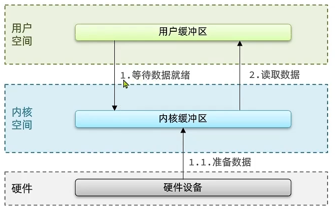


### 阻塞IO

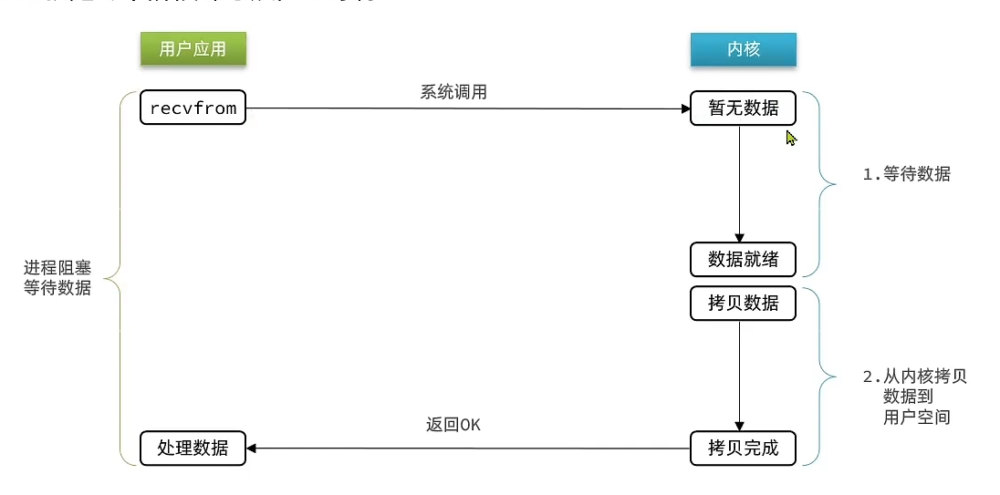

在等待数据就绪以及数据拷贝的时候，用户进程需要进行等待，在这期间，用户进程无法处理其他的事情，所以成为阻塞IO


### 非阻塞IO

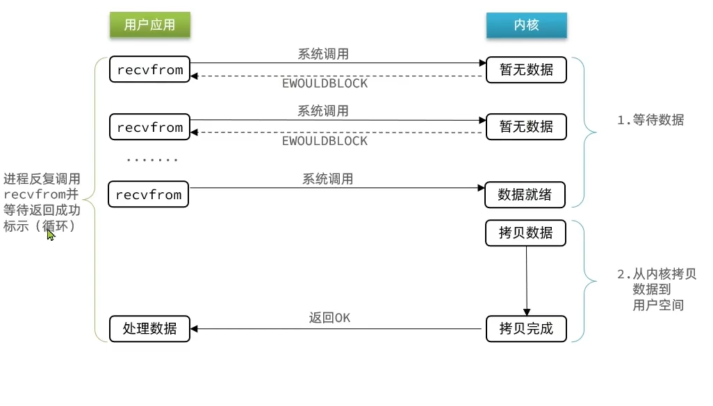

在非阻塞IO模型中，在等待数据就绪阶段，用户进程调用recvfrom，内核发现数据还没有准备好，就会返回EWOULDBLOCK，用户进程收到之后就知道数据还没有准备好，后重新发送recvfrom，直到内核数据准备就绪

在此期间，虽然用户进程没有阻塞，但是用户进程会不断的询问数据，会造成CPU空转，


### IO多路复用

文件描述符（File Descriptor），是一个无符号整数，从0开始递增，在Linux中，任何文件都会有一个文件描述符与之对应，无论是常规文件，音视频，还是Socket。

IO多路复用就是使用一个线程去监听多个FD，在某一个FD可读或可写的时候会收到通知，从而避免无效等待，浪费CPU资源

IO多路复用有三种实现方案：select，poll，epoll

select 和 poll只会通知用户进程有FD就绪，但是不知道是哪一个FD就绪，所以需要逐个遍历FD来确定

epoll则会在通知用户进程FD就绪的同时，把已经就绪的FD写入用户空间


#### select模式

大致执行流程：

在内核空间中，先创建一个fds_set，将需要监听的fd对应的位设置为1，然后将fds_set拷贝到内核空间，调用select函数。

进入内核空间，内核会检查这些fds_set中哪些fd就绪了，如果都没有就绪就等待。如果有就绪的，将把就绪的fd位保留不变（还是1），其他位置为0，然后将fds_set拷贝到用户空间，同时select函数会返回就绪的fd的个数

然后用户空间中，线程会逐个遍历所有fd，找到就绪的fd并进行处理


select模式下有几个缺点：

1. 在select函数执行之前，需要先将fds_set拷贝到内核空间，在select函数结束之后，还需要将fds_set拷贝到用户空间，涉及到两次拷贝
2. fds_set的大小有限制，只能表示1024个fd
3. 调用select函数之后，并不知道哪些fd就绪了，还需要逐个遍历fd，找到就绪的fd

#### poll

poll对select进行了一定的改进，但是改进不多

poll执行大致流程：

1. 用户进程创建fd数组，数组大小可以自定义
2. 调用poll函数，将polldfd数组拷贝到内核空间，转为链表存储，理论上无上限
3. 内核遍历fd，判断是否有就绪
4. 数据准备就绪或者超时，将pollfd数组拷贝到用户空间，返回就绪fd数量n
5. 用户进程判断n是否大于0，大于0就遍历fd找到就绪的fd

相比select模式，只是改变了fd数组的大小，在poll模式下，fd数组大小可以自定义，理论上无上限。

但是用户进程还是需要遍历fd才能找到就绪的fd，换汤不换药，而且如果fd数组很大，还会消耗更多的时间


#### epoll

epoll模式涉及到三个函数

- epoll_create

  在内核中创建eventpoll结构体，返回对应的句柄epfd，通过该句柄可以唯一的找到一个eventpoll

  在eventpoll结构体中，有一个红黑树和一个链表。

- epoll_ctl

  将一个FD添加到epoll的红黑树中，同时设置一个回调函数，当FD中的数据准备就绪的时候会触发，将对应的FD添加到就绪链表中

- epoll_wait

  检查就绪链表是否为空，如果不为空就返回就绪的FD数量。该函数会在用户空间中指定一个区域events，内核会将就绪的FD拷贝到用户空间指定的events中，


相比select和poll模式，epoll进行了较大的改进

首先，epoll减少了拷贝的开销，不用每一次都把整个fd集合从用户空间拷贝到内核空间再从内核空间拷贝到用户空间

epoll使用红黑树保存要监听的fd，理论上也是无上限，同时增删改查的效率都比较高。每一个fd只需要调用一次epoll_ctl就可以添加到红黑树中，以后每次调用epoll_wait无需传入任何参数，无需重复拷贝fd到内核空间

其次，epoll可以让用户进程很方便的找到已经就绪的fd，不用逐个遍历了。epoll会将就绪的fd放到用户空间指定的位置，这样用户进程可以直接知道有哪些fd就绪了


当FD有数据可读时，我们调用epoll_wait就可以得到通知，但是时间的通知有两种模式：

- LevelTriggered，简称LT。当FD有数据可读的时候，会重复通知多次，知道数据处理完，是默认模式
- EdgeTriggered，简称ET。当FD有数据可读的时候，只会被通知一次，不管数据是否处理完成

举个例子：现在你有一些快递在快递站，LT就是发现你有快递没有取，就会不断的发短信提醒你，知道你把你的快递取完了。ET就是只会发短信通知你一次，就不会再通知你，不管你有没有去取快递。

ET（边缘触发）的效率相比LT（水平触发）的更高一点，因为边缘触发可以减少epoll_wait系统调用的次数

### 信号驱动IO


### 异步IO


### 零拷贝技术


## Linux常用命令


# Java基础

## 基础知识

### 解释一下什么是JDK，JRE，JVM

JDK：Java Development Kie 是Java开发工具包，包括了JRE，JVM

JRE：Java Runtime Environment 是Java运行环境，包括了JVM与Java核心类库

JVM：Java Virtual Machine 是Java虚拟机，是Java跨平台的关键


### 为什么Java代码可以一次编写，到处运行？

JVM是Java跨平台的关键

Java源程序(.java)编译成字节码(.class)文件，在程序运行时，由JVM将字节码翻译成特定平台的机器码并运行。也就是说只需要在不同的机器上安装对应的JVM即可实现跨平台。


### Java文件中可以有几个类？

可以有多个类，但是只能由一个 public修饰的类。


### java中的访问控制权限？

- public

  公共权限，可以被任意包下的任意类的访问

- protected

  受保护权限，可以被同一包的类访问，也可以被其他包中的该类的子类访问

- default

  默认权限，只能被同一包的类访问

- private

  只能被该类的内部成员访问（子类也不行）


### java中的数据类型？

- 基本数据类型

  - byte 1字节 初始值0
  - shot 2字节 初始值0
  - int 4字节 -2^31 ~ 2^31 -1 初始值0
  - long 8字节 初始值0L
  - float 4字节 初始值0.0F
  - double 8字节 初始值0.0
  - char 2字节 unicode编码
  - boolean 初始值false

- 引用类型

  需要了解JVM内存分布


### 成员变量和局部变量的区别？

成员变量是在类的范围内定义的变量，有默认初始值

未被static修饰的成员变量也叫做实例变量，存储在对象的堆内存中，生命周期与对象相同。

被static修饰的变量称为类变量，存储在方法区中，生命周期与当前类相同。


局部变量是在方法体内部定义的变量，没有默认初始值，存储在栈内存中，


### 什么是包装类？有什么用？与基本数据类型的区别？

在Java中万物皆对象，但是基本数据类型并不是对象，所以使用包装类来将基本数据类型封装成对象。

使用包装类可以对基本数据类型提供更强大的方法。

区别：

- 包装类是对象，默认值是null
- 包装类可以用于泛型，比如集合中存放的是包装类，不能是基本数据类型
- 基本数据类型占用空间小
- 基本数据类型的局部变量在栈内存的局部变量表中，基本数据类型的成员变量在堆内存中，包装类因为是对象所以在堆内存中

### 自动拆箱、自动装箱？

装箱就是将基本数据类型用对应的包装类包装起来

拆箱就是将包装类变为基本数据类型

```java
Integer i = 1;	//装箱   等价于 Integer i = Integer.valueOf(1);
int n = i;		//拆箱   等价于 int n = i.intVlaue();
```


装箱调用了包装类的`valueOf()`方法(静态方法)，拆箱调用了包装类的`xxxValue()`方法（实例方法）


### 包装类的缓存机制？

在`Byte Short Integer Long`这四种包装类中缓存了数字为[-128,127]的相应类型的缓存对象。其中Integer的缓存最大值127是可以通过调整虚拟机参数修改的

`Character`缓存了在[0,127]之间的数据,`Boolean`直接返回`True,False`

`Float Double`没有缓存机制

```java
//使用了缓存对象，所以i1 i2 指向同一个对象
Integer i1 = 33;
Integer i2 = 33;
System.out.println(i1 == i2);// 输出 true

//Float没有缓存  所以自动装箱为不同的对象
Float i11 = 333f;
Float i22 = 333f;
System.out.println(i11 == i22);// 输出 false

//同Float没有缓存机制
Double i3 = 1.2;
Double i4 = 1.2;
System.out.println(i3 == i4);// 输出 false
```


```java
Integer i1 = 40;
Integer i2 = new Integer(40);
System.out.println(i1==i2);// 输出false  因为i1使用缓存对象，i2是new了一个新对象
```


所以对于包装类型进行数值比较的时候使用`equals()`方法


### 如何对Integer Double类型进行判断相等？

整形、浮点类型的包装类都继承了`Number`类,提供了将数字转换为byte,short,int,long,float,double的方法，所以可以将Integer.Double转换为相同的数据类型再进行比较

如下面的示例代码：

```java
Integer i = 100;
Double j = 100.0;
System.out.println(i.doubleValue() == j.doubleValue());
```


### int和Integer的区别？如何判断相等？ 进行 == 运算会得到什么结果？

在进行==运算的时候，会将Integer自动拆箱，在与int进行比较；如果相等返回true

### 对于面向对象的理解？

面向对象通常和面向过程进行比较，先说下面下个过程。

面向过程是将一个过程拆分成有一个个方法，通过这些方法去完成一个事情。

而面向对象更关心完成这个事情需要哪些对象参与，每个对象需要执行什么方法。

面向过程更加高效，面向对象更加易于拓展和维护。


### 面向对象的三大特性？

#### 封装

封装就是把一个对象的状态信息隐藏在对象的内部，不允许外部对象直接访问这些内部信息。但是提供了一些外界可以访问的公共方法来操作这些信息。就像我们看不到电视的内部实现，但是我们可以使用遥控器去操作电视机。

通常做法就是将对象的成员变量使用`private`修饰，然后提供`public`修饰的`get、set`等方法让外界操作变量。

#### 继承

从一些具有相同变量或方法的类中提取公共部分，作为这些类的父类。子类继承了父类的变量与方法，同时各子类也有自己特殊的变量和方法。比如猫、狗等都是动物，这样就可以抽象出一个动物类，狗、猫是子类，继承了这个动物类。

使用继承可以快速创建新的类，提高代码的复用率。程序的可维护性等。

子类继承了父类所有的属性和方法，但是父类私有的属性和方法子类无法访问

子类有自己的属性和方法

子类可以重写父类的方法


#### 多态

多态顾名思义就是表示一个对象具有多种状态，具体表现为父类的引用指向子类的实例，这种做法被称为向上转型。

当把一个子类对象赋值给父类引用的时候，如`Animal dog = new Dog();`，这个dog对象的编译类型是`Animal`，但是运行类型是`Dog`,所以在运行时，dog会表现出子类的行为特征。


### 封装的目的是什么？如何实现封装？

略

### 对于多态的理解？如何实现多态？


### Java为什么是单继承？为什么不能有多继承？

就好像每个人都只有一个亲生父亲一样，Java子类只能有一个直接父类


### 重载和重写的区别？构造方法可以重写吗？

重载是一个类中的多个方法，有相同的方法名，参数列表不同。与返回值和访问修饰符无关。

@OverLoad 表示重载

重写是父子类中，若子类方法想要与父类构成重写关系，就需要方法名、参数列表与父类相同，同时返回值要小于等于父类方法，抛出异常小于等于父类，访问修饰符大于等于父类，如果父类是private，则子类不可重写

@OverWrite 表示重写


### 介绍一下Object类的常用方法

- toString() 返回对象的字符串表示
- equals() 判断两个对象是否相等 默认是判断是否为同一个对象，不过可以重写
- getClass() 获得对象的运行时类型
- hashCode() 计算hashCode
- wait() 用于线程阻塞
- notify() 唤醒对象锁中的某个线程
- notifyAll() 唤醒对象锁里面所有阻塞的线程


### hashCode() 和 equals()的关系？为什么要重写这两个方法？

可以使用这两个方法一起判断两个对象是否相等，

- 两个对象相同，则hashCode相同
- 两个对象不同，则hashCode可能相同，可能不相同


equals默认是进行 == 比较，只有当两个对象是同一个对象的时候才能返回true，可以重写，让他判断两个对象的内容是否相同。


如果重写了equals就必须重写hashcode。在判断对象是否相等的时候，会先判断hashcode是否相等，如果相等了再判读equals是否相等。如果不重写hashcode，那么可能两个内容相同的对象，也就是equals相同的对象，他们的hashcode不同，这样在集合中，尤其是HashSet、HashMap这种要求唯一性的集合中，由于hashcode不同便认为是不同的对象，会导致集合中重复出现我们认为是相同的对象。


### == 和 equals 的区别？

==：

- 基本数据类型：判断数值是否相等
- 引用数据结构：比较两个对象的内存地址是否相同，即是否是同一个对象

equals：

- 没有重写 使用==
- 重写另说


### String类有哪些方法？

- charAt()
- subString() 
- toUpperCase()
- toLowerCase()
- ...

### String可以被继承吗？

String类被final修饰吗，，不可以被继承


### String、StringBuilder、StringBuffer的区别？

- 可变性

  String是不可变的，StringBuilder、StringBuffer是可变的，可以使用append()等方法修改字符串

- 线程安全性

  String因为是不可变的，可以认为是一个常量，是线程安全的。

  StringBuilder线程不安全

  StringBuffer对方法加了同步锁，是线程安全的

- 性能

  每次修改String时，都会新建一个新的对象，然后将原来的引用指向新的对象。

  StringBuffer由于使用了锁，所以性能相比StringBuilder较差。

### 创建字符串时，new String(“abc”) 和 "aaa"的创建过程？推荐使用哪种方法？

使用`String a = "abc";`创建字符串时，会先检查常量池中有没有''"abc"，如果没有就将"abc"加入常量池，否则就复用常量池中的"abc"，将其引用赋值给变量a

使用`String a = new String("abc");`会先在堆中创建字符串"abc"，然后在堆中新建一个String对象，该对象的数据会指向常量池中的字符串常量。


### 对于字符串拼接的理解？两个字符串相加底层如何实现？

对于String的拼接通常使用的是+进行拼接。包括字符串常量之间的拼接，字符串常量与String变量的拼接

看看下面的代码：

```java
String str1 = "str";
String str2 = "ing";
String str3 = "str" + "ing";
String str4 = str1 + str2;
String str5 = "string";
System.out.println(str3 == str4);//false
System.out.println(str3 == str5);//true
System.out.println(str4 == str5);//false
```

对于编译期间可以确定的字符串也就是常量字符串，JVM会将这个字符串常量放入字符串常量池。比如`"abc"  "xyz"`进行拼接等价于`"abcxyz"`

如果拼接双方存在字符串变量，那么就会使用StringBuilder实现拼接。JVM会自动创建一个StringBuilder实例并调用append()方法进行拼接，并使用toString()将拼接结果返回。


如果字符串变量也就是String变量被final修饰了，那么也可以认为是一个常量

```java
final String a = "abc";
fianl String b = "xyc";
String c = "abc" + "xyc";
String d = a + b;
System.out.println(c == d);//true
```

a 和 b会被当成常量处理。但是如果值在运行期间才会知道，那么编译器不会进行优化。


### 说一下String的intern()方法

如果字符串s在字符串常量池中存在对应字面量，则intern()方法返回该字面量的地址；如果不存在，则在字符串常量池创建一个对应的字面量，并返回该字面量的地址

可以看下面这段代码：

```java
// 在堆中创建字符串对象”Java“
// 将字符串对象”Java“的引用保存在字符串常量池中
String s1 = "Java";
// 直接返回字符串常量池中字符串对象”Java“对应的引用
String s2 = s1.intern();
// 会在堆中在单独创建一个字符串对象
String s3 = new String("Java");
// 直接返回字符串常量池中字符串对象”Java“对应的引用
String s4 = s3.intern();
// s1 和 s2 指向的是堆中的同一个对象
System.out.println(s1 == s2); // true
// s3 和 s4 指向的是堆中不同的对象
System.out.println(s3 == s4); // false
// s1 和 s4 指向的是堆中的同一个对象
System.out.println(s1 == s4); //true
```


### 接口和抽象类的区别？

共同点：

- 都不能被实例化
- 都可以由抽象方法
- 都可以有默认实现的方法（JDK8中接口的默认方法需要使用default修饰，接口里面也可以有静态方法，抽象类可以有实现的方法）

不同点：

- 一个类只能继承一个类，但是可以实现多个接口

- 接口关注对于方法的约束，一个类实现了一个接口，那么类就具备了对应的行为。

  抽象类更关注对于代码的复用

- 接口只能定义静态常量`(public static final)`，且必须给初始值，抽象类可以定义普通成员变量

- 接口没有构造方法，抽象类可以有构造方法，但是不是用来创建对象，而是对抽象类进行初始化操作

- 接口中的方法不能有实现，但是可以使用default关键字来表示默认方法，这种默认方法是可以有方法体的。或者可以在接口中定义静态方法，也是可以有方法体的

  抽象类中可以有抽象方法也可以有普通的方法


### 接口可以有构造函数吗？

不能。

### 对于面向接口编程的理解？

面向接口编程可以提高系统的可拓展性和可维护性，降低程序的耦合度


### 对于static关键字的理解？

static关键字可以修饰变量，方法，代码块，内部类等。

类成员（static修饰的属性和方法）不能访问成员属性和方法。因为static修饰的内容属于类，类加载早于对象的实例化，所以无法访问。

static修饰的内容：

- 变量：类变量，他随类的信息存储在方法区而不是堆。通过类名访问，发生修改该类的所有实例化对象都知道
- 方法：类方法，通过类名调用
- 代码块：静态代码块，在类加载时隐式调用一次，之后不会再调用
- 静态内部类：可以有静态成员和非静态成员，不过静态内部类只能访问外部类的静态成员


### static修饰的类能不能被继承？

可以被继承


### static和final有什么区别

static用于修饰静态成员，被类所拥有

final修饰常量，不能被修改。

final类不能被继承，final方法不能被重载，fianl变量不能改变值（先赋初始值）

### 说一下java中的四种引用

- 强引用

  强引用是基本的引用方式，无论在何种情况下，只要强引用关系存在，垃圾收集器就永远不会回收被引用的对象。

  JVM宁愿抛出OutOfMemory错误也不会回收对象

  

- 软引用

  如果一个对象具有软引用，在内存充足时不会回收，在内存不充足时会回收。

  可以用来实现缓存

  `SoftReference`

- 弱引用

  被弱引用关联的对象，只要发生GC，就会回收这个对象

  `WeakReference`

- 虚引用

  无法通过虚引用获得对象。设置虚引用的唯一目的就是在对象被GC的时候能收到一个系统通知。


### 深拷贝和浅拷贝的区别？什么是引用拷贝？

- 浅拷贝：

  浅拷贝会在堆上创建一个新的对象，不过如果原对象内部的属性是引用类型的话，浅拷贝会直接复制内部对象的引用地址，也就是说拷贝对象和原对象共用一个内部对象。

- 深拷贝：

  深拷贝会完全复制整个对象，包括这个对象所包含的内部对象。也就是创建一个全新的对象。

- 引用拷贝：

  引用拷贝就是两个不同的引用指向同一个对象


### 如何实现深拷贝？如何实现浅拷贝？

在Java中，Object类有一个方法clone就是用来实现拷贝的。想要拷贝一个对象，就需要重写clone方法，同时还需要实现Cloneable类，这个类只是起一个标志的作用，因为里面没有方法要去实现，如果没有实现这个接口就会排除异常`CloneNotSupportedException`。

重写clone方法仅仅是实现了浅拷贝。如果想要实现深拷贝有下面两种方法：

1. 类的所有的引用类型都重写clone方法，比如说一个类A，里面有一个B类的属性，想要实现深拷贝就需要类A，B都重写clone方法

2. 通过序列化实现深拷贝。因为通过反序列化得到的对象是一个全新的。

   直接将对象序列化到输出流中，然后将其读回，这样产生的新的对象是对现有对象的一个深拷贝。在此过程中，我们不必将对象写到文件中，因为可以用ByteArrayOutputStream将数据保存到字节数组中。

   ```java
   // 注意需要实现Cloneable和Serializable
   class SerialCloneable implements Cloneable,Serializable{
       public Object clone(){
           try {
               ByteArrayOutputStream bout = new ByteArrayOutputStream();
               ObjectOutputStream out = new ObjectOutputStream(bout);
               out.writeObject(this);
               out.close();
   
               ByteArrayInputStream bin = new ByteArrayInputStream(bout.toByteArray());
               ObjectInputStream in = new ObjectInputStream(bin);
               Object ret = in.readObject();
               in.close();
               return ret;
           } catch (Exception e){
               return null;
           }
   	}
   }
   
   ```

   

### Java中是值传递还是引用传递？

在Java中只有值传递。

值传递就是方法接受的是实参值的拷贝、会创建副本

引用传递指的是方法接收的是实参引用的对象在内存中的地址，不会创建副本。方法中对于形参的修改会直接影响到实参。

形参指的是方法的参数列表中的参数，用来接受实参，不需要有确定值

实参指的是用于传递给方法的参数，需要有确定值


下面的三个例子解释了Java是值传递

例子1：

```java
public static void main(String[] args) {
    int num1 = 10;
    int num2 = 20;
    swap(num1, num2);
    System.out.println("num1 = " + num1);
    System.out.println("num2 = " + num2);
}

public static void swap(int a, int b) {
    int temp = a;
    a = b;
    b = temp;
    System.out.println("a = " + a);
    System.out.println("b = " + b);
}

//结果
a = 20
b = 10
num1 = 10
num2 = 20
```

在swap方法中交换a，b的值并没有影响num1，num2的值，也就是说a，b是num1和num2的副本


例子2：

```java
public static void main(String[] args) {
    int[] arr = { 1, 2, 3, 4, 5 };
    System.out.println(arr[0]);
    change(arr);
    System.out.println(arr[0]);
}

public static void change(int[] array) {
    // 将数组的第一个元素变为0
    array[0] = 0;
}

//结果
0
1
```

change方法中的形参array复制了一份arr的引用，所以两者执行的是同一个数组对象，所以array修改会影响到arr


例子3：

```java
public class Person {
    private String name;
   // 省略构造函数、Getter&Setter方法
}

public static void main(String[] args) {
    Person xiaoZhang = new Person("小张");
    Person xiaoLi = new Person("小李");
    swap(xiaoZhang, xiaoLi);
    System.out.println("xiaoZhang:" + xiaoZhang.getName());
    System.out.println("xiaoLi:" + xiaoLi.getName());
}

public static void swap(Person person1, Person person2) {
    Person temp = person1;
    person1 = person2;
    person2 = temp;
    System.out.println("person1:" + person1.getName());
    System.out.println("person2:" + person2.getName());
}

//结果
person1:小李
person2:小张
xiaoZhang:小张
xiaoLi:小李
```


交换的知识形参的引用，实参没有发生变化。


为什么不使用引用传递呢？

出于安全考虑，方法内部对值的操作对于方法的调用者来说是未知的。


### 数组转链表的方式？

最暴力的方式就是手动new一个链表，然后遍历数组把元素加到链表里面

通过Arrays.asList()方法实现数组转链表，不过不能用于基本数据类型的数组转换，只能用于包装类的数组的转换。而且返回的链表的长度是固定的。

通过new ArrayList() 和 Arrays.asList()配合使用，构造出长度可变的链表

通过Stream流的方式实现转换。可以实现基本数据类型转换成链表

```java
// 测试代码
int[] test = new int[]{1,2,3,4,5};
// 通过Arrays获得Stream流，通过boxed进行装箱（集合中的元素不能是基本数据类型，需要转换成包转类）
// 通过collect进行收集
ArrayList<Integer> collect = Arrays.stream(test).boxed().collect(Collectors.toCollection(ArrayList::new));
System.out.println(collect);
```

### 链表转数组？

调用toArray()方法，这是Collection接口的抽象方法，每一个首先类都要去实现这个方法

### Stream流（不是IO Stream）有哪些方法？

通常用来处理集合，比如List

常用方法如下：

| 方法名称 | 方法作用                  | 是否是终结方法 | 是否可以链式调用 |
| -------- | ------------------------- | -------------- | ---------------- |
| count    | 统计个数                  | 是             | 否               |
| foreach  | 逐个遍历                  | 是             | 否               |
| filter   | 过滤（有参，返回boolean） | 函数拼接       | 是               |
| map      | 映射（有参有返回值）      | 函数拼接       | 是               |
| limit    | 取前几个                  | 函数拼接       | 是               |
| skip     | 跳过几个                  | 函数拼接       | 是               |

含有一个就是收集方法，collect，将流中的元素收集成指定的集合


### 对于匿名内部类的理解？

匿名内部类本质上是一种有具体实现的父类或者接口的匿名对象，比如有一个接口，通常需要写一个类实现这个接口，然后才可以对这个类进行实例化。使用匿名内部类之后就不需要编写这个类，可以直接new一个接口，然后去实现接口中的方法。

### Lambda表达式的理解？

可以用来替代匿名内部类，之前需要使用如下的方式使用匿名内部类。

```java
new Thread(new Runnable(){
	@Override
	public void run(){
	
	}
})
```

使用Lambda之后可以简化写法。使用`()->{}`替代匿名内部类的写法。小括号是参数列表，大括号是方法体。

```java
new Thead(()->{Sysetem.out.println();})
```

需要注意只有该匿名内部类中只有一个抽象方法的时候才可以使用。通常是与函数式接口配合使用


### 函数式编程？

我认为是在方法的参数列表中添加一个函数式接口，方法直接调用函数式接口里面的方法，不需要关心里面的呃细节。具体实现细节由方法的调用者在调用的时候去实现。


### 序列化和反序列化

#### 什么是序列化和反序列化?

当我们需要存储Java对象或者在网络中传输Java对象的时候就需要用到序列化。

序列化就将Java对象转换为二进制字节流的过程

反序列化就是将在序列化过程之中生成的二进制字节流转换成Java对象的过程。

#### 在哪些场景写需要使用到序列化和反序列化？

- 对象在进行网络传输（比如远程过程调用RPC的时候）之前需要进行序列化，接收到序列化的对象之后再进行反序列化
- 将对象存储到文件之间需要进行序列化，将对象从文件中读取出来需要进行反序列化
- 将对象存储到数据库之前需要序列化，从数据库中读取出来之后需要进行反序列化


#### 序列化协议对应了TCP/IP模型的哪一层？

在TCP/IP协议模型中，应用层是由OSI模型中的三层构成的，分别是应用层，表示层，会话层，其中表示层的任务就是对数据进行处理，比如进行数据加密解密，压缩解压缩等。所以表示层可以将应用层的数据转换为二进制数据，同时可以将二进制数据转换为对应的应用层数据，这就是序列化和反序列化。

所以说，序列化和反序列化的任务由表示层完成，这也对应的TCP/IP模型的应用层


#### 常见的序列化协议有哪些？

Java中实现序列化的方式有JDK自带的序列化，但是效率较低，且存在安全问题，所以一般不用

JSON，XML这种文本类序列化方式，可读性比较好，但是性能比较差

比较常用的就是使用其他的序列化协议，如Hessian等基于二进制的序列化协议


#### JDK自带的序列化是如何实现的？

使用JDK自带的序列化，只需要实现Java.io.Serializable接口即可。

使用JDK自带的序列化器需要在类中指定一个变量serialVersionUID，这个变量起到了版本控制的作用。反序列化的时候，会检查serialVersionUID是否和当前类的serialVersionUID一致。如果不一致则会抛出异常。

#### 如果有些字段不希望进行序列化怎么办？

可以添加`transient`关键字，transient关键字的作用就是阻止实例中那些用此关键字修饰的变量序列化，当对象被序列化时，被该关键字修饰的变量的值不会被持久化和恢复

使用transient有几点需要注意：

- transient只能修饰变量，不能修饰类和方法
- 被该关键字修饰的变量在反序列化的时候变量的值会被置为变量类型的默认值
- static变量因为不属于任何对象，所以无论有没有被该关键字修饰，都是不会被序列化的
- static和transient关键字修饰的内容均不会序列化，但是在反序列化之后，static变量还有值，这是因为static变量是属于类的，在类加载的时候就会对static变量进行赋值，所以这里静态变量读到的值是JVM中已经保存的值，并不是反序列化得到的值


## 泛型

### 对于泛型的理解？

在集合中经常使用泛型。一个集合在被设计的时候并不知道它里面会存放什么内容，使用泛型来替代在集合中所需要存放的内容。只需要在创建一个集合的实例的时候指定这个泛型是什么类型就可以了。

泛型在使用的时候需要先定义泛型，就是在方法前面先下一个尖括号，里面定义方法中使用到的泛型，然后在方法中才可以使用泛型。

比如在下面的方法中，就是用到了泛型，先定义了两个泛型R，ID，然后在方法中就可以使用这些个泛型了

```java
/**
 * 缓存空对象解决缓存穿透
 */
public <R,ID> R queryWithPassThrough(String keyPrefix, ID id, Class<R> type, Function<ID,R> dbFallBack,Long time,TimeUnit unit){
    String key = keyPrefix + id;
    // 1.先从redis中查询
    String json = stringRedisTemplate.opsForValue().get(key);

    // 2.判断是否查询到结果
    if(!StringUtils.isEmpty(json)){
        // 3.查询到就返回
        return JSONUtil.toBean(json,type);
    }

    if("".equals(json)){
        // 4.如果查询到的是空对象
        return null;
    }

    // 5.没有查询寻到就去数据库中查询 函数式编程，由调用者去执行
    R r = dbFallBack.apply(id);
    if(r == null){
        // 6.数据库中也没有 就缓存空对象，并设置过期时间
        set(key,"",RedisConstants.CACHE_NULL_TTL,TimeUnit.SECONDS);
        return null;
    }
    // 7.存在数据库中就返回，同时写入redis
    set(key,r,time,unit);
    return r;
}
```


### 泛型擦除？


###  List<? super T> 和 List<? extend T> 有什么区别？

？是通配符，用于表示类型未知的List

? super T 规定了下限，传入的类型必须是T的父类

？extend T 规定了上限，传入的类型必须是T的子类


## I/O

### java I/O流的分类

1. 按照数据流的方向：输入流，输出流

   输入和输出是相对内存而言的，将磁盘上的文件读入内存就是输入流。将文件从内存写入磁盘就是输出流

   

2. 按照处理数据单位：字节流，字符流

   字节流处理的是8位的字节，字符流处理的是16位的字符（java采用unicode编码）。

   由于中文占用不止一个字节，如果使用字节流处理，那么一种字符就会被割裂成多个字节，导致乱码。

   字节流通常用于处理图像、音视频等文件，而字符流用于处理纯文本文件。

   

3. 按照功能：节点流，处理流

   节点流：直接操作数据读写的流类

   

   处理流：对一个已存在的流的连接和封装，通过对数据进行处理为程序提供功能更强大、灵活的读写功能，如`BufferedInputStream`


### 随机访问流

`RandomAccessFile`，随机访问流，支持随意跳转到文件的任意位置进行读写。


### I/O流使用了哪些设计模式


### 对BIO，NIO，AIO的了解


## 集合

### 集合概览

#### 继承体系

主要有两种，一个是`Collection`接口，一个是`Map`接口，`Collection`接口下有`List`，`Set`，`Queue`三个子接口，`Map`接口下有`HashMap`，`HashTable`两个子类，和`SortMap`接口，下面有`TreeMap`子类

在Collection接口的上面还应该再加一个Iterable接口，用来实现迭代器相关的方法


#### 有哪些线程安全的集合？

HashTable，Vector这种集合可以保证线程安全，不过这两种集合是使用synchronized的方式来保证线程安全的。不过这些容器的性能不加

之后出现了像CopyOnWriteArrayList，CopyOnWriteArraySet，ConcurrentHashMap，这些可以保证线程安全的集合。

ConcurrentHashMap是通过使用cas和synchronized的方式，锁住的一个哈希槽，就是数组中的一个位置。

CopyOnWriteArrayList的话是利用了COW写时复制的方式实现。读操作不用加锁，写操作会先加锁（ReentrantLock），然后将原来的数组复制一份，对复制出来的数据进行写操作。等写操作结束之后，再将原来容器的引用替换为新的容器，最后释放锁i资源。不过这种方式极其耗时，适合在读多写少的情况下使用


### 集合框架底层数据结构

#### List

- ArrayList：Object[]
- Vector：Object[]
- LinkedList：双向链表

#### Set

- HashSet：HashMap实现，可以存储null，唯一，无序
- LinkedSet：LinkedHashMap实现，
- TreeSet：红黑树实现，有序，唯一

##### Queue

- PriorityQueue：Object[]，数组实现二叉堆
- ArrayQueue：Object[]，数组+双指针

#### Map

- HashMap：数组+链表+红黑树，当链表长度>8时会检查数组长度是否大于64，不大于就进行数组扩容，大于就转换为红黑树
- TreeMap：红黑树
- HashTable：数组+链表
- LinkedHashMap：同HashMap


### Collection 和 Collections的区别

Collection是集合体系的最顶层接口，

Collections是一个工具类，方便操作Collection


### Collection子接口之List

#### ArrayList和Vector的区别

ArrayList线程不安全，Vector线程安全，底层都是使用Object[]


#### ArrayList 和 LinkedList 的区别

- 线程安全问题

  两者都是线程不安全的

- 底层数据结构

  ArrayList底层使用**Object[]**，相当于动态数组。

  LinkedList底层使用的是双向链表

- 插入与删除元素是否受到位置的影响

  ArrayList由于是基于数组存储的，所以插入数据的时候会受到影响。add方法，默认插入在最后一位，时间复杂度为O(1)，add(int index,E element)此时指定插入位置，就需要对该位置后面的元素进行移动，时间复杂度为O(n-i);

  LinkedList采用链表存储，在头部或者尾部插入或删除元素不受影响。如果在指定的位置插入删除数据，需要先移动到指定的位置在执行插入删除操作。

- 是否支持快速随机访问

  LinkedList不支持，ArrayList支持

- 空间占用

  ArrayList的占用主要在于在数组末尾会预留一段空间。而LinkedList在于每个元素都会比ArrayList多占用一些空间

在很多场景下，LinkedList可以被ArrayList替换


#### ArrayList的线程安全问题

`ArrayList`不是线程安全的，在多线程得到情况下，会出现线程安全问题。比较容易出现问题的地方在于

- 添加元素

  添加元素的过程elementData[size++] = e这个步骤可以拆分为elementData[size] = e,size++两步

  加入有两个线程同时执行，线程A执行了elementData[size] = e1，此时线程切换到B，同样执行了elementData[size] = e2，这时线程B就覆盖了线程A添加的元素，随后两个线程分别执行size++的操作。

  这样，就会有一个位置没有元素，会出现null值。另外size++的过程也会出现线程安全的问题

- 数组扩容

  在添加元素之前都会先检查数组的容量，然后执行添加元素的动作。如果此时仅能添加最后一个元素，两个线程同时执行，线程A检查数组容量有剩余，切换到B执行，检查数组容量有剩余，然后添加元素。这时切换回线程A执行，同样添加元素，但是只能添加一个元素还被B抢先了，这时就会出现数组越界的异常

为了解决该问题，可以使用

1. `Vector`
2. `Collections.synchronizedList()`
3. `CopyOnWriteArrayList`

##### `Vector`

解决方案就是采用同步关键字`synchonized`修饰方法实现同步

```java
public void add(int index, E element) {
    insertElementAt(element, index);
}

public synchronized void insertElementAt(E obj, int index) {
    modCount++;
    if (index > elementCount) {
        throw new ArrayIndexOutOfBoundsException(index
                                                 + " > " + elementCount);
    }
    ensureCapacityHelper(elementCount + 1);
    System.arraycopy(elementData, index, elementData, index + 1, elementCount - index);
    elementData[index] = obj;
    elementCount++;
}

//get方法也是用同步关键字
public synchronized E get(int index) {
    if (index >= elementCount)
        throw new ArrayIndexOutOfBoundsException(index);

    return elementData(index);
}
```


##### `Collections.synchonizedList()`

```java
public static <T> List<T> synchronizedList(List<T> list) {
    return (list instanceof RandomAccess ?
            new SynchronizedRandomAccessList<>(list) :
            new SynchronizedList<>(list));
}
```

由于`ArrayList`实现了`RandomAccess`接口，所以会得到一个`SynchronizedRandomAccessList`。

该类的`add/get`方法如下：

```java
public void add(int index, E element) {
    synchronized (mutex) {list.add(index, element);}
}

public E get(int index) {
    synchronized (mutex) {return list.get(index);}
}
```

`add/get`方法均有同步代码块实现，读、写操作均会加锁，效率较低。


##### `CopyOnWriteArrayList`

该类实现了读写操作不互斥，读操作不加锁。

```java
//add方法
public boolean add(E e) {
    final ReentrantLock lock = this.lock;
    lock.lock();
    try {
        Object[] elements = getArray();
        int len = elements.length;
        Object[] newElements = Arrays.copyOf(elements, len + 1);
        newElements[len] = e;
        setArray(newElements);
        return true;
    } finally {
        lock.unlock();
    }
}

//get方法
private E get(Object[] a, int index) {
    return (E) a[index];
}
```

在面临写操作的时候，`CopyOnwriteArrayList`会先复制原来的数组并且在新数组上进行修改，最后再将原数组覆盖。如果写操作过程中发生了线程切换。并且切换到读线程，因为此时数组并未发生覆盖，读操作读取的还是原数组。

也就是说**当读写并发时 读操作是在旧数组中 读到的旧值**。


#### ArrayList部分源码以及扩容、`add()` 原理

从`ArrayList`的构造方法说起，`ArrayList`有三种构造方法

- 无参构造

  ```java
  /**
  *默认构造函数，使用初始容量10构造一个空列表(无参数构造)
  */
  public ArrayList() {
  	this.elementData = DEFAULTCAPACITY_EMPTY_ELEMENTDATA;
  }
  ```

- 有参构造（指定初始容量）

  ```java
  /**
   * 带初始容量参数的构造函数。（用户自己指定容量）
   */
  public ArrayList(int initialCapacity) {
      if (initialCapacity > 0) {//初始容量大于0
          //创建initialCapacity大小的数组
          this.elementData = new Object[initialCapacity];
      } else if (initialCapacity == 0) {//初始容量等于0
          //创建空数组
          this.elementData = EMPTY_ELEMENTDATA;
      } else {//初始容量小于0，抛出异常
          throw new IllegalArgumentException("Illegal Capacity: "+initialCapacity);
      }
  }
  ```

  

- 有参构造（使用指定的collection进行构造）

  ```java
  /**
   *构造包含指定collection元素的列表，这些元素利用该集合的迭代器按顺序返回
    *如果指定的集合为null，throws NullPointerException。
    */
  public ArrayList(Collection<? extends E> c) {
      elementData = c.toArray();
      if ((size = elementData.length) != 0) {
          // c.toArray might (incorrectly) not return Object[] (see 6260652)
          if (elementData.getClass() != Object[].class)
              elementData = Arrays.copyOf(elementData, size, Object[].class);
      } else {
          // replace with empty array.
          this.elementData = EMPTY_ELEMENTDATA;
      }
  }
  
  ```

  从这些个构造方法中可以得出，如果使用默认的构造方法创建`ArrayList`，实际上初始化赋值的是一个空数组。只有当第一次add元素的时候，才会对其分配空间，大小默认为10。

上面有说到，对于无参构造器创建的`ArrayList`来说，只有在第一次add元素的时候才会进行初始化，下面就来看一下`add`方法

```java
/**
 * 将指定的元素追加到此列表的末尾。
 */
public boolean add(E e) {
    //添加元素之前，先调用ensureCapacityInternal方法
    ensureCapacityInternal(size + 1);  // Increments modCount!!
    //这里看到ArrayList添加元素的实质就相当于为数组赋值
    elementData[size++] = e;
    return true;
}
```

下面看一下`ensureCapacityInternal`方法的内容

```java
//得到最小扩容量
private void ensureCapacityInternal(int minCapacity) {
    if (elementData == DEFAULTCAPACITY_EMPTY_ELEMENTDATA) {
        // 获取默认的容量和传入参数的较大值
        minCapacity = Math.max(DEFAULT_CAPACITY, minCapacity);
    }

    ensureExplicitCapacity(minCapacity);
}
```

`DEFAULT_CAPACITY` 默认容量等于10，在`add`第一个元素的时候，传入的参数

`minCapacity` = 1,在`Math.max()`比较之后得到`minCapacity` = 10

下面看一下`ensureExplicitCapacity`方法

```java
  //判断是否需要扩容
private void ensureExplicitCapacity(int minCapacity) {
    modCount++;
    // overflow-conscious code
    if (minCapacity - elementData.length > 0)
        //调用grow方法进行扩容，调用此方法代表已经开始扩容了
        grow(minCapacity);
}
```

分析上面的代码：

- 在`add`第一个元素的时候，`elementData.length`等于0（因为此时还是一个空数组），在`ensureCapacityInternal`中已经将`minCapacity`从1变为了10，这样就会调用`grow`方法进行扩容
- 在第二次`add`元素的时候，由于`elementData`不再是默认的空数组了，这样就不会对执行`minCapacity = Math.max(DEFAULT_CAPACITY, minCapacity);` `minCapacity` 等于2，此时`elementData.length = 10`，不会调用`grow`方法。
- 同理第三次、第四次、直到第10次`add`的时候都不会`grow`
- 在add第11个元素的时候，`minCapacity = 11`，大于`elementData.length = 10`，会执行`grow`方法

下面就看一下`grow`方法的具体内容

```java
/**
 * 要分配的最大数组大小
 */
private static final int MAX_ARRAY_SIZE = Integer.MAX_VALUE - 8;
//扩容核心方法
private void grow(int minCapacity) {
    // overflow-conscious code
    int oldCapacity = elementData.length;
    //新的容量等于旧容量的1.5倍
    int newCapacity = oldCapacity + (oldCapacity >> 1);
    //比较新容量是否大于最小需求量，如果小于，就把最小需求量赋值给新容量
    if (newCapacity - minCapacity < 0)
        newCapacity = minCapacity;
    //最小需求量如果大于MAX_ARRAY_SIZE，新容量等于Integer.MAX_VALUE；否则等于MAX_ARRAY_SIZE，即Integer.MAX_VALUE-8
    if (newCapacity - MAX_ARRAY_SIZE > 0)
        newCapacity = hugeCapacity(minCapacity);
    // minCapacity is usually close to size, so this is a win:
    elementData = Arrays.copyOf(elementData, newCapacity);
}

private static int hugeCapacity(int minCapacity) {
    if (minCapacity < 0) // overflow
        throw new OutOfMemoryError();
    return (minCapacity > MAX_ARRAY_SIZE) ?
        Integer.MAX_VALUE :
    MAX_ARRAY_SIZE;
}
```

`add`第一个元素的时候，`minCapacity`等于10,`oldCapacity`等于0，`newCapacity`经过计算也等于0。这样第一个`if`判断为`true`，`newCapacity = minCapacity;`，第二个`if`判断为`false`。此时`elementData.length = 10`

`add方法return true  size++`  

当 `add` 第 11 个元素进入 `grow` 方法时，`newCapacity` 为 15，比 `minCapacity`（为 11）大，第一个 if 判断不成立。新容量没有大于数组最大 size，不会进入 `hugeCapacity` 方法。数组容量扩为 15，`add` 方法中 `return true,size` 增为 11。


在最后调用了Arrays.copyOf()方法进行数组拷贝，底层调用了System.arraycopy()方法

**特别提醒**

`size`是针对集合而言的，返回该集合中有多少元素

`length`针对数组，返回数组长度

`length()`该方法针对字符串，返回字符串长度


总结一下扩容的原理：

当需要add一个元素的时候，会先检查当前ArrayList的容量是否能够添加一个元素。

检查的过程会先计算出添加一个元素需要的最小容量，也就是当前的size + 1。这里要注意如果此时的ArrayList是刚初始化，数组还是默认空数组的时候，计算出的容量就是默认容量10。计算完需要的最小容量之后与当前数组的大小进行比较，如果数组大小小于最小容量就执行扩容grow方法。

扩容时使用位运算进行扩容(旧容量>>1 + 旧容量  就相当于旧容量*1.5)，新容量为旧容量的1.5倍。如果新容量仍然大于最小容量，那么新容量就等于最小容量。然后判断新容量和数组最大长度的大小关系，如果超过了最大长度，就比较最小容量和最大长度，如果大于，新容量就等于integer.MAX_VALUE，如果小于，新容量就等于最大长度限制。计算出新容量之后就进行数组拷贝，调用Arrays.copyOf()方法，底层是通过System.arraycopy()方法实现的。

但这里扩容的步骤就结束了，将需要add的元素加到size+1处就完成了add的整个流程


#### 如果要添加的元素很多，会发什么什么？

```java
private static int hugeCapacity(int minCapacity) {
    if (minCapacity < 0) // overflow
        throw new OutOfMemoryError();
    return (minCapacity > MAX_ARRAY_SIZE) ?
        Integer.MAX_VALUE :
        MAX_ARRAY_SIZE;
}
```

要添加的数据很多的时候需要考虑这个方法。minCapacity就是需要的大小，newCapacity就是扩容后的大小。扩容后的大小大于MAX_ARRAY_SIZE，也就是数组最大大小的时候会调用这个方法。如果需要的最小容量大于这个最大数组大小，新容量就等于Integer.MAX_VALUE，否则就等于数组最大大小。如果需要的最小容量比Integer.MAX_VALUE还要大，那么就会触发OutOfMemoryError()


#### addAll()方法的原理？

对于无参构造的AttayList，第一次执行addAll()方法的时候会先进行一次扩容，这一次扩容会计算第一次扩容之后的容量。如果传入的集合元素大于10，那么第一次扩容得到的ArrayList的容量就是集合元素的个数。乳沟小于10，那么第一次扩容就是10。

这个计算只会执行一次

```java
private static int calculateCapacity(Object[] elementData, int minCapacity) {
    if (elementData == DEFAULTCAPACITY_EMPTY_ELEMENTDATA) {
        return Math.max(DEFAULT_CAPACITY, minCapacity);
    }
    return minCapacity;
}
```


#### Arrays.copyOf()方法和System.arraycopy()方法？

Arrays.copyOf()会复制出来一份新的数据，然后调用System.copyof()将原数组中内容拷贝到新数组中

System.arraycopy()是一个本地方法，可以指定源数组，源数组的位置，目标数组，目标数组的位置，以及拷贝的个数

```java
// Arrays.copyOf()
public static <T,U> T[] copyOf(U[] original, int newLength, Class<? extends T[]> newType) {
    @SuppressWarnings("unchecked")
    T[] copy = ((Object)newType == (Object)Object[].class)
        ? (T[]) new Object[newLength]
        : (T[]) Array.newInstance(newType.getComponentType(), newLength);
    System.arraycopy(original, 0, copy, 0,
                     Math.min(original.length, newLength));
    return copy;
}

// System.arraycopy()
public static native void arraycopy(Object src,  int  srcPos,
                                        Object dest, int destPos,
                                        int length);
```


### Collection子接口之Set

#### 比较 HashSet、LinkedHashSet 和 TreeSet 三者的异同

- 三者都是Set接口的实现类，都能保证元素唯一，且线程不安全。

- 主要区别在于底层数据结构不同。

  HashSet是基于HashMap实现的

  `LinkdeHashSet`底层是链表+哈希表，插入和取出顺序满足FIFO

  `TreeSet`底层使用红黑树，元素是有序的

- `HashSet`用于不需要保证元素插入和取出顺序的场景

  `LinkedHashSet` 用于保证元素的插入和取出顺序满足 FIFO 的场景

  `TreeSet` 用于支持对元素自定义排序规则的场景


### Collection子接口之Queue

#### Queue 和 Deque

`Queue` 是单端队列，只能从一端插入元素，另一端删除元素，实现上一般遵循 先进先出（FIFO） 规则。

`Deque` 扩展了 `Queue` 的接口, 是双端队列，增加了在队首和队尾进行插入和删除的方法，同样根据失败后处理方式的不同分为两类。事实上，`Deque` 还提供有 `push()` 和 `pop()` 等其他方法，可用于模拟栈。

#### ArrayQueue和LinkedList的区别

底层数据结构不同，ArrayQueue使用变长数据+双指针实现，LinkedList使用链表实现

#### 什么是PriorityQueue

实现了Queue接口，元素出队的顺序按照元素的优先级排序，优先级越高越早出队

利用二叉堆实现，默认是小根堆，也可以使用Comparator来自定义排序。


### Map

#### 哈希冲突的解决方法

- 链地址法

  将所有哈希值相同的记录存储在一个链表里面，就像HashMap一样。

- 开放地址法

  在遇到哈希冲突的时候，寻找一个新的空闲的哈希地址

  - 线性探测法
  - 平方探测法

- 再哈希法

  同时构造多个哈希函数，出现哈希冲突的时候使用第二个、第三个等其他哈希函数知道不出现冲突为止。

- 建立公共溢出区

  将哈希表分为基本表和溢出表，将发生冲突的都存储在溢出表中


#### 如何检查元素重复

利用`hashCode()和equals()`进行判断

首先调用hashCode方法判断hashCode是否已经存在，如果不存在则认为无重复元素，如果存在在调用equals方法进一步判断是否真的是重复元素


#### HashMap与HashTable的区别

1. HashMap线程不安全，默认是非synchronize的。HashTable是线程安全的，方法是synchronize的
2. HashMap有containsKey 和 containsValue方法，而HashTable有contains方法
3. HashMap中entry的key 和 value可以是null，而HashTable不行


#### HashMap是线程安全的吗？在什么时候会出现线程不安全的情况？

不是线程安全的，他的方法不是synchronize的。

线程不安全体现在下面几个方面？

1. 在插入数据时，假设有两个线程A，B同时要插入一条数据。经过Hash计算发现两个线程要插入的位置相同，此时该位置还没有数据。线程A先插入数据，经过if判断发现这个位置没有数据，继续执行，还没有放入数据的时候发生线程切换。线程B执行，经过if判断发现没有数据，因为线程A还没来得及执行。在线程B放入数据前，发生线程切换，A继续执行。A在该位置放入数据。之后轮到B执行，因为已经经过了if判断，所以B会直接放入数据，这样就发生了覆盖的问题。

2. 在扩容的时候，会rehash，然后重新计算各个结点的位置。假设现在某个位置上有两个结点A->B。线程1

   ，2分别进行扩容。线程1中指针指向了A，发生线程切换。线程B完成扩容，假设两个结点扩容之后还在同一个hash槽总，由于采用的是头插法，变成B->A。此时线程A恢复执行，会在现有基础上改变A的位置，使用头插法，就会形成A->B,同时B->A的一个环。在JDK8中使用了尾插法，可以解决该问题。但是HashMap仍然是线程不安全的。


#### HashMap如何得到key的hash值？

HashMap中使用hash来对key计算hash值。

做法就是先将key的hashCode赋值给变量h，然后将变量h右移16位，最后将key的hashCode与右移之后的h进行异或运算。本质上就是对key的hashCode，高16位与低16位进行异或运算，结果作为HashMap中key的哈希值

```java
static final int hash(Object key) {
    int h;
    return (key == null) ? 0 : (h = key.hashCode()) ^ (h >>> 16);
}
```


通过这个扰动函数可以使数据在哈希表中分布的更加均匀，较少了碰撞的发生。


#### HashMap在jdk1.7 和 jdk1.8中的区别

- 底层数据结构不同

  主要区别在于实现的数据结构不同

  在1.7中，HashMap由数组+链表实现。

  在1.8中，HashMap由数组+链表+红黑树实现

  

  在1.8中使用Node数组来存放数据，Node可以是链表的节点也可以是Tree的节点

  

  再插入数据时，会根据key的Hash值定位（`hash&(n-1)`）到数组中的一个位置，如果该位置已经有数据了，那就会在这个位置上形成一个链表。（这就是1.7的方式）如果链表的长度超过8个，那么就会调用treeifyBin方法，检查数组长度是否大于64，不大于就`resize()`，大于就将链表转换为红黑树

  

  对于1.7的方式，如果hash结果很不好，所有的数据hash值相同，导致所有数据都在一条链表上，这样获得数据的时间复杂度就是O(n)

  对于1.8的方式，就算hash的结果不好，所有的数据组成一个红黑树，查询效率也是O(logn)

- 新增节点的方法不同

  1.7采用头插法，1.8采用尾插法
  
- 哈希数组初始化的时机不同。

  1.8中哈希数组是懒加载的，会在第一次添加元素的时候执行初始化。1.7中的哈希数组在创建的时候就进行了初始化

- 扩容之后，1.7会对所有的元素进行rehash，重新计算位置，使用头插法。

  1.8中判断hash & oldCap == 0，等于0的放在一个链表里面，不等于等的放在另一个链表里面。等于0的元素还在原来的位置，不等于0的元素移动到当前位置+oldCap的位置


#### HashMap 何时变为红黑树，为什么要变成红黑树的结构？

##### 何时转化为红黑树

当链表长度大于等于阈值TREEIFY_THRESHOLD（默认为8），且数组长度大于等于MIN_TREEIFY_CAPACITY（默认为64）的时候变为红黑树。

当红黑树的节点小于等于6的时候会恢复为链表的形态。

##### 为什么要转化为红黑树

查询链表的时间复杂度为O(n) 

查询红黑树的时间复杂度通常为O(logn)  因为红黑树有自平衡的特点，可以防止不平衡的情况的发生，故查找的时间复杂度控制在O(logn)

在节点不多的时候，二者查询性能相差较小，随着节点的增多，需要转化为红黑树来提升查询性能。

##### 为什么不一开始就使用红黑树


因为树节点占用的空间是普通节点的两倍，所以只有当同种含有足够的节点的时候才使用树节点。当同种节点个数较少的时候再转换为原来的结构

时间与空间不可兼得，牺牲空间获得较大的时间性能提升

##### 为什么转换成红黑树和退化成链表的阈值不相同？

主要是防止这个节点上的数据频繁的在链表和红黑树之间切换


#### HashMap为什么使用红黑树而不适用普通的AVL树

红黑树不像AVL树一样追求严格的平衡，所以红黑树就比AVL树省下了一些调整平衡的时间。

AVL树和红黑树的查找效率相似，但是红黑树的插入和删除的效率要比AVL树更好，所以AVL树更加适合在查找频繁的场景，红黑树更加适合在修改频繁的场景


#### HashMap的容量为什么设置为2的n次幂

为了让数据均匀分布，hash值通常范围较大。如果直接将hash值映射到数组位置的话，就需要很大的数组，这样显然是不可取的。可以使用`hash%length`的方式将hash映射到数组下标，这样就可以缩小数组的长度。

由于取余（%）操作中如果除数是2的幂次则等价于与其除数减一的与（&）操作，也就是说（hash%length == hash&(length-1)）的前提是length是2的幂次，与操作的效率比取余操作更高，所以就需要保证HashMap的长度是2的幂次。

hash % length =>  如果除数为2的n次方则等价于hash & length-1操作，由于&更快，所以使用这种方法确定index，故需要保证


#### HashMap的加载因子为什么是0.75

选择0.75是对时间和空间的一种折中。

如果选择较小，会频繁扩容，较少的元素占据了较大的空间；

如果选择过大，会导致hash冲突增加，运行效率受到影响。


#### HashMap的扩容过程

HashMap会在两个时机进行扩容。

1. HashMap实行懒加载，在new HashMap的时候并不会对table进行赋值。在进行第一次put操作时，才会进行resize构建table

2. HashMap.size 大于 Threshold时，会进行resize；

   在第一次构建的时候，如果没有指定initialCapacity，就是用默认的16；

   threshold = table.length * loadFactor

扩容过程：

1. 计算新数组的容量

   1. 旧数组容量是不是达到上限，达到了旧不能扩容
   2. 没达到新容量就等于旧容量的两倍，左移1位

2. 生成一个新的数组

3. 如果原来的数组不为空进行移动的操作（如果旧数组为空就可以跳过，直接返回初始化的新数组了）

   1. 对数组中的所有位置遍历

   2. 如果当前位置只有一个元素，就重新计算下标，放到新数组中

      

   3. 如果该节点是树的节点，就执行树的分裂操作。这里注意，当树中节点个数小于等于6的时候就需要转换成链表了。

      

   4. 如果是链表，就需要判断链表中节点的hash & oldCap 是不是等于0。等于0的放到一个链上，不等于0的放到另一个链表上。

      

      遍历完链表就将等于0的链表放到新数组的原位置，不等于0的链表放到新数组的原位置+oldCap的位置。

      

      

4. 最后返回新数组


#### HashMap的put操作过程

put的过程：

1. 先判断 table== null || table.length == 0

   如果是，就先对table进行resize

2. 计算待put数据的key的hash值，得到索引位置。如果当前位置没有元素，则可以直接put

3. 如果当前位置有元素了，判断是否为同一个key（hash相同，且key的地址或者内容相同）

   ```java
   if (p.hash == hash &&
       ((k = p.key) == key || (key != null && key.equals(k))))
       e = p;
   ```

   是同一个key就执行替换操作

4. 不是同一个key，就要判断该节点属于TreeNode还是普通Node。如果是TreeNode，就执行红黑树的插入

   

   

5. 普通Node就会进行尾插法插入链表尾部。如果链表长度>=8,会调用treeifyBin方法，该方法还会判断数组长度是否大于64。只有链表长度>=8,且数组长度>=64才会转换为红黑树。如果遇到key相同的节点，也会执行替换操作。

6. 最后记录操作次数modCount++。检查size是否大于阈值(threshold = table.size * loadFactor)，如果大于就resize

白嫖一手流程图


#### 如何实现一个线程安全的HashMap？ConcurrentHashMap的原理

可以使用ConcurrentHashMap完成

- ConcurrentHashMap与HashMap的区别

  采用的数据结构相似，是线程安全的（采用CAS + Synchronize实现）

  另外HashMap的键值允许有null，而ConcurreentHashMap不允许有null

- ConcurrentHashMap与HashTable的区别

  数据结构不同：

  与HashMap的结构类似

  HashTable的结构式数组+链表的方式

  实现线程安全的方式不同：

  ConcurrentHashMap锁的粒度更细

  HashTable使用全表锁，会锁住整个表，效率低

##### 在jdk1.8中ConcurrentHashMap的原理：

在1.7中使用分段锁，访问不同的分段的时候不会产生锁的竞争，提升了效率。

在1.8中摒弃了分段锁，使用cas + synchronized的方式，每次只锁住链表或者红黑树的首节点，只要hash不冲突，就不会并发。


#### 如果new HashMap的时候传入一个初始容量，那么HashMap的容量是如何确定的？

如果传入的容量是2的n次方，那么就使用这个容量。

如果不是，就选择第一个大于该值的2的次方数作为初始容量。比如传入9，会选择16作为容量。

因为要保证HashMap的容量为2的n次方。


### 迭代器

#### 如何使用迭代器遍历集合？

遍历之前先获取集合对象的Iterator对象，然后调用hasNext()方法判断是否有下一个元素，调用next来获得下一个元素

关注两个方法：hasNext和next

hasNext会判断后面是否还有元素，next会先向后移动一位然后放回当前的元素，所以说在使用next之前需要先使用hasNext判断一下后面还有没有元素

```java
Iterator<Integer> iterator = collect.iterator();
while(iterator.hasNext()){
    System.out.println(iterator.next());
}
```


另外Iterator还有remove方法，用来删除集合中的元素。


#### Iterator 和 ListIterator有什么区别？

Iterator可以用来遍历各种几个，包括Set和List，

ListIterator只能用来遍历List，提供了比Iterator更加强大的方法。


#### 你知道迭代器的fail-fast机制吗？fail-safe？

在使用迭代器遍历集合的过程中，如果删除或修改了集合中的元素，就会触发ConcurrentModificationException，并发修改异常。这就是fail-fast

如果是并发安全的集合，使用fail-safe机制可以避免抛出并发修改的异常。原理就是在使用迭代器进行遍历之前，会把原来的集合拷贝一份，遍历的时候使用的是拷贝出来的新的集合

fail-fast原理如下：

比如在ArrayList内部有一个Itr内部类，就是实现了Iterator，在调用next时会先检查expectedModCount和modCount是不是相等，如果不相等就会抛出异常。

这里的expectedModCount是迭代器记录的修改次数，modCount是集合的修改次数。对集合的每一次写操作都会让modCount+1。在获得迭代器对象的时候会把集合的modCount赋值给迭代器的expectedModCount，在使用迭代器遍历集合时，如果集合内容被修改，这样modCount就会增加，这样就会造成modCount和expectedModCount不一致，就认为集合内容被修改了，就抛出异常。


## 反射机制

### 对于泛型的理解？

通过反射机制，可以在程序运行时动态分析类以及执行类中的方法。

使用反射可以使代码更加灵活，但是也增加了安全性问题（因为一个类在反射机制面前可以说是透明的），且性能较差。

### 反射在实际项目中的应用场景？

在写业务代码的时候反射用到的不多，但是在框架中如Spring里面就大量使用反射机制。

在这些框架中大量使用了动态代理，动态代理就依赖于反射机制。


### 如何获得类对象？

1. 类名.clas
2. 实例对象.getClass();
3. Class.forName("ClassName")；
4. 使用类加载器 ClassLoader中的loadClas("FullClassName");


## 异常

### try-catch-finally执行顺序

先执行try，无论有没有异常都会执行finally，有一场会执行catch。对于各代码块中的return语句，下面分六种情况讨论

- try{}catch{}finally{}return;

  程序顺序执行

- try{return;}catch{}finally{}return;

  程序执行try代码块return语句之前的代码，包括return语句中的表达式，在执行finally代码块，最后执行try中的return语句

- try{ } catch(){return;} finally{} return;

  先执行try，没有异常执行finally，最后return

  有异常，执行catch块return之前（包括return中的表达式运算）代码，在执行finally代码，最后执行catch中的return

- try{ return; }catch(){} finally{return;}

  程序执行try块中return之前（包括return语句中的表达式运算）代码；再执行finally块，因为finally块中有return所以提前退出。

- try{} catch(){return;}finally{return;}

  程序执行catch块中return之前（包括return语句中的表达式运算）代码；再执行finally块，因为finally块中有return所以提前退出。

- try{ return;}catch(){return;} finally{return;}

  程序执行try块中return之前（包括return语句中的表达式运算）代码；
  有异常：执行catch块中return之前（包括return语句中的表达式运算）代码；则再执行finally块，因为finally块中有return所以提前退出。
  无异常：则再执行finally块，因为finally块中有return所以提前退出。

总之，finally代码块一定会执行，如果finally里面有return语句，一定会执行finaly中的return语句，因为finally代码块会在try，catch的return之前执行


### 介绍一下java中的异常接口？

`Throwable`是异常的顶级父类，有两个子类：`Error，Exception`

- Error属于程序无法处理的错误，如Java虚拟机运行出错，虚拟内存不足错误等
- Exception是程序本身可以处理的异常，可以通过catch块进行捕捉。Exception分为Checked Exception（受检查异常，必须处理）和Unchecked Exception（不受检查异常，不用处理）
  - Checked Exception 受检查异常，在编译阶段如果受检查异常没有被处理就无法通过编译
  - UnChecked Exception 不受检查异常，不用处理也可以通过编译


### Throwable类的常用方法有哪些？

```java
String getMessage();	//返回发生异常时的检验描述

String toString();		//返回异常发生时的详细信息

void printStackTrace();	//在控制台上打印Throwable对象封装的异常信息
```


### java中的异常应该如何处理？

1. 捕获异常

   。。。

2. 处理异常

   。。。

3. 回收资源

   。。。


## 并发

### 创建线程的方式

1. 继承`Thread`类

   ```java
   public class Test {
       public static void main(String[] args) {
           Thread t1 = new MyThread();
           t1.start();
       }
   }
   
   class MyThread extends Thread{
       @Override
       public void run() {
           System.out.println("重写thread方法");
           super.run();
       }
   }
   ```

2. 实现`Runnable`接口

   ```java
   public class Test {
       public static void main(String[] args) {
           // 也可以使用匿名内部类的方式实现  或者是使用lambda表达式
           Thread t1 = new Thread(new MyRun());
           t1.start();
       }
   }
   
   class MyRun implements Runnable{
       @Override
       public void run() {
           System.out.println("重写run方法");
       }
   }
   ```

3. 实现`Callable`接口 通过FutureTask接口创建线程

   FutureTask继承了Runnable接口，所以实质上还是通过Runnable创建

   ```java
   public class Test {
       public static void main(String[] args) {
           FutureTask futureTask = new FutureTask(new MyCallable());
           Thread t1 = new Thread(futureTask);
           t1.start();
       }
   }
   
   class MyCallable implements Callable{
       @Override
       public Object call() throws Exception {
           System.out.println("重写call方法");
           return null;
       }
   }
   ```

   

4. 线程池创建？


### `Runnable` 和 `Callable`的区别

两者最大的区别在于Runnable没有返回值，但是Callable是有返回值的


### 进程、线程的关系

#### 什么是进程

进程是程序的一次执行过程，是系统运行程序的基本单位，因此进程是动态的。系统运行一个程序就是一个进程从创建、运行到消亡的过程。

#### 什么是线程

线程是一个比进程更小的执行单位，一个进程在其执行的过程中可以产生很多线程。与进程不同的是，同类的多个进程共享进程的堆和方法区的资源，但每个线程有自己的程序计数器、虚拟机和本地方法栈。因此线程的切换相较于进程来说比较小。


#### 线程和进程的关系

**线程是进程划分成的更小的运行单位。线程和进程最大的不同在于基本上各进程是独立的，而各线程则不一定，因为同一进程中的线程极有可能会相互影响。线程执行开销小，但不利于资源的管理和保护；而进程正相反。**


### Linux环境下如何查看java的进程信息？

```shell
# 查看所有进程的信息
ps -ef

# 通过关键字筛查，通过管道grep完成
ps -ef | grep java

# 通过jps命令查看java进程
jps

# 通过top命令查看进程对cpu的占用
top

# 通过top查看具体线程的信息
top -H -p 进程id

# 通过jstack查看进程的快照
jstack 进程id

# 通过图形化的jconsole查看进程信息

```


### 并发和并行的区别

并发：两个或两个以上的作业在**同一时间段**内执行

并行：两个或两个以上的作业在**同一时刻**执行

### 同步异步的区别

同步：在发出一个调用之后，在没有得到结果之前，会一直等待

异步：在发出一个调用之后，不用等待结果，继续执行后面的操作


### 为什么使用多线程？多线程下会有什么问题？

对于为什么要使用多线程：

线程作为轻量级进程，是程序执行的最小单位，线程间切换的成本小于进程切换。另外对于多核CPU，多个线程可以并行，提高了系统的运行效率。


多线程的问题：

可能出现死锁，内存泄漏，线程不安全等问题

### 线程的生命周期与状态

生命周期：

NEW 新建

RUNNABLE 就绪

RUNNING 运行

DEAD 死亡


状态：

1. NEW：初始状态

   线程被创建出来，还没有调用`start()`方法

2. RUNNABLE：运行状态

   调用了`start()`方法，等待运行

3. BLOCKED：阻塞状态

   等待锁释放

4. WAITING：等待状态

   该线程需要等待其他的线程一起执行每个动作

5. TIME_WAITING：超时等待状态

   可以在一段时间后自行返回，不用像WAITING一样一直等待

6. TERMINATED：终止状态

   线程运行完毕


### 什么是上下文切换

线程在执行过程中会有自己的运行条件和状态（也称上下文），比如上文所说到过的程序计数器，栈信息等。当出现如下情况的时候，线程会从占用 CPU 状态中退出。

- 主动让出 CPU，比如调用了 `sleep()`, `wait()` 等。
- 时间片用完，因为操作系统要防止一个线程或者进程长时间占用 CPU 导致其他线程或者进程饿死。
- 调用了阻塞类型的系统中断，比如请求 IO，线程被阻塞。
- 垃圾回收（垃圾回收线程会暂停所有用户线程STW）
- 被终止或结束运行

这其中前四种都会发生线程切换，线程切换意味着需要保存当前线程的上下文，留待线程下次占用 CPU 的时候恢复现场。并加载下一个将要占用 CPU 的线程上下文。这就是所谓的 **上下文切换**。


### 什么是线程死锁，如何避免死锁

详细参照操作系统篇


### 是否可以直接调用Thread类的run方法

`new Thread()`会新建一个线程，处于初始状态。

调用`start()`方法会进入就绪状态，当该线程获得cpu资源，会自动调用`run()`方法

如果手动调用`run()`方法，那么这个方法就只是一个普通的方法，不存在多线程的切换

### 对于`sleep()`方法和`wait()`方法的理解

二者均可以暂停线程的执行。

区别在于：

- **`sleep()`方法没有释放锁，`wait()`方法释放了锁**

- `sleep()`方法执行完成后线程会自动苏醒，而`wait()`不会自动苏醒，需要由其他的线程调用`notify()` 或 `notifyAll()`来唤醒线程

- `sleep()`是Thread类的静态本地方法，`wait()`是`Object类`的本地方法

  为什么要这样设计呢？

  因为`wait`是要让获得对象锁得到线程等待，就要释放当前线程占据的对象锁。每个对象都有对象锁，因此就需要对当前对象进行操作

  而`sleep`只是让线程暂停执行，不涉及对象锁

### Thread的常见方法

#### start

启动线程，线程进入RUNNABLE状态。此时线程不一定会立刻执行，需要操作系统给这个线程分配时间片

#### sleep

运行中的线程进入TIMED_WAITING状态，只是让当前的线程暂停执行一段时间，不会释放锁

#### yield

运行中的线程进入就绪状态。执行yield后可能当前线程会立刻再次执行

#### join

没加超时时间就是进入WAITING状态，加了超时时间就是进入TIMED_WAITING状态。

等待线程运行结束，这里等待的线程就是等待调用join方法的线程。

在下面的例子中，t1先打印t1开始，然后等待5秒打印t1结束，最后将r修改位10。主线程中先打印main开始，然后打印r的值。主线程调用了`t1.join()`，就会导致主线程后面的语句需要等待t1执行完毕之后才会继续执行

```java
private static int r = 0;
public static void main(String[] args) throws Exception{
    Thread t1 = new Thread(()->{
        System.out.println("t1开始");
        try {
            Thread.sleep(5000);
        } catch (InterruptedException e) {
            e.printStackTrace();
        }
        System.out.println("t1结束");
        r = 10;
    });

    t1.start();

    System.out.println("main开始");
    t1.join();
    System.out.println(r);
}
```

通过join方法可以完成多个线程之间的同步等待。

比如主线程需要等到其他的线程执行完之后再去执行操作，就可以在主线程中调用其他需要等待的线程的join方法，从而实现主线程等待其他线程的同步。

join方法可以添加超时时间，如果超过这个时间，等待的线程还没有执行完，就会放弃等待，开始执行代码。

#### interrupt

##### 打断sleep、wait、join的线程

打断sleep、wait、join的线程，会情况打断标记（isInterrupt() = faslse），会抛出一个打断异常。

其他情况的线程比如IO阻塞等，会设置打断标记

##### 打断park的线程

##### 打断正在运行的线程

打断正在运行的线程，并不会影响线程的执行，只是被打断的线程直到有人要打断自己，至于要不要停止执行，还取决于被打断的线程自身


#### interrupted

静态方法，判断线程是否打断，判断完成之后会清除打断标记


#### setDeamon

设置守护线程

默认情况下，Java进程会等待所有的线程结束后结束进程。有一种特殊的线程，守护线程，只要其他的非守护线程运行结束了，即使守护线程没有运行完，也会立刻结束。

GC线程就是一种守护线程。

### 加锁保证并发安全

#### wait与notify、notifyAll

这三个方法都是Object类的方法

持有锁的线程调用wait方法，就会进入对象锁的wait_set中，释放锁，等待其他线程唤醒。

notify可以随机唤醒一个处于wait_set中的线程，notifyAll则是全部唤醒

被唤醒的线程需要进入同步队列entryList中重新竞争锁，所以synchronized是一种非公平的锁


#### LockSupport的park、unpark

```java
// 暂停当前线程  如果在park之前调用过unpark，那么本次park就不会执行
// 就相当于有一个计数器，park会将计数器减1，unpark则会+1，但是这个计数器最多只能到1 
// 调用park的时候判断计数器的值  计数器为0就需要暂停，不为0就减1，不需要暂停
LockSupport.park();

// 恢复线程的执行
LockSupport.unpark(暂停的线程对象);
```

与wait-notify的区别在于：

- wait-notify必须和对象锁配合使用，但是park-unpark不用
- park-unpark是以线程为单位阻塞和唤醒线程的，而notify只能随机唤醒一个线程，notifyAll则是唤醒所有线程，不精确
- unpark可以在park之前执行。也就是在park之前执行一次unpark的话下一次的park就不会生效


#### ReentrantLock

##### 与synchronized的区别

- 可以设置为公平锁

  默认是不公平的，可以在创建锁的时候设置是否是公平的

- 可以绑定条件，实现精确唤醒

  ```java
  // 一个锁可以设置多个条件
  Condition condition1 = lock.newCondition();
  Condition condition2 = lock.newCondition();
  
  // 条件等待
  condition1.await();
  
  // 条件唤醒
  condition1.signal();
  condition1.signalAll();
  ```

  相比synchronized的wait-notify，ReentrantLock可以设置多个条件，能够根据条件更加精确的去唤醒等待的线程

- 支持可中断锁（可中断的意思就是在等待获得锁的时候可以被其他线程打断）

  ```java
  lock.lockInterruptibly();
  // 该方法会尝试获得锁，如果获得锁成功，方法立刻返回
  // 获得锁失败，就进入阻塞状态，除非出现两件事
  // 第一就是获得锁成功
  // 第二就是其他线程打断了当前线程
  ```

- 可以设置获取锁的超时时间

  ```java
  boolean isLocked = lock.tryLock(long timeout);
  ```

- ReentrantLock基于API实现，synchronized基于JVM实现


其他都差不多，像可重入性等


### 无锁的方式保证共享资源的安全性

#### CAS

Compare And Set/Swap 比较并设置/交换，通过底层的一条CPU指令实现的（对于x86架构的CPu，使用lock cmpxchg指令实现CAS），是一种原子性的操作。

CAS同时需要和volatile关键配合使用，保证每一次的更新与读取操作都能够反映到主存中，多个线程都能获取到变量的最新值。适用于线程数较少，CPU核心数多的情况下。

效率上与synchronized相比需要分情况讨论，在竞争不激烈的情况下，使用CAS可以提高效率。但是在竞争非常激烈的情况，CAS失败的次数很急剧增加，然后不断重试，性能反而不如synchronized高

#### 原子整数

JUC包提供的工具类，一种使用了CAS方式保证并发安全的整形变量。

包括AtomicInteger、AtomicLong、AtomicBoolean等

以AtomicInteger为例，方法有：

- 

- compareAdnSet，比较并交换

- increAndGet，自增并获得

- getAndIncre，获取并自增

- updateAndGet，更新并获取

  ```java
  public final int updateAndGet(IntUnaryOperator updateFunction) {
      int prev, next;
      do {
          prev = get();
          next = updateFunction.applyAsInt(prev);
      } while (!compareAndSet(prev, next));
      return next;
  }
  ```

下面的方法递增都是使用了compareAndSet，尝试交换，不成功就循环重试

#### 原子引用

AtomicReference 原子引用

AtomicStampedReference 带版本号的原子引用，可以解决ABA问题

AtomicMarkedReference 简化版的带版本号的

#### ABA问题

ABA问题就是线程1得到当前值为A，然后另外的线程2将值修改为B，之后又修改为A，切换回线程1执行，使用CAS发现当前值还是A，就认为没有被修改过。但是这里显然是错误的，因为A已经被修改了

要解决CAS中的ABA问题，可以使用AtomicStampedReference，添加了版本号，每一次修改都会修改版本号，将版本号+1，这样就不会出现ABA问题


#### 原子数组

原子数组保护的是数组中的每一个位置的元素

AtomicIntegerArray

AtomicLongArray

AtomicReferenceArraay

#### 原子更新器

原子引用保护的引用本身，当我们想要保护引用类型内部的属性的时候就需要使用原子更新器。

AtomicIntegerFieldUpdater

AtomicLongFieldUpdater

AtomicReferenceFieldUpdater

#### 原子累加器

LongAdder

#### Unsafe对象

这些原子类的底层都是通过Unsafe对象实现的。这个类比较底层，可以操作内存，如果交给变成人员使用可能会发生内存方面的问题，所以叫不安全类。

那么怎么获得Unsafe对象呢？

Unsafe类提供了一个静态的get方法，但是在JDK8中调用会报错。可以通过反射去获得对象

```java
class TestUnsafe{
    public static void main(String[] args) throws Exception{
        // 通过反射获取Unsafe对象
        Field theUnsafe = Unsafe.class.getDeclaredField("theUnsafe");
        theUnsafe.setAccessible(true);
        Unsafe unsafe = (Unsafe) theUnsafe.get(null);
        System.out.println(unsafe);
        
        Teacher teacher = new Teacher();
        // 获得属性在内存中的偏移量
        long idOffset = unsafe.objectFieldOffset(Teacher.class.getDeclaredField("id"));
        long nameOffset = unsafe.objectFieldOffset(Teacher.class.getDeclaredField("name"));

        // 执行CAS操作
        unsafe.compareAndSwapInt(teacher,idOffset,0,1);
        unsafe.compareAndSwapObject(teacher,nameOffset,null,"张三");

        // 输出结构
        System.out.println(teacher);
    }

    static class Teacher{
        volatile int id;
        volatile String name;

        @Override
        public String toString() {
            return "Teacher{" +
                    "id=" + id +
                    ", name='" + name + '\'' +
                    '}';
        }
    }
}
```


### 不可变类实现并发安全


final的原理？


### JUC

#### AQS原理

`AbstractQueuedSynchronizer`，抽象队列同步器，Java中大部分的用于实现线程同步的类，像ReentrantLock、CountDownLatch等都是基于AQS实现的。AQS是一种提供了原子式管理同步状态、阻塞和唤醒线程功能以及队列模型的简单框架


#### ReentrantLock原理

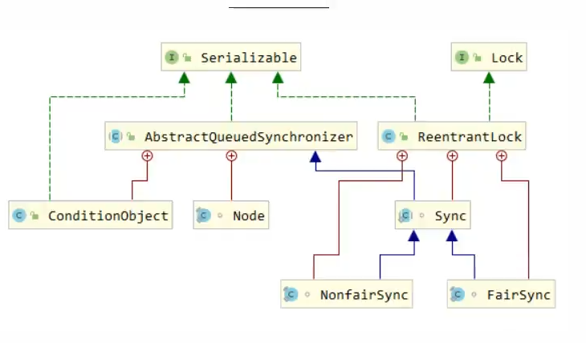


#### CountDownLatch


### 线程安全的集合

- 遗留的线程安全的集合

  HashTable，Vector

- 使用Collections装饰的线程安全的集合类

  ```java
  Collections.synchronizedList();
  Collections.synchronizedSet();
  Collections.synchronizedMap();
  ```

  内部实现也是加了synchronized实现

- JUC下的线程安全的集合类

  ConcurrentHashMap、CopyOnWriteArrayList，BlockingQueue

#### ConcurrentHashMap

##### 1.7 和 1.8中的区别

在JDK1.7中使用的是分段锁的形式。有一个Segment数组，Segment数组中的每一个位置上是一个HashEntry的数组。也就是说每一次锁住的是一段哈希数组。另外使用的数据结构式数组+链表


JDK1.8中使用的是synchronized + CAS的方式实现的。数据结构变为数组+链表+红黑树，每一次锁住的是一个哈希槽，锁的粒度相比1.7更低。


##### get方法

get方法比较简单，就是直接通过hash值计算下标然后取出数据。

如果找到的头节点的hash值为负数，说明正在扩容或者是红黑树的形式

在获取key哈希值的时候需要保证得到的hash值为正，因为负数的hash有特殊的含义，比如-1表示MOVED，需要扩容，-2表示树的根节点，-3表示RESERVED。

如何保证是正数呢？方法就是利用HashMap中的方法得到hash然后与0x7fffffff进行与运算。这样结果的第一位就是0，补码首位为0的一定是正数

```java
(h = key.hashCode()) ^ (h >>> 16) & 0x7fffffff
```


##### put方法

好不多说，直接上源码

```java
public V put(K key, V value) {
    return putVal(key, value, false);
}

/** Implementation for put and putIfAbsent */
final V putVal(K key, V value, boolean onlyIfAbsent) {
    // key 和 value 不能为空
    if (key == null || value == null) throw new NullPointerException();
    int hash = spread(key.hashCode());
    int binCount = 0;
    for (Node<K,V>[] tab = table;;) {
        // f = 目标位置元素
        Node<K,V> f; int n, i, fh;// fh 后面存放目标位置的元素 hash 值
        if (tab == null || (n = tab.length) == 0)
            // 数组桶为空，初始化数组桶（自旋+CAS)
            tab = initTable();
        else if ((f = tabAt(tab, i = (n - 1) & hash)) == null) {
            // 桶内为空，CAS 放入，不加锁，成功了就直接 break 跳出
            if (casTabAt(tab, i, null,new Node<K,V>(hash, key, value, null)))
                break;  // no lock when adding to empty bin
        }
        else if ((fh = f.hash) == MOVED)
            tab = helpTransfer(tab, f);
        else {
            V oldVal = null;
            // 使用 synchronized 加锁加入节点
            synchronized (f) {
                if (tabAt(tab, i) == f) {
                    // 说明是链表
                    if (fh >= 0) {
                        binCount = 1;
                        // 循环加入新的或者覆盖节点
                        for (Node<K,V> e = f;; ++binCount) {
                            K ek;
                            if (e.hash == hash &&
                                ((ek = e.key) == key ||
                                 (ek != null && key.equals(ek)))) {
                                oldVal = e.val;
                                if (!onlyIfAbsent)
                                    e.val = value;
                                break;
                            }
                            Node<K,V> pred = e;
                            if ((e = e.next) == null) {
                                pred.next = new Node<K,V>(hash, key,
                                                          value, null);
                                break;
                            }
                        }
                    }
                    else if (f instanceof TreeBin) {
                        // 红黑树
                        Node<K,V> p;
                        binCount = 2;
                        if ((p = ((TreeBin<K,V>)f).putTreeVal(hash, key,
                                                       value)) != null) {
                            oldVal = p.val;
                            if (!onlyIfAbsent)
                                p.val = value;
                        }
                    }
                }
            }
            if (binCount != 0) {
                if (binCount >= TREEIFY_THRESHOLD)
                    treeifyBin(tab, i);
                if (oldVal != null)
                    return oldVal;
                break;
            }
        }
    }
    addCount(1L, binCount);
    return null;
}
```

梳理一下大致的流程：

1. 计算key的哈希值
2. 判断是否需要初始化
3. 根据hash值定位key应该在的Node
4. 如果Node为空，就表示当前位置可以写入元素，就利用CAS的方式尝试写入，失败就自旋保证成功
5. 如果该Node的hash等于-1，就意味着需要进行扩容
6. 都不满足就利用synchronized锁写入数据
7. 对于链表形式，就以尾插法插入；如果是树形式（hash=-2），就执行红黑树的插入。插入完成之后判断是否需要进行树化，也是判断链表长度是不是大于8以及数组长度是不是大于64


#### CopyOnWriteArrayList

CopyOnWrite是一种写时复制技术的技术。允许并发的读操作，以及读写分离。实现方式就是进行写操作的时候先加上一个ReentrantLock，然后对原数组复制一份，对复制出来的这个数组进行写操作，完成后将新数组的引用返回给变量，就的数据就被丢弃了。

这样写与写之间会互斥，读与读之间并发，读与写之间是分离的，也是可以并发执行的。但是这种方式会造成短时间的不一致。

写操作

```java
public boolean add(E e) {
    final ReentrantLock lock = this.lock;
    lock.lock();
    try {
        Object[] elements = getArray();
        int len = elements.length;
        Object[] newElements = Arrays.copyOf(elements, len + 1);
        newElements[len] = e;
        setArray(newElements);
        return true;
    } finally {
        lock.unlock();
    }
}
```


#### LinkedBlockingQueue

不想看了。好像就是用了两把锁，一个锁住队头，一个锁住队尾。这样生产者和消费者之间是可以并发执行的。


### volatile关键字

保证了有序性，可见性

通过禁止指令重排序保证程序执行的有序性，

被volatile修饰的关键字，在读取和修改的时候都会直接在主存上进行，保证各个线程都能读取到最新的数据。

#### 如何保证变量的可见性？

在Java中volatile关键字可以保证变量的可见性，如果一个变量被volatile修饰，就表示这个变量是共享且不稳定的，每次都需要从主存中进行读取。

#### 如何禁止指令重排序？

通过插入特定的内存屏障


#### 可以保证原子性吗？

不可以。


### 什么是乐观锁和悲观锁？

#### 悲观锁

悲观锁总是假设最坏的情况，认为共享资源每次都会出现问题，所以在每一次访问共享资源的时候都加锁。同一时刻只有一个线程可以访问共享资源。像`synchronized`关键字就是悲观锁。

常用于写多读少的场景，避免频繁获得锁失败影响性能

#### 乐观锁

乐观锁总是假设最好的情况，认为共享资源每次访问的时候不会出现问题，访问的时候不需要加锁，只有在修改的时候去验证对应的资源是否被其他的线程修改过即可。

乐观锁可以使用CAS（Compare and Swap）以及版本号的方式实现。

常用于读多写少的情景，避免频繁加锁影响性能。

#### 如何实现乐观锁？

可以使用版本号以及CAS的方式实现

- 版本号

  一般在数据表的字段上加一个版本号字段，表示该数据被修改的次数。每次修改版本号都加1。如果有两个线程A，B都要修改一行数据。A先得到该行数据版本号为1，B也得到版本号为1。随后A对该行数据进行修改，同时版本号+1，此时版本号为2。B修改的时候发现版本号跟自己知道的版本号对不上，就知道这行数据已经被别人修改过了，就会放弃操作。

- CAS

  CAS全称是`Compare And Swap`，比较并交换。CAS的思想就是用预期值和要更新的变量值进行比较，如果相等就行更新。

  CAS操作是原子性的，底层依赖一条CPU指令。

  CAS涉及三个值，V，要更新的变量值，E，预期值，N，拟写入的新值

  当V = E的时候，用N更新V。如果不相等就认为其他的线程更新了该变量，就放弃更新。

  `Unsafe`类提供了CAS的操作，提供了compareAndSwapObject，compareAndSwapInt，compareAndSwaoLong等CAS方法。

  Unsafe类可以直接访问内存，类似于C语言的指针，大量使用可能造成错误，所以叫不安全类


#### 使用乐观锁存在哪些问题？

- ABA问题。

  一个线程1使用CAS方式的预期值是A，另外的线程2对该值进行了更新，更新为B，之后有更新为A。这样线程1得到变量值与预期值相等，认为没有被别的线程更新。但是实际上已经被更新了。

  解决方式就是另外追加版本号之类的标志。这样变量每被修改一次标志都会不一样。

- 循环时间开销大

  CAS的时候经常会使用自旋的方式不断重试，也就是不成功就会一直循环执行直到成功。如果长时间不成功，会浪费大量时间。

  

- CAS只能对单个变量有效

  可以使用原子引用，将多个需要使用CAS的变量放在一个对象里面，然后利用`AtomicReference`操作。


### synchronized关键字

#### 是什么？有什么用？

`synchronized`关键字是一种对象锁，用于是实现代码同步，解决多线程之间访问资源的同步性，可以保证被修饰的代码块或者方法在任意时刻只能由一个线程执行。保证了程序执行的原子性、有序性、可见性

`synchronized`可以用来修饰代码块，实例方法，静态方法等

1. 修饰实例方法

   需要获得当前对象的锁才可以访问

   ```java
   synchronized void method() {
       //业务代码
   }
   ```

   

2. 修饰静态方法

   会给当前类加锁，需要获得当前类对象（Class对象）才可以访问临界区

   ```java
   synchronized void method(){
       //业务代码
   }
   ```

   

3. 修饰代码块

   在括号中有两种情况。

   如果是this，也就是加了对象锁，如果是类.class，也就是类对象得锁

   ```java
   synchronized(this) {
       //业务代码
   }
   ```

   

#### 构造方法可以被synchronized修饰吗

构造方法本身就是线程安全的，不存在同步构造方法

#### 底层是如何实现的？

如果修饰的是方法，则会通过`ACC_SYNCHRONIZED`来辨别一个方法是不是同步方法

如果修饰的是代码块，会通过`monitorenter` 和 `monitorexit`指令实现。需要依赖`monitor`对象实现。

每一个Java对象的内存可以分为三个部分，对象头，实例数据和对齐填充。

对象头中包括Klass Pointor 类型指针，Mark Word 标记字段。在Mark Word中存储了对象自身运行的数据，如hashCode，分代年龄，锁状态标志，线程持有的锁，偏向线程ID等。


每一个Java对象都会关联一个ObjectMonitor对象。Monitor对象中有EntryList，WaitSet两个队列，用来保存对象列表，有一个Owner属性，指向当前持有锁的线程。

ObjectMonitor对象中有一些属性：

两个同步队列：cxq，EntryList，一个等待队列：waitSet，还有就是Owner表示持有锁的线程，count记录重入次数


#### 对于synchronized有哪些优化措施？

自旋锁，自适应自旋锁，锁消除，锁粗化，偏向锁，轻量级锁，重量级锁

##### 自旋锁

需要不断的循环重试获取锁，自选等待本身虽然避免了线程切换的开销，但是会占用CPU时间，造成CPU空转，所以自旋有一定的次数上限，超过上限还没有获得锁就会以传统的方式挂起线程。自旋次数默认值是10


##### 自适应自旋

对自旋锁的改进，自旋的次数不再是一个固定值，而是由前一次在同一个锁上的自旋时间以及锁的拥有者的状态来决定。

如果在同一个锁对象上，自旋等待刚刚成功获得过锁，并且持有锁的线程正在运行中，就说明这一次自旋很大可能可以获得锁，就会重试更多的次数。

如果在一个锁对象上很少成功获得锁，就会减少自旋次数甚至直接跳过自旋等待的过程。


##### 锁消除

锁消除指的就是虚拟机即时编译器在运行时，对一些代码要求同步，但是对被检测到这些代码不可能出现共享数据竞争的锁进行消除。锁消除的主要判定依据拉源于逃逸分析的数据支持。


##### 锁粗化

在编写代码时，总是推荐将同步块的作用范围限制的尽可能小，这样是为了使得需要同步的操作数尽可能变少，即使存在锁竞争，等待锁的线程也能尽可能快地得到锁。

但是如果虚拟机检测到有这样一串零碎地操作都对同一个对象加锁，将会把加锁同步地范围扩展（粗化）到整个操作序列地外部，这样只需要加一次锁，避免频繁加锁和解锁。


##### 轻量级锁

使用CAS的方式消除同步原语。轻量级锁提升性能的依据就是“对于绝大多数的锁，在整个同步周期内都是不存在竞争的”

一个线程去获取非加锁状态的对象锁（01），虚拟机会现在当前线程的栈帧中创建一个锁记录(Lock Record)的空间，用来存放锁对象的Mark Word的副本（Displaced Mark Word）。

然后使用CAS的方式尝试将锁对象的Mark Word替换为执行这个Lock Record的指针。如果更新成功，就意味着这个线程获得了锁，并且锁对象的锁标记位变为00。

如果更新失败，就以为者至少存在一个线程与当前线程竞争获取该对象的锁。如果Mark Word中的指针指向当前线程的栈帧，就以为这当前线程以及获得了锁，可以直接进入。如果不是，就意味着发生了锁竞争，就会膨胀为重量级锁。

##### 偏向锁

偏向锁地目的是消除数据在无竞争情况下地同步原语。相比轻量级锁使用CAS来消除同步原语，偏向锁就是在无竞争地情况下连CAS的操作都不需要。

首先需要通过虚拟机设置开启偏向锁。

在锁对象的Mark Word中，如果锁标记为01，表示未锁定，偏向模式设置为1，表示可偏向。这是锁对象第一次被线程获取的时候，会通过CAS的方式，将线程ID记录在锁对象的Mark Word中。如果CAS成功，之后持有锁的线程可以直接进入这个锁相关的同步代码块。

如果有其他的线程希望获取锁，偏向模式就会结束。根据当前锁的状态来确定是否撤销偏向（偏向模式设置为0），撤销后标志位恢复到未锁定状态（01）或者轻量级锁状态（00）

需要注意一点：

当对象调用了Object::hashCode()方法之后，就无法进入偏向状态了。因为会记录对象的hashCode，也就无法记录偏向的线程ID了。

对于处于偏向锁状态的对象，调用hashCode()方法之后会进入重量级锁状态。对象头中保存了指向的ObjectMonitor对象的指针，也就是说ObjectMonitor中有字段保存了非加锁状态下对象的Mark Word，自然可以获得hashCode的值


### synchronized和ReentrantLock的具体区别？

- 从底层实现来说，synchronized是JVM层面的锁，ReentrantLock是API层面的锁

- synchronized不需要手动释放锁，而ReentrantLock需要手动释放锁

- sync是非公平锁，ReentrantLock可以选择是公平锁还是非公平锁

- sync不可以绑定条件Condition，但是ReentrantLock可以绑定条件实现精确唤醒，不会像sync一样要么随机唤醒，要么全部唤醒

- 锁住的对象不同，sync锁住的是对象，因为锁是保存在对象头里面的，根据锁对象头数据来标识是否有线程获得锁

  ReentrantLock锁住的线程，根据进入的线程和int类型的state标识锁的获得和争抢


### 什么是公平锁？什么是非公平锁？

公平锁就是锁被释放之后先申请的线程能先得到锁资源，

非公平锁就是锁被释放后，先申请的线程不一定先得到锁，可能随机或者使用其他优先级进行排序。

ReentrantLock可以作为公平锁也可以作为非公平锁。

synchronized是非公平锁


### 什么是可重入锁？

可重入锁就是指线程可以再次获得自己持有的锁。比如某个线程得到了锁资源，在锁没有释放的时候想再次得到锁资源是可以得到的。synchronized和ReentrantLock都是可重入锁


### 可中断锁和不可中断锁？

可中断锁就是获取锁的过程不用一直等待，不需要等到获得锁之后才能进行其他的操作。ReentrantLock是可中断锁

不可中断锁就是指线程一旦申请了锁，就必须等到获得锁资源才可以进行其他操作。synchronized就是不可中断锁

### 实现线程安全的方式有哪些？

1. 互斥同步

   也就是加上互斥锁，synchronized或者ReentrantLock

2. 非互斥同步

   通常就是使用CAS的方式

3. 无同步方案

   使用可重入代码（不调用全局变量、存储在堆上的数据和公用的系统资源，用到的状态量全部由方法参数传入，不调用非可重入方法）或者线程本地存储（Therad Local Storage）


### ThreadLoacl

#### 什么是ThreadLoacl？有什么用？

通常情况下我们创建的变量是可以被所有线程所共享并修改的。如果我们想每一个线程都有自己的专属本地变量就需要使用ThreadLoacl实现。ThreadLoacl可以比喻为一个存放数据的盒子，盒子中可以存放每个线程的私有数据。

创建一个ThreadLoacl变量之后每一个访问这个变量的线程都会有这个变量的本地副本，可以使用`get() set()`方法来读取 修改保存的本地副本的值

#### ThreadLoacl的实现原理？

在Thread中有两个变量ThreadLocal.ThreadLocalMap 

```java
public class Thread implements Runnable {
    //......
    //与此线程有关的ThreadLocal值。由ThreadLocal类维护
    ThreadLocal.Threa dLocalMap threadLocals = null;

    //与此线程有关的InheritableThreadLocal值。由InheritableThreadLocal类维护
    ThreadLocal.ThreadLocalMap inheritableThreadLocals = null;
    //......
}
```


```
ThreadLocal存放在堆中，多个线程共享这个ThreadLoacl。每一个Thread也就是每一个线程都有自己的ThreadLoaclMap，以ThreadLocal为键，保存的内容为值。虽然是多个线程共享ThradLoacl，但是由于每个线程都有自己的ThreadLocal，所以多个线程之间是隔离的。


不过我不太懂既然每一个线程都有自己的ThreadLocalMap，那么为什么还要使用ThreadLocal来操作这个map呢
```


ThreadLoaclMap是ThreadLoacl的内部类，但是ThreadLocalMap是Thread的成员变量。这种设计感觉比较奇怪。


#### ThreadLoacl的内存泄露问题

无论Entry是强引用还是弱引用，都会导致内存泄漏问题。

导致这个问题的原因在于，在使用完ThreadLoacl之后没有及时进行remove，还有一点就是如果线程还在运行，那么线程中还会保存ThreadLocalMap的引用，ThreadLocalMap中也会保存Entry的引用，

避免内存泄漏的方法：

- 使用完ThreadLocal之后及时remove对应的Entry
- 使用完ThreadLocal之后，当前Thread也随之运行结束


#### ThreadLocal如何解决Hash冲突问题？

ThreadLocal使用线性探测法解决Hash冲突。也就是会先根据key的哈希值确定一个数组下标。如果发现这个位置已经被其他的元素占用了，则利用固定的算法寻找一定步长的下一个位置，直到找到能存放的位置。在ThreadLocal中的步长就是1


### 线程池

并不推荐使用`Executors` 去创建线程池，推荐使用`ThreadPoolExecutor`，这样可以让写代码的人知道线程池的运行规则

#### 为什么使用线程池

- 降低资源消耗

  通过重复利用已经创建的线程降低线程创建和销毁造成的开销

- 提高响应速度

  当任务到达时，无需等待线程创建直接就可以执行

- 提高线程的可管控性

  线程不能被无限创建，使用线程池可以对线程进行统一管理

#### 如何创建线程池

1. 通过ThreadPoolExecutor的构造方法创建
2. 通过Executors创建

#### 创建线程池的参数

以利用`ThreadPoolExecutor`的无参构造为例介绍创建线程池需要的参数

```java
public ThreadPoolExecutor(int corePoolSize,
                          int maximumPoolSize,
                          long keepAliveTime,
                          TimeUnit unit,
                          BlockingQueue<Runnable> workQueue,
                          ThreadFactory threadFactory,
                          RejectedExecutionHandler handler) {
	//。。。
}
```

- `corePoolSize` 核心线程大小

  线程池中会维护一个最小的线程数量，即使这些线程处于空闲状态，他们也不会被销毁，除非设置了`allowCoreThreadTimeOut`

- `maximumPoolSize` 最大线程数

  一个任务提交到线程池后，首先会缓存到工作队列中，如果工作队列满了，则会创建一个新线程，然后从工作队列中取出一个任务交给新线程处理。将刚刚新提交的任务放入工作队列中。不过线程池不会无限制地创建新线程，有一个最大线程数量地限制，这个数量由`maximunPoolSize`决定。

- `keepAliveTime` 空闲线程存活时间

  一个线程处于空闲状态，且当前线程的数量大于`corePoolSize`，那么在指定时间后，这个空闲的线程会被销毁。

- `unit` 存活时间单位

- `workQueue` 工作队列

  - `ArrayBlockingQueue`：基于数组的有界阻塞队列

    按照FIFO的规则，新任务进来，放在队尾，等待调度。

    有界数组可以防止资源耗尽的问题。当线程池中的线程数量达到`corePoolSize`后，再有新任务进来则会将任务放入队列的队尾，等待调度。如果队列已经满了，则新建一个进程并取出一个任务去执行，将新提交的任务放入队列中。如果线程数量已经达到`maximunPoolSize`则会执行拒绝策略。

    

  - `LinkedBlockingQueue`：基于链表的无界阻塞队列

    最大容量为`Integer.MAX_VALUE`,按照FIFO的顺序。

    当线程数量达到`corePoolSize`之后，如果还有新任务进来，会放入队列中，不会再创建新的线程。此种情况下`maximunPoolSize`不起作用

  - `SynchronousQueue`：不缓存任务的阻塞队列

    不存储元素的阻塞队列，生产者放入一个进程必须等待消费者取出。

  - `PriorityBlockingQueue`：具有优先级的无界阻塞队列

    具有优先级的无界阻塞队列，优先级可以通过`Comparator`实现

- `threadFactory` 线程工厂

  创建一个新线程的时候，可以用来设定线程名，是否为`daemon`等

- `handler` 拒绝策略

  - AbortPolicy

    默认策略，直接丢弃任务并抛出`RejectedExecutionException`异常
  
  - CallerRunsPolicy
  
    由生产者进程去执行该任务
  
  - Discardpolicy
  
    直接丢弃
  
  - DiscardOldestPolicy
  
    丢弃进入队列最早的任务，尝试把该任务加入队列


#### 线程池原理

#### `execute`方法

```java
/*
	*源码中的一段注释
     * Proceed in 3 steps:
     *
     * 1. If fewer than corePoolSize threads are running, try to
     * start a new thread with the given command as its first
     * task.  The call to addWorker atomically checks runState and
     * workerCount, and so prevents false alarms that would add
     * threads when it shouldn't, by returning false.
     *
     * 2. If a task can be successfully queued, then we still need
     * to double-check whether we should have added a thread
     * (because existing ones died since last checking) or that
     * the pool shut down since entry into this method. So we
     * recheck state and if necessary roll back the enqueuing if
     * stopped, or start a new thread if there are none.
     *
     * 3. If we cannot queue task, then we try to add a new
     * thread.  If it fails, we know we are shut down or saturated
     * and so reject the task.
     */

// 执行命令，其中命令（下面称任务）对象是Runnable的实例
public void execute(Runnable command) {
    // 判断命令（任务）对象非空
    if (command == null)
        throw new NullPointerException();
    // 获取ctl的值
    int c = ctl.get();
    // 判断如果当前工作线程数小于核心线程数，则创建新的核心线程并且执行传入的任务
    if (workerCountOf(c) < corePoolSize) {
        if (addWorker(command, true))
            // 如果创建新的核心线程成功则直接返回
            return;
        // 这里说明创建核心线程失败，需要更新ctl的临时变量c
        c = ctl.get();
    }
    // 走到这里说明创建新的核心线程失败，也就是当前工作线程数大于等于corePoolSize
    // 判断线程池是否处于运行中状态，同时尝试用非阻塞方法向任务队列放入任务（放入任务失败返回false）
    if (isRunning(c) && workQueue.offer(command)) {
        int recheck = ctl.get();
        // 这里是向任务队列投放任务成功，对线程池的运行中状态做二次检查
        // 如果线程池二次检查状态是非运行中状态，则从任务队列移除当前的任务调用拒绝策略处理之（也就是移除前面成功入队的任务实例）
        if (! isRunning(recheck) && remove(command))
            // 调用拒绝策略处理任务 - 返回
            reject(command);
        // 走到下面的else if分支，说明有以下的前提：
        // 0、待执行的任务已经成功加入任务队列
        // 1、线程池可能是RUNNING状态
        // 2、传入的任务可能从任务队列中移除失败（移除失败的唯一可能就是任务已经被执行了）
        // 如果当前工作线程数量为0，则创建一个非核心线程并且传入的任务对象为null - 返回
        // 也就是创建的非核心线程不会马上运行，而是等待获取任务队列的任务去执行 
        // 如果前工作线程数量不为0，原来应该是最后的else分支，但是可以什么也不做，因为任务已经成功入队列，总会有合适的时机分配其他空闲线程去执行它
        else if (workerCountOf(recheck) == 0)
            addWorker(null, false);
    }
    // 走到这里说明有以下的前提：
    // 0、线程池中的工作线程总数已经大于等于corePoolSize（简单来说就是核心线程已经全部懒创建完毕）
    // 1、线程池可能不是RUNNING状态
    // 2、线程池可能是RUNNING状态同时任务队列已经满了
    // 如果向任务队列投放任务失败，则会尝试创建非核心线程传入任务执行
    // 创建非核心线程失败，此时需要拒绝执行任务
    else if (!addWorker(command, false))
        // 调用拒绝策略处理任务 - 返回
        reject(command);
}

```


简单分析下整个流程：

1. 如果当前工作线程的个数小于核心线程数，则创建新的核心线程（`addWorker(coomond,true)`）

2. 如果当前工作线程总数大于等于核心线程数，首先判断先乘除是否处于运行状态，同时尝试使用非阻塞方式向任务队列中放入任务。

   这一步会二次检查线程池运行状态，如果当前工作线程数为0，则创建一个非核心线程并传入一个空的任务对象

3. 如果向任务队列中放任务失败了，则会尝试创建非核心线程并传入当前任务

   创建失败就执行拒绝策略

`execute`方法的执行流程图


#### `addWorker`方法

```java
// 添加工作线程，如果返回false说明没有新创建工作线程，如果返回true说明创建和启动工作线程成功
private boolean addWorker(Runnable firstTask, boolean core) {
    retry:  
    // 注意这是一个死循环 - 最外层循环
    for (int c = ctl.get();;) {
        // 这个是十分复杂的条件，这里先拆分多个与（&&）条件：
        // 1. 线程池状态至少为SHUTDOWN状态，也就是rs >= SHUTDOWN(0)
        // 2. 线程池状态至少为STOP状态，也就是rs >= STOP(1)，或者传入的任务实例firstTask不为null，或者任务队列为空
        // 其实这个判断的边界是线程池状态为shutdown状态下，不会再接受新的任务，在此前提下如果状态已经到了STOP、或者传入任务不为空、或者任务队列为空（已经没有积压任务）都不需要添加新的线程
        if (runStateAtLeast(c, SHUTDOWN)
            && (runStateAtLeast(c, STOP)
                || firstTask != null
                || workQueue.isEmpty()))
            return false;
        // 注意这也是一个死循环 - 二层循环
        for (;;) {
            // 这里每一轮循环都会重新获取工作线程数wc
            // 1. 如果传入的core为true，表示将要创建核心线程，通过wc和corePoolSize判断，如果wc >= corePoolSize，则返回false表示创建核心线程失败
            // 1. 如果传入的core为false，表示将要创非建核心线程，通过wc和maximumPoolSize判断，如果wc >= maximumPoolSize，则返回false表示创建非核心线程失败
            if (workerCountOf(c)
                >= ((core ? corePoolSize : maximumPoolSize) & COUNT_MASK))
                return false;
            // 成功通过CAS更新工作线程数wc，则break到最外层的循环
            if (compareAndIncrementWorkerCount(c))
                break retry;
            // 走到这里说明了通过CAS更新工作线程数wc失败，这个时候需要重新判断线程池的状态是否由RUNNING已经变为SHUTDOWN
            c = ctl.get();  // Re-read ctl
            // 如果线程池状态已经由RUNNING已经变为SHUTDOWN，则重新跳出到外层循环继续执行
            if (runStateAtLeast(c, SHUTDOWN))
                continue retry;
            // 如果线程池状态依然是RUNNING，CAS更新工作线程数wc失败说明有可能是并发更新导致的失败，则在内层循环重试即可 
            // else CAS failed due to workerCount change; retry inner loop 
        }
    }
    // 标记工作线程是否启动成功
    boolean workerStarted = false;
    // 标记工作线程是否创建成功
    boolean workerAdded = false;
    Worker w = null;
    try {
        // 传入任务实例firstTask创建Worker实例，Worker构造里面会通过线程工厂创建新的Thread对象，所以下面可以直接操作Thread t = w.thread
        // 这一步Worker实例已经创建，但是没有加入工作线程集合或者启动它持有的线程Thread实例
        w = new Worker(firstTask);
        final Thread t = w.thread;
        if (t != null) {
            // 这里需要全局加锁，因为会改变一些指标值和非线程安全的集合
            final ReentrantLock mainLock = this.mainLock;
            mainLock.lock();
            try {
                // Recheck while holding lock.
                // Back out on ThreadFactory failure or if
                // shut down before lock acquired.
                int c = ctl.get();
                // 这里主要在加锁的前提下判断ThreadFactory创建的线程是否存活或者判断获取锁成功之后线程池状态是否已经更变为SHUTDOWN
                // 1. 如果线程池状态依然为RUNNING，则只需要判断线程实例是否存活，需要添加到工作线程集合和启动新的Worker
                // 2. 如果线程池状态小于STOP，也就是RUNNING或者SHUTDOWN状态下，同时传入的任务实例firstTask为null，则需要添加到工作线程集合和启动新的Worker
                // 对于2，换言之，如果线程池处于SHUTDOWN状态下，同时传入的任务实例firstTask不为null，则不会添加到工作线程集合和启动新的Worker
                // 这一步其实有可能创建了新的Worker实例但是并不启动（临时对象，没有任何强引用），这种Worker有可能成功下一轮GC被收集的垃圾对象
                if (isRunning(c) ||
                    (runStateLessThan(c, STOP) && firstTask == null)) {
                    if (t.isAlive()) // precheck that t is startable
                        throw new IllegalThreadStateException();
                    // 把创建的工作线程实例添加到工作线程集合
                    workers.add(w);
                    int s = workers.size();
                    // 尝试更新历史峰值工作线程数，也就是线程池峰值容量
                    if (s > largestPoolSize)
                        largestPoolSize = s;
                    // 这里更新工作线程是否启动成功标识为true，后面才会调用Thread#start()方法启动真实的线程实例
                    workerAdded = true;
                }
            } finally {
                mainLock.unlock();
            }
            // 如果成功添加工作线程，则调用Worker内部的线程实例t的Thread#start()方法启动真实的线程实例
            if (workerAdded) {
                t.start();
                // 标记线程启动成功
                workerStarted = true;
            }
        }
    } finally {
        // 线程启动失败，需要从工作线程集合移除对应的Worker
        if (! workerStarted)
            addWorkerFailed(w);
    }
    return workerStarted;
}

// 添加Worker失败
private void addWorkerFailed(Worker w) {
    final ReentrantLock mainLock = this.mainLock;
    mainLock.lock();
    try {
        // 从工作线程集合移除之
        if (w != null)
            workers.remove(w);
        // wc数量减1    
        decrementWorkerCount();
        // 基于状态判断尝试终结线程池
        tryTerminate();
    } finally {
        mainLock.unlock();
    }
}

```


## 多线程设计模式

### 两阶段终止模式

解决如何优雅的解决其他线程

```java
// 测试两阶段终止
class MyMonitor{
    Thread monitor;

    public void start(){
        monitor = new Thread(()->{
           System.out.println("开始执行监控");
           while(true) {
               Thread current = Thread.currentThread();
               if(current.isInterrupted()){
                   System.out.println("执行终止的操作");
                   break;
               }
               try {
                   // 如果在sleep期间打断，不会记录打断标记
                   Thread.sleep(1000);
                   // 如果在正常执行期间打断，会记录打断标记
                   System.out.println("正在监控");
               } catch (InterruptedException e) {
                   e.printStackTrace();
                   // 在调用一次打断方法，确保sleep情况下的打断也会有打断标记
                   current.interrupt();
               }
           }
            System.out.println("监控已经关闭");
        });
        monitor.start();
    }

    public void stop(){
        monitor.interrupt();
    }

    public static void main(String[] args) {
        MyMonitor myMonitor = new MyMonitor();
        myMonitor.start();
        try {
            Thread.sleep(2234);
        } catch (InterruptedException e) {
            e.printStackTrace();
        }
        myMonitor.stop();
    }
}
```


### 保护性暂停

用于一个线程等待另一个线程的执行结果。

join也可以实现一个线程等待另一个线程的结果，但是使用join必须是一个线程运行结束之后才会唤醒其他的线程，使用wait-notify的话，一个线程生成了结果并唤醒等待的线程后，还可以继续执行其他的事情，不是说必须运行完才会唤醒

```java
// 保护性暂停
class GuardedObject{
    // 结果
    private Object response;

    public Object getResponse(){
        // 获得当前对象锁
        synchronized (this){
            while(response == null){
                // 没有结果就继续等待
                System.out.println("还没获得结果，等待一会");
                try {
                    this.wait();
                } catch (InterruptedException e) {
                    e.printStackTrace();
                }
            }
        }
        return response;
    }
	
    // 有超时时间的保护性暂停
    public Object getResponse(long timeout){
        // 获得当前对象锁
        synchronized (this){
            // 开始时间
            long start = System.currentTimeMillis();
            // 经历的时间
            long passedTime = 0;
            while(response == null){
                if(passedTime > timeout){
                    System.out.println("超过时间了");
                    break;
                }
                // 没有结果就继续等待
                System.out.println("还没获得结果，等待一会");
                try {
                    this.wait(timeout - passedTime);
                } catch (InterruptedException e) {
                    e.printStackTrace();
                }
                // 重新计算经历的时间
                passedTime = System.currentTimeMillis() - start;
            }
        }
        return response;
    }
    
    public void setResponse(){
        synchronized (this){
            System.out.println("结果已经设置了，可以唤醒等待结果的线程了");
            response = new Object();
            // 唤醒等待的线程
            this.notifyAll();
        }
    }

    public static void main(String[] args) {
        GuardedObject guardedObject = new GuardedObject();
        // 线程t1等待线程t2的运行结果
        new Thread(()->{
            System.out.println(guardedObject.getResponse());
        },"t1").start();

        new Thread(()->{
            try {
                // 模拟生成结果的耗时
                Thread.sleep(2000);
            } catch (InterruptedException e) {
                e.printStackTrace();
            }
            guardedObject.setResponse();
        },"t2").start();

    }
}
```


join方法的实现原理就是使用了保护性暂停


### 生产者消费者

```java
class MyMessageQueue{
    private Deque<Message> queue = new LinkedList<>();
    private int capacity;

    public MyMessageQueue(int capacity){
        this.capacity = capacity;
    }

    public Message get(){
        synchronized (queue){
            while(queue.isEmpty()){
                // 队列为空的时候就等待
                System.out.println(Thread.currentThread().getName() + "没有消息，等待一下");
                try {
                    queue.wait();
                } catch (InterruptedException e) {
                    e.printStackTrace();
                }
            }

            Message message = queue.pollFirst();
            System.out.println(Thread.currentThread().getName() + "取出了一条消息" + message.getId());
            // 取出了一个消息，通知等待的线程
            queue.notifyAll();
            return message;
        }
    }

    public void put(Message message){
        synchronized (queue){
            while(queue.size() == capacity){
                System.out.println(Thread.currentThread().getName() + "消息满了，等待一下");
                // 队列满了就等待
                try {
                    queue.wait();
                } catch (InterruptedException e) {
                    e.printStackTrace();
                }
            }
            System.out.println(Thread.currentThread().getName() + "添加了一条消息");
            // 添加了一条消息，唤醒等待的线程
            queue.addLast(message);
            queue.notifyAll();
        }
    }

    public static void main(String[] args) {
        MyMessageQueue myMessageQueue = new MyMessageQueue(2);
        // 一个线程不断的获取消息
        new Thread(()->{
            while(true){
                myMessageQueue.get();
            }
        }).start();

        // 10个线程去生产消息
        for (int i = 0; i < 10; i++) {
            int finalI = i;
            new Thread(()->{
                myMessageQueue.put(new Message(finalI + 1,new Object()));
            }).start();
        }
    }

}

final class Message{
    private int id;
    private Object message;

    public Message(int id, Object message) {
        this.id = id;
        this.message = message;
    }

    public int getId() {
        return id;
    }

    public Object getMessage() {
        return message;
    }

    @Override
    public String toString() {
        return "Message{" +
                "id=" + id +
                ", message=" + message +
                '}';
    }
}
/*
执行结果
Thread-0没有消息，等待一下
Thread-1添加了一条消息
Thread-0取出了一条消息1
Thread-0没有消息，等待一下
Thread-3添加了一条消息
Thread-2添加了一条消息
Thread-6消息满了，等待一下
Thread-0取出了一条消息3
Thread-0取出了一条消息2
Thread-0没有消息，等待一下
Thread-5添加了一条消息
Thread-4添加了一条消息
Thread-9消息满了，等待一下
Thread-10消息满了，等待一下
Thread-0取出了一条消息5
Thread-0取出了一条消息4
Thread-0没有消息，等待一下
Thread-6添加了一条消息
Thread-8添加了一条消息
Thread-7消息满了，等待一下
Thread-0取出了一条消息6
Thread-0取出了一条消息8
Thread-0没有消息，等待一下
Thread-10添加了一条消息
Thread-9添加了一条消息
Thread-0取出了一条消息10
Thread-0取出了一条消息9
Thread-0没有消息，等待一下
Thread-7添加了一条消息
Thread-0取出了一条消息7
Thread-0没有消息，等待一下
*/
```


### 固定顺序运行

要求多个线程按照一定的顺序运行，比如要求一个线程先打印2，然后另一个线程打印1

```java
class TestSync{
    // 判断线程2是否结束
    static boolean isT2Finished = false;
    static Object lock = new Object();
    // 使用wait-notify完成（await-signal相似）
    public static void main(String[] args) {
        Thread t1 = new Thread(() -> {
            synchronized (lock){
                // 线程2没有结束就等待
                while(!isT2Finished){
                    try {
                        lock.wait();
                    } catch (InterruptedException e) {
                        e.printStackTrace();
                    }
                }
                // 结束等待就意味着线程2结束了，可以打印1
                System.out.println(1);
            }
        }, "t1");

        Thread t2 = new Thread(() -> {
            synchronized (lock){
                System.out.println(2);
                // 设置结束标志 同时唤醒等待线程
                isT2Finished = true;
                lock.notifyAll();
            }
        }, "t2");
        
        t1.start();
        t2.start();
    }

    // 通过park-unpark实现
    // 线程1调用park然后输出1，线程2先输出2在调用unpark
    // 如果线程1先执行，会park。等线程2执行完unpark线程1才会继续执行
    // 如果线程2先执行，输出2之后线程1的park无效，输出1
    public static void main2(String[] args) {
        Thread t1 = new Thread(() -> {
            LockSupport.park();
            System.out.println(1);
        }, "t1");

        Thread t2 = new Thread(() -> {
            System.out.println(2);
            LockSupport.unpark(t1);
        }, "t2");
        t1.start();
        t2.start();
    }
}
```

### 多线程交替执行

比如三个线程交替输出1，2，3，4，5，6...，即线程1输出1，4，7 线程2输出2，5，8，线程3输出3，6，9

使用synchrnoized的wait-notify实现

```java
class WaitNotify{
    private int flag = 1;
    private int loopNum;

    public void print(int curFlag){
        for (int i = 0; i < loopNum; i++) {
            synchronized (this){
                while(flag != curFlag){
                    try {
                        this.wait();
                    } catch (InterruptedException e) {
                        e.printStackTrace();
                    }
                }
                System.out.println(flag);
                flag = flag + 1 > 3 ? 1 : flag + 1;
                this.notifyAll();
            }
        }
    }

    public static void main(String[] args) {
        WaitNotify waitNotify = new WaitNotify();
        waitNotify.loopNum = 3;
        new Thread(()->{
            waitNotify.print(1);
        }).start();

        new Thread(()->{
            waitNotify.print(2);
        }).start();

        new Thread(()->{
            waitNotify.print(3);
        }).start();
    }
}
```

使用ReentrantLock的条件等待实现

```java
class TestAwaitSignal {
    private static int loopNum;
    private static ReentrantLock lock = new ReentrantLock();

    public static void print(String str,Condition cur,Condition next) {
        for (int i = 0; i < loopNum; i++) {
            lock.lock();
            try {
                cur.await();
                System.out.println(str);
                next.signalAll();
            } catch (InterruptedException e) {
                e.printStackTrace();
            } finally {
                lock.unlock();
            }
        }
    }

    public static void main(String[] args) {
        loopNum = 3;
        Condition condition1 = lock.newCondition();
        Condition condition2 = lock.newCondition();
        Condition condition3 = lock.newCondition();

        new Thread(() -> {
            print("a",condition1,condition2);
        }).start();
        new Thread(() -> {
            print("b",condition2,condition3);
        }).start();
        new Thread(() -> {
            print("c",condition3,condition1);
        }).start();

        lock.lock();
        try{
            condition1.signalAll();
        }finally {
            lock.unlock();
        }
    }
}
```


使用LockSupport的park-unpark完成

```java
class TestParkUnPark{
    private static int loopNum = 3;
    public static void print(String str,Thread next){
        for (int i = 0; i < loopNum; i++) {
            LockSupport.park();
            System.out.println(str);
            LockSupport.unpark(next);
        }
    }
    public static Thread t1;
    public static Thread t2;
    public static Thread t3;

    public static void main(String[] args) {
        t1 = new Thread(() -> {
            print("a",t2);
        });
        t2 = new Thread(() -> {
            print("b",t3);
        });
        t3 = new Thread(() -> {
            print("c",t1);
        });
        t1.start();
        t2.start();
        t3.start();

        LockSupport.unpark(t1);
    }
}
```


三个线程交替打印1~100

```java
// 两个线程打印1~100
class Test1{
    static int num = 1;
    static int flag = 1;
    static Object lock = new Object();
    static void print(int cur){
        while(num < 100){
            synchronized (lock){
                while(cur != flag){
                    try {
                        lock.wait();
                    } catch (InterruptedException e) {
                        e.printStackTrace();
                    }
                }
                if(num <= 100){
                    System.out.println(Thread.currentThread().getName() + " " +num++);
                }
                flag = flag + 1 > 3 ? 1 : flag + 1;
                lock.notifyAll();
            }
        }
    }
    public static void main(String[] args) {
        new Thread(()->{
            print(1);
        },"t1").start();
        new Thread(()->{
            print(2);
        },"t2").start();
        new Thread(()->{
            print(3);
        },"t3").start();
    }
}
```


### 享元模式

对相同的对象进行共享。当需要修改的时候就会创建新的对象。

#### 体现

##### 包装类

包种类中都有一种缓存机制（除了Float 和 Double）

这些包装类会缓存一个字节的数据，在调用valueOf的时候，也就是自动装箱的时候，会检查数据是不是缓存范围内的数据，对于Integer来说就是-128~127，这时会使用缓存中的对象。


```java
// 模拟连接池
class MyConnectionPool{
    private MockConnection[] connections;
    private AtomicIntegerArray states;
    private final int capacity = 3;

    public MyConnectionPool(){
        connections = new MockConnection[capacity];
        states = new AtomicIntegerArray(new int[capacity]);
        for (int i = 0; i < capacity; i++) {
            connections[i] = new MockConnection("mockConnection-" + i);
        }
    }

    public MockConnection borrow(){
        while(true){
            for (int i = 0; i < states.length(); i++) {
                if(states.get(i) == 0){
                    states.compareAndSet(i,0,1);
                    System.out.println(Thread.currentThread().getName() + " 获得连接：" + connections[i]);
                    return connections[i];
                }
            }
            // 没有空闲连接就等待一下
            synchronized (this){
                try {
                    System.out.println(Thread.currentThread().getName() + " 没有连接，等待一下");
                    this.wait();
                } catch (InterruptedException e) {
                    e.printStackTrace();
                }
            }
        }

    }

    public void free(MockConnection connection){
        for (int i = 0; i < capacity; i++) {
            if(connection == connections[i]){
                System.out.println(Thread.currentThread().getName() + " 成功归还连接 " + connection);
                states.set(i,0);
                synchronized (this){
                    this.notifyAll();
                }
                break;
            }
        }
    }

    public static void main(String[] args) {
        MyConnectionPool myConnectionPool = new MyConnectionPool();
        for (int i = 0; i < 5; i++) {
            new Thread(()->{
                MockConnection borrow = myConnectionPool.borrow();
                try {
                    Thread.sleep(new Random().nextInt(1500));
                } catch (InterruptedException e) {
                    e.printStackTrace();
                }
                myConnectionPool.free(borrow);
            },"t" + i).start();
        }
    }
}
class MockConnection{
    String name;

    public MockConnection(String name) {
        this.name = name;
    }

    @Override
    public String toString() {
        return "MockConnection{" +
                "name='" + name + '\'' +
                '}';
    }
}
```


## JDK8的新特性

### Lambda表达式


### Stream流


### functional interface函数式接口

接口上使用`@FunctionalInterface`就表示这个接口是一种函数式接口。函数式接口只能有一个抽象方法

常用的函数式接口有四种

- Supplier

  ```java
  // 无参有返回值
  // 作用是获取一个元素
  T get();
  ```

- Consumer

  ```java
  // 有参无返回值
  // 作用是消费一个元素
  void accept(T t);
  ```

- Predicate

  ```java
  // 有参数，返回一个布尔值
  // 作用是判断一个元素
  boolean test(T t);
  ```

- Function

  ```java
  // 有参有返回值
  // 作用是通过一个参数T获得R
  R apply(T t);
  ```

  

## JVM

### Java内存区域

在JDK1.8中运行区域包括线程共享的、线程私有的以及直接内存。

线程共享的区域包括堆、方法区

线程私有的区域包括程序计数器、本地方法栈、虚拟机栈


- 程序计数器

  

- 虚拟机栈

  除了一些本地方法是通过本地方法栈调用的之外，Java中其他所有的方法调用都是使用栈来实现的。

  方法调用的数据需要通过栈进行传递，每一次方法调用都会有一个对应的栈帧被压入栈中，每一个方法调用结束后都会有一个栈帧被弹出

  栈是由一个个的栈帧组成，每个栈帧都拥有局部变量表，操作数栈，动态链接，方法返回地址。

  

  - 局部变量表

    主要存放了编译器可知的各种数据类型与对象引用等

  - 操作数栈

    主要作为方法调用的中转站使，用于存放方法执行过程中产生的计算结果。

  - 动态链接

  - 方法返回地址

- 本地方法栈

  为虚拟机使用到的Native方法服务

- 堆

  Java虚拟机所管理的内存最大的一部分，Java堆是所有线程共享的一块内存区域，此区域的唯一目的就是存放对象实例，几乎所有的对象实例以及数组都在这里分配内存。

  - 字符串常量池

    字符串常量池是JVM为了提升性能和减少内存消耗针对字符串（String类）开辟的一块区域，主要目的是为了避免字符串的重复创建。

    ```java
    //字符串对象会现在堆中创建对象"abc"  然后将该对象的引用存放在字符串常量池中
    String i = "abc";
    //直接将"abc"保存在常量池中的引用复制给i
    String j = "abc";
    System.out.println(i == j);	//true  因为i,j执行的都是同一个对象"abc"
    ```

    字符串常量池中保存了字符串常量对象以及StringTable，本质上是一个哈希表，保存的是字符串对象的引用，而引用指向的字符串对象保存在堆中，可以使用`intern`方法将字符串入池

- 方法区

  - 运行时常量池

    


# ThreadPoolExecutor源码解读

## 源码解读

### 关键属性

```java
public class ThreadPoolExecutor extends AbstractExecutorService {

    // 控制变量-存放状态和线程数
    private final AtomicInteger ctl = new AtomicInteger(ctlOf(RUNNING, 0));

    // 任务队列，必须是阻塞队列
    private final BlockingQueue<Runnable> workQueue;

    // 工作线程集合，存放线程池中所有的（活跃的）工作线程，只有在持有全局锁mainLock的前提下才能访问此集合
    private final HashSet<Worker> workers = new HashSet<>();
    
    // 全局锁
    private final ReentrantLock mainLock = new ReentrantLock();

    // awaitTermination方法使用的等待条件变量
    private final Condition termination = mainLock.newCondition();

    // 记录峰值线程数
    private int largestPoolSize;
    
    // 记录已经成功执行完毕的任务数
    private long completedTaskCount;
    
    // 线程工厂，用于创建新的线程实例
    private volatile ThreadFactory threadFactory;

    // 拒绝执行处理器，对应不同的拒绝策略
    private volatile RejectedExecutionHandler handler;
    
    // 空闲线程等待任务的时间周期，单位是纳秒
    private volatile long keepAliveTime;
    
    // 是否允许核心线程超时，如果为true则keepAliveTime对核心线程也生效
    private volatile boolean allowCoreThreadTimeOut;
    
    // 核心线程数
    private volatile int corePoolSize;

    // 线程池容量
    private volatile int maximumPoolSize;

    // 省略其他代码
}
```


### 构造方法

```java
public ThreadPoolExecutor(int corePoolSize,
                          int maximumPoolSize,
                          long keepAliveTime,
                          TimeUnit unit,
                          BlockingQueue<Runnable> workQueue,
                          ThreadFactory threadFactory,
                          RejectedExecutionHandler handler) {
    if (corePoolSize < 0 ||
        maximumPoolSize <= 0 ||
        maximumPoolSize < corePoolSize ||
        keepAliveTime < 0)
        throw new IllegalArgumentException();
    if (workQueue == null || threadFactory == null || handler == null)
        throw new NullPointerException();
    this.corePoolSize = corePoolSize;
    this.maximumPoolSize = maximumPoolSize;
    this.workQueue = workQueue;
    this.keepAliveTime = unit.toNanos(keepAliveTime);
    this.threadFactory = threadFactory;
    this.handler = handler;
}
```

在构造方法中有七个重要的参数：

- corePoolSize

  核心线程数，

- maximunPoolSize

  最大线程数，也就是线程池的容量

- keepAliveTime

  线程空闲等待时间

- unit

  keepAliveTime的时间单位

- workQueue

  BlockingQueue< Runnable > 类型，任务队列

- threadFactory

  线程工厂，用来创建线程，

- handler

  拒绝策略，有四种拒绝策略

  - AbortPolicy

    直接拒绝，抛出RejectedExecutionException异常，默认的拒绝策略

  - DiscardPolicy

    抛弃策略，直接忽略提交的任务

  - DiscardOldestPolicy

    抛弃最老任务策略，也就是抛弃workQueue对头的任务，然后执行当前提交的任务

  - CallRunsPolicy

    调用者执行策略，也就是让调用execute()方法的线程去执行该任务

### 状态控制

```java
private final AtomicInteger ctl = new AtomicInteger(ctlOf(RUNNING, 0));

//Integer.SIZE = 32
private static final int COUNT_BITS = Integer.SIZE - 3;
//工作线程掩码
private static final int COUNT_MASK = (1 << COUNT_BITS) - 1;

private static final int RUNNING    = -1 << COUNT_BITS;
private static final int SHUTDOWN   =  0 << COUNT_BITS;
private static final int STOP       =  1 << COUNT_BITS;
private static final int TIDYING    =  2 << COUNT_BITS;
private static final int TERMINATED =  3 << COUNT_BITS;

// 通过ctl值获取运行状态
private static int runStateOf(int c)     { return c & ~COUNT_MASK; }
// 通过ctl值获取工作线程数
private static int workerCountOf(int c)  { return c & COUNT_MASK; }

// 通过运行状态和工作线程数计算ctl的值，或运算
private static int ctlOf(int rs, int wc) { return rs | wc; }

private static boolean runStateLessThan(int c, int s) {
    return c < s;
}

private static boolean runStateAtLeast(int c, int s) {
    return c >= s;
}

private static boolean isRunning(int c) {
    return c < SHUTDOWN;
}

// CAS操作线程数增加1
private boolean compareAndIncrementWorkerCount(int expect) {
    return ctl.compareAndSet(expect, expect + 1);
}

// CAS操作线程数减少1
private boolean compareAndDecrementWorkerCount(int expect) {
    return ctl.compareAndSet(expect, expect - 1);
}

// 线程数直接减少1
private void decrementWorkerCount() {
    ctl.addAndGet(-1);
}

```

线程池的状态使用一个原子整形`AtomicInteger`的变量ctl来表示，该变量可以反应线程池的两个参数，分别是rs（runState 运行状态）和 wc（workCount 工作线程个数）

ctl占4byte，即32bits，其中高3位用来表示rs，低29位用来表示wc，

所以线程池的状态rs最多有2^3种，工作线程最多有2^29-1个，（这个数量在短时间内不用考虑超过上限，在未来可以使用AtomicLong来改变）

COUNT_MASK工作线程掩码计算方式，通过位运算将高三位置0，低29位置1，在需要获得wc的时候，只需要将ctl和COUNT_MASK进行与运算就可以了


下面是每一个状态的计算方式

```java
/*
在计算机中，所有数据都是用二进制补码的形式保存，
在32位有符号数中，-1表示为1000 0000-0000 0000-0000 0000-0000 0001
对应的补码为1111 1111-1111 1111-1111 1111-1111 1111
左移29位之后为 111 00000-0000 0000-0000 0000-0000 0000
其他状态同理

这五种状态的值依次递增，在状态转换的时候，状态值之后向递增的方向变换，但不是每一个状态都会遇到

*/
private static final int RUNNING    = -1 << COUNT_BITS;
private static final int SHUTDOWN   =  0 << COUNT_BITS;
private static final int STOP       =  1 << COUNT_BITS;
private static final int TIDYING    =  2 << COUNT_BITS;
private static final int TERMINATED =  3 << COUNT_BITS;
```


源码中对于几种状态的描述：

```java
/*
RUNNING:  Accept new tasks and process queued tasks
SHUTDOWN: Don't accept new tasks, but process queued tasks
STOP:     Don't accept new tasks, don't process queued tasks,
          and interrupt in-progress tasks
TIDYING:  All tasks have terminated, workerCount is zero,
          the thread transitioning to state TIDYING
          will run the terminated() hook method
TERMINATED: terminated() has completed
*/
```

状态转换图


### execute方法

```java
// 执行命令，其中命令（下面称任务）对象是Runnable的实例
public void execute(Runnable command) {
    // 判断命令（任务）对象非空
    if (command == null)
        throw new NullPointerException();
    // 获取ctl的值
    int c = ctl.get();
    // 判断如果当前工作线程数小于核心线程数，则创建新的核心线程并且执行传入的任务
    if (workerCountOf(c) < corePoolSize) {
        if (addWorker(command, true))
            // 如果创建新的核心线程成功则直接返回
            return;
        // 这里说明创建核心线程失败，需要更新ctl的临时变量c
        c = ctl.get();
    }
    // 走到这里说明创建新的核心线程失败，也就是当前工作线程数大于等于corePoolSize
    // 判断线程池是否处于运行中状态，同时尝试用非阻塞方法向任务队列放入任务（放入任务失败返回false）
    if (isRunning(c) && workQueue.offer(command)) {
        int recheck = ctl.get();
        // 这里是向任务队列投放任务成功，对线程池的运行中状态做二次检查
        // 如果线程池二次检查状态是非运行中状态，则从任务队列移除当前的任务调用拒绝策略处理之（也就是移除前面成功入队的任务实例）
        if (! isRunning(recheck) && remove(command))
            // 调用拒绝策略处理任务 - 返回
            reject(command);
        // 走到下面的else if分支，说明有以下的前提：
        // 0、待执行的任务已经成功加入任务队列
        // 1、线程池可能是RUNNING状态
        // 2、传入的任务可能从任务队列中移除失败（移除失败的唯一可能就是任务已经被执行了）
        // 如果当前工作线程数量为0，则创建一个非核心线程并且传入的任务对象为null - 返回
        // 也就是创建的非核心线程不会马上运行，而是等待获取任务队列的任务去执行 
        // 如果前工作线程数量不为0，原来应该是最后的else分支，但是可以什么也不做，因为任务已经成功入队列，总会有合适的时机分配其他空闲线程去执行它
        else if (workerCountOf(recheck) == 0)
            addWorker(null, false);
    }
    // 走到这里说明有以下的前提：
    // 0、线程池中的工作线程总数已经大于等于corePoolSize（简单来说就是核心线程已经全部懒创建完毕）
    // 1、线程池可能不是RUNNING状态
    // 2、线程池可能是RUNNING状态同时任务队列已经满了
    // 如果向任务队列投放任务失败，则会尝试创建非核心线程传入任务执行
    // 创建非核心线程失败，此时需要拒绝执行任务
    else if (!addWorker(command, false))
        // 调用拒绝策略处理任务 - 返回
        reject(command);
}
```

大致流程如下：

- 如果wc < corePoolSize ，就会创建新的核心线程来执行任务（任务实例会传入直接用于构造工作线程实例）
- 如果wc >= corePoolSize，现在判断线程池是否处于运行中状态，同时尝试将任务加到workQueue中，然后进行double-check，检查当前线程池的状态，检查当前wc是否为0，如果是0，就创建一个非核心线程并传入任务对象null
- 如果向任务队列中添加失败，就尝试创建非核心线程并传入任务实例
- 创建非核心线程失败，就执行拒绝策略

主要流程就是前三步，在第二部中进行double-check检查线程池运行状态以及工作线程个数的原因如下：

```java
/*
2. If a task can be successfully queued, then we still need
to double-check whether we should have added a thread
(because existing ones died since last checking) or that
the pool shut down since entry into this method. So we
recheck state and if necessary roll back the enqueuing if
stopped, or start a new thread if there are none.

如果一个任务成功加入任务队列，我们依然需要二次检查是否需要添加一个工作线程（因为所有存活的工作线程有可能在最后一次检查之后已经终结）或者执行当前方法的时候线程池是否已经shutdown了。所以我们需要二次检查线程池的状态，必须时把任务从任务队列中移除或者在没有可用的工作线程的前提下新建一个工作线程。
*/
```

execute方法流程图：


### addWorker方法

```java
// 添加工作线程，如果返回false说明没有新创建工作线程，如果返回true说明创建和启动工作线程成功
// 第一个参数用来表示用于直接传入的任务实例，第二个参数表示创建的线程是不是核心线程
private boolean addWorker(Runnable firstTask, boolean core) {
    retry:  
    // 注意这是一个死循环 - 最外层循环
    for (int c = ctl.get();;) {
        // 这个是十分复杂的条件，这里先拆分多个与（&&）条件：
        // 1. 线程池状态至少为SHUTDOWN状态，也就是rs >= SHUTDOWN(0)
        // 2. 线程池状态至少为STOP状态，也就是rs >= STOP(1)，或者传入的任务实例firstTask不为null，或者任务队列为空
        // 其实这个判断的边界是线程池状态为shutdown状态下，不会再接受新的任务，在此前提下如果状态已经到了STOP、或者传入任务不为空、或者任务队列为空（已经没有积压任务）都不需要添加新的线程
        if (runStateAtLeast(c, SHUTDOWN)
            && (runStateAtLeast(c, STOP)
                || firstTask != null
                || workQueue.isEmpty()))
            return false;
        // 注意这也是一个死循环 - 二层循环
        for (;;) {
            // 这里每一轮循环都会重新获取工作线程数wc
            // 1. 如果传入的core为true，表示将要创建核心线程，通过wc和corePoolSize判断，如果wc >= corePoolSize，则返回false表示创建核心线程失败
            // 1. 如果传入的core为false，表示将要创非建核心线程，通过wc和maximumPoolSize判断，如果wc >= maximumPoolSize，则返回false表示创建非核心线程失败
            if (workerCountOf(c)
                >= ((core ? corePoolSize : maximumPoolSize) & COUNT_MASK))
                return false;
            // 成功通过CAS更新工作线程数wc，则break到最外层的循环
            if (compareAndIncrementWorkerCount(c))
                break retry;
            // 走到这里说明了通过CAS更新工作线程数wc失败，这个时候需要重新判断线程池的状态是否由RUNNING已经变为SHUTDOWN
            c = ctl.get();  // Re-read ctl
            // 如果线程池状态已经由RUNNING已经变为SHUTDOWN，则重新跳出到外层循环继续执行
            if (runStateAtLeast(c, SHUTDOWN))
                continue retry;
            // 如果线程池状态依然是RUNNING，CAS更新工作线程数wc失败说明有可能是并发更新导致的失败，则在内层循环重试即可 
            // else CAS failed due to workerCount change; retry inner loop 
        }
    }
    // 标记工作线程是否启动成功
    boolean workerStarted = false;
    // 标记工作线程是否创建成功
    boolean workerAdded = false;
    Worker w = null;
    try {
        // 传入任务实例firstTask创建Worker实例，Worker构造里面会通过线程工厂创建新的Thread对象，所以下面可以直接操作Thread t = w.thread
        // 这一步Worker实例已经创建，但是没有加入工作线程集合或者启动它持有的线程Thread实例
        w = new Worker(firstTask);
        final Thread t = w.thread;
        if (t != null) {
            // 这里需要全局加锁，因为会改变一些指标值和非线程安全的集合
            final ReentrantLock mainLock = this.mainLock;
            mainLock.lock();
            try {
                // Recheck while holding lock.
                // Back out on ThreadFactory failure or if
                // shut down before lock acquired.
                int c = ctl.get();
                // 这里主要在加锁的前提下判断ThreadFactory创建的线程是否存活或者判断获取锁成功之后线程池状态是否已经更变为SHUTDOWN
                // 1. 如果线程池状态依然为RUNNING，则只需要判断线程实例是否存活，需要添加到工作线程集合和启动新的Worker
                // 2. 如果线程池状态小于STOP，也就是RUNNING或者SHUTDOWN状态下，同时传入的任务实例firstTask为null，则需要添加到工作线程集合和启动新的Worker
                // 对于2，换言之，如果线程池处于SHUTDOWN状态下，同时传入的任务实例firstTask不为null，则不会添加到工作线程集合和启动新的Worker
                // 这一步其实有可能创建了新的Worker实例但是并不启动（临时对象，没有任何强引用），这种Worker有可能成功下一轮GC被收集的垃圾对象
                if (isRunning(c) ||
                    (runStateLessThan(c, STOP) && firstTask == null)) {
                    if (t.isAlive()) // precheck that t is startable
                        throw new IllegalThreadStateException();
                    // 把创建的工作线程实例添加到工作线程集合
                    workers.add(w);
                    int s = workers.size();
                    // 尝试更新历史峰值工作线程数，也就是线程池峰值容量
                    if (s > largestPoolSize)
                        largestPoolSize = s;
                    // 这里更新工作线程是否启动成功标识为true，后面才会调用Thread#start()方法启动真实的线程实例
                    workerAdded = true;
                }
            } finally {
                mainLock.unlock();
            }
            // 如果成功添加工作线程，则调用Worker内部的线程实例t的Thread#start()方法启动真实的线程实例
            if (workerAdded) {
                t.start();
                // 标记线程启动成功
                workerStarted = true;
            }
        }
    } finally {
        // 线程启动失败，需要从工作线程集合移除对应的Worker
        if (! workerStarted)
            addWorkerFailed(w);
    }
    return workerStarted;
}

// 添加Worker失败
private void addWorkerFailed(Worker w) {
    final ReentrantLock mainLock = this.mainLock;
    mainLock.lock();
    try {
        // 从工作线程集合移除之
        if (w != null)
            workers.remove(w);
        // wc数量减1    
        decrementWorkerCount();
        // 基于状态判断尝试终结线程池
        tryTerminate();
    } finally {
        mainLock.unlock();
    }
}
```


### 工作线程内部类Worker

线程池中的工作线程会被包装成为一个Worker，继承了AQS，实现了Runnable接口

重写的run方法会调用外部的runWorker方法

```java
private final class Worker extends AbstractQueuedSynchronizer implements Runnable{
    /**
        * This class will never be serialized, but we provide a
        * serialVersionUID to suppress a javac warning.
        */
    private static final long serialVersionUID = 6138294804551838833L;

    // 保存ThreadFactory创建的线程实例，如果ThreadFactory创建线程失败则为null
    final Thread thread;
    // 保存传入的Runnable任务实例
    Runnable firstTask;
    // 记录每个线程完成的任务总数
    volatile long completedTasks;
    
    // 唯一的构造函数，传入任务实例firstTask，注意可以为null
    Worker(Runnable firstTask) {
        // 禁止线程中断，直到runWorker()方法执行
        setState(-1); // inhibit interrupts until runWorker
        this.firstTask = firstTask;
        // 通过ThreadFactory创建线程实例，注意一下Worker实例自身作为Runnable用于创建新的线程实例
        this.thread = getThreadFactory().newThread(this);
    }

    // 委托到外部的runWorker()方法，注意runWorker()方法是线程池的方法，而不是Worker的方法
    public void run() {
        runWorker(this);
    }

    // Lock methods
    //
    // The value 0 represents the unlocked state.
    // The value 1 represents the locked state.
    //  是否持有独占锁，state值为1的时候表示持有锁，state值为0的时候表示已经释放锁
    protected boolean isHeldExclusively() {
        return getState() != 0;
    }

    // 独占模式下尝试获取资源，这里没有判断传入的变量，直接CAS判断0更新为1是否成功，成功则设置独占线程为当前线程
    protected boolean tryAcquire(int unused) {
        if (compareAndSetState(0, 1)) {
            setExclusiveOwnerThread(Thread.currentThread());
            return true;
        }
        return false;
    }
    
    // 独占模式下尝试是否资源，这里没有判断传入的变量，直接把state设置为0
    protected boolean tryRelease(int unused) {
        setExclusiveOwnerThread(null);
        setState(0);
        return true;
    }
    
    // 加锁
    public void lock()        { acquire(1); }

    // 尝试加锁
    public boolean tryLock()  { return tryAcquire(1); }

    // 解锁
    public void unlock()      { release(1); }

    // 是否锁定
    public boolean isLocked() { return isHeldExclusively(); }
    
    // 启动后进行线程中断，注意这里会判断线程实例的中断标志位是否为false，只有中断标志位为false才会中断
    void interruptIfStarted() {
        Thread t;
        if (getState() >= 0 && (t = thread) != null && !t.isInterrupted()) {
            try {
                t.interrupt();
            } catch (SecurityException ignore) {
            }
        }
    }
}
```


### runWorker方法

```java
final void runWorker(Worker w) {
    // 获取当前线程，实际上和Worker持有的线程实例是相同的
    Thread wt = Thread.currentThread();
    // 获取Worker中持有的初始化时传入的任务对象，这里注意存放在临时变量task中
    Runnable task = w.firstTask;
    // 设置Worker中持有的初始化时传入的任务对象为null
    w.firstTask = null;
    // 由于Worker初始化时AQS中state设置为-1，这里要先做一次解锁把state更新为0，允许线程中断
    w.unlock(); // allow interrupts
    // 记录线程是否因为用户异常终结，默认是true
    boolean completedAbruptly = true;
    try {
        // 初始化任务对象不为null，或者从任务队列获取任务不为空（从任务队列获取到的任务会更新到临时变量task中）
        // getTask()由于使用了阻塞队列，这个while循环如果命中后半段会处于阻塞或者超时阻塞状态，getTask()返回为null会导致线程跳出死循环使线程终结
        while (task != null || (task = getTask()) != null) {
            // Worker加锁，本质是AQS获取资源并且尝试CAS更新state由0更变为1
            w.lock();
            // If pool is stopping, ensure thread is interrupted;
            // if not, ensure thread is not interrupted.  This
            // requires a recheck in second case to deal with
            // shutdownNow race while clearing interrupt
            // 如果线程池正在停止（也就是由RUNNING或者SHUTDOWN状态向STOP状态变更），那么要确保当前工作线程是中断状态
            // 否则，要保证当前线程不是中断状态
            if ((runStateAtLeast(ctl.get(), STOP) ||
                    (Thread.interrupted() &&
                    runStateAtLeast(ctl.get(), STOP))) &&
                !wt.isInterrupted())
                wt.interrupt();
            try {
                // 钩子方法，任务执行前
                beforeExecute(wt, task);
                try {
                    task.run();
                    // 钩子方法，任务执行后 - 正常情况
                    afterExecute(task, null);
                } catch (Throwable ex) {
                    // 钩子方法，任务执行后 - 异常情况
                    afterExecute(task, ex);
                    throw ex;
                }
            } finally {
                // 清空task临时变量，这个很重要，否则while会死循环执行同一个task
                task = null;
                // 累加Worker完成的任务数
                w.completedTasks++;
                // Worker解锁，本质是AQS释放资源，设置state为0
                w.unlock();
            }
        }
        // 走到这里说明某一次getTask()返回为null，线程正常退出
        completedAbruptly = false;
    } finally {
        // 处理线程退出，completedAbruptly为true说明由于用户异常导致线程非正常退出
        processWorkerExit(w, completedAbruptly);
    }
}
```


runWorker大致执行流程：


### getTask方法

```java
private Runnable getTask() {
    // 记录上一次从队列中拉取的时候是否超时
    boolean timedOut = false; // Did the last poll() time out?
    // 注意这是死循环
    for (;;) {
        int c = ctl.get();

        // Check if queue empty only if necessary.
        // 第一个if：如果线程池状态至少为SHUTDOWN，也就是rs >= SHUTDOWN(0)，则需要判断两种情况（或逻辑）：
        // 1. 线程池状态至少为STOP(1)，也就是线程池正在停止，一般是调用了shutdownNow()方法
        // 2. 任务队列为空
        // 如果在线程池至少为SHUTDOWN状态并且满足上面两个条件之一，则工作线程数wc减去1，然后直接返回null
        if (runStateAtLeast(c, SHUTDOWN)
            && (runStateAtLeast(c, STOP) || workQueue.isEmpty())) {
            decrementWorkerCount();
            return null;
        }
        // 跑到这里说明线程池还处于RUNNING状态，重新获取一次工作线程数
        int wc = workerCountOf(c);

        // Are workers subject to culling?
        // timed临时变量勇于线程超时控制，决定是否需要通过poll()此带超时的非阻塞方法进行任务队列的任务拉取
        // 1.allowCoreThreadTimeOut默认值为false，如果设置为true，则允许核心线程也能通过poll()方法从任务队列中拉取任务
        // 2.工作线程数大于核心线程数的时候，说明线程池中创建了额外的非核心线程，这些非核心线程一定是通过poll()方法从任务队列中拉取任务
        boolean timed = allowCoreThreadTimeOut || wc > corePoolSize;
        // 第二个if：
        // 1.wc > maximumPoolSize说明当前的工作线程总数大于maximumPoolSize，说明了通过setMaximumPoolSize()方法减少了线程池容量
        // 或者 2.timed && timedOut说明了线程命中了超时控制并且上一轮循环通过poll()方法从任务队列中拉取任务为null
        // 并且 3. 工作线程总数大于1或者任务队列为空，则通过CAS把线程数减去1，同时返回null，
        // CAS把线程数减去1失败会进入下一轮循环做重试
        if ((wc > maximumPoolSize || (timed && timedOut))
            && (wc > 1 || workQueue.isEmpty())) {
            if (compareAndDecrementWorkerCount(c))
                return null;
            continue;
        }

        try {
            // 如果timed为true，通过poll()方法做超时拉取，keepAliveTime时间内没有等待到有效的任务，则返回null
            // 如果timed为false，通过take()做阻塞拉取，会阻塞到有下一个有效的任务时候再返回（一般不会是null）
            Runnable r = timed ?
                workQueue.poll(keepAliveTime, TimeUnit.NANOSECONDS) :
                workQueue.take();
            // 这里很重要，只有非null时候才返回，null的情况下会进入下一轮循环
            if (r != null)
                return r;
            // 跑到这里说明上一次从任务队列中获取到的任务为null，一般是workQueue.poll()方法超时返回null
            timedOut = true;
        } catch (InterruptedException retry) {
            timedOut = false;
        }
    }
}
```


# JVM

## TODO：

i++ 和 ++i的区别？从字节码的角度来解释

## 内存区域划分

### 概览

JVM可以自动帮我们进行内存管理，不需要像C/C++一样手动去分配释放内存。但是我们仍然需要了解JVM中的内存划分，如果不了解这些内容的话，一旦出现内存泄漏或者内存溢出的问题就会束手无策。

在JVM中，运行时数据区域包括线程共享的堆、方法区，线程私有的程序计数器、虚拟机栈、本地方法栈。

JDK1.7和JDK1.8的内存区域划分图如下：


下面就详细介绍一下各个区域的作用

### 程序计数器

程序计数器是一块较小的内存空间，可以看作是当前线程所执行的字节码的行号指示器。字节码解释器工作时通过改变这个计数器的值来选取下一跳需要执行的字节码指令，分支、循环、跳转、异常处理等功能都需要依赖这个计数器完成。

为了保证线程切换后能够恢复到正确的位置继续执行，每一个线程都要有一个独立的程序计数器，个线程互不影响。

总结：

程序计数器是一块较小的线程私有的空间，存放的是下一条要执行的字节码指令的行号。通过程序计数器可以实现程序的循环、跳转、异常处理等。另外在多线程的环境下还可以记录当前线程执行的位置，在发生线程切换后能够恢复到正确的执行位置。

另外程序计数器是唯一一个没有规定任何OutOfMemoryError情况的区域


### 虚拟机栈

虚拟机栈和程序计数器一样是线程私有的，生命周期和线程相同。

在Java中除了本地方法通过本地方法栈实现之外，其他所有的方法调用都需要通过虚拟机栈实现。每一个方法被执行的时候，Java虚拟机都会同步创建一个栈帧，存储了方法的局部变量表、操作数栈、动态链接、方法出口等信息。一个方法被调用直至执行完毕的过程就对应着一个栈帧在虚拟机栈中从入栈到出栈的过程。


#### 局部变量表

局部变量表主要存放了编译期间可知的各种基本数据类型（8种基本数据类型），对象引用（reference类型，不等同于对象本身，可能是指向对象起始地址的引用指针，也可能是指向一个代表对象的句柄或者其他与对象相关的信息），还returnAddress类型（指向一条字节码指令的地址）

局部变量表的存储空间使用局部变量槽（Slot）表示，64位长度的long和double会占两个slot，其他类型只占一个slot。局部变量表所需的内存空间在编译期间就会确定


#### 操作数栈

操作数栈可以用来保存方法执行过程中的临时变量以及产生的中间计算结果


#### 动态链接

动态连接主要服务于一个方法调用其他方法的场景。

在Class文件的常量池中保存了大量的符号引用，比如方法引用的符号引用。当一个方法要调用另一个方法的时候，就需要将常量池中执行方法的符号引用转换成其在内存地址中的直接引用。动态链接的作用就是将常量池中符号引用转换为调用方法的直接引用。


#### 方法出口

。。


当栈深度溢出抛出StackOverFlowError错误

当栈扩展失败抛出OutOfMemoryErroe错误


虚拟机栈不涉及垃圾回收

虚拟机栈的大小可以通过xss参数设定，这个值不是越大越好。因为我们可以使用的物理内存是一定的，如果虚拟机栈设置的比较大，就意味着线程的个数就会变少

针对方法内的局部变量是否是线程安全的：

- 如果方法内的局部变量没有逃离方法的作用范围，就可以认为是线程安全的
- 如果方法内的局部变量逃离的方法的作用范围，并且是引用类型的变量，就需要考虑线程安全问题


### 本地方法栈

本地方法栈是为调用本地方法服务的，同样是线程私有的，有局部变量表、操作数栈、动态链接、方法出口等。

当栈深度溢出抛出StackOverFlowError错误

当栈扩展失败抛出OutOfMemoryErroe错误


### 堆

JVM所管理的内存中最大的一块就是堆内存，是线程共享的，在虚拟机启动的时候创建，该区域的唯一目的是存放对象实例。几乎所有的对象实例以及数组都会在这里分配内存。（这里是几乎，随着逃逸分析技术的强大，栈上分配、标量替换导致不是所有对象都在堆中分配内存）

堆是垃圾收集的主要区域，因此也被称为**GC堆**。

由于现在的垃圾收集器基本都是用分代收集的算法，所以Java堆可以细分为新生代和老年代，新生代又可以继续细分为Eden，Survivor等。这部分在垃圾收集篇详细展开。

堆内存可能会抛出OutOfMemoryError错误


### 方法区

方法区是线程共享的区域，用来存放被虚拟机加载的类信息、常量、静态变量、即时编译器编译后的代码缓存等数据。

Java虚拟机规范只是规定了方法区这么一个逻辑概念，并没有规定具体的实现。不同的JVM可以对方法区有不同的实现。比如HotSpot虚拟机在1.8之前使用永久代实现JVM（使用的是堆内存），但是1.8及之后的版本使用元空间MetaSpace实现（使用的是本地内存）


所以说在JDK1.7开始，字符串常量池、静态变量等就已经不再方法区中，而是在堆内存中。到了1.8就完全没有永久代了，剩下的信息如类信息转移到了元空间中

为什么要这样改动呢？

- 元空间存放的是类的元数据，使用的是系统内存，这样就可以加载更多的类


方法区和Java堆一样不用使用连续的内存，也可以选择不实现垃圾收集。对于这部分的垃圾收集主要是对常量的收集和类型的卸载

同样会抛出OutOfMemoryError


### 运行时常量池

运行时常量池是方法区的一部分。Class文件中除了有类的版本、字段、方法、接口等描述信息外，还有一项信息是**常量池表（Constant Pool Table）**。

运行时常量池类似于传统编程语言中的符号表。

相比Class文件常量池，运行时常量池的一大特点就是动态性，也就是不要求常量一定只有在编译器才产生，在运行期间也可以把新的常量放入池中。

### 字符串常量池

主要目的是避免字符串的重复创建。

字符串常量池（String Table）可以认为是一种哈希表，以字符串为key，字符串对象的引用为value（引用指向了堆中的字符串对象）

在1.7之前，在永久代中。1.7及之后的版本中，字符串常量池和静态变量移动到了堆中


这样移动是因为永久代中GC的效率太低， 需要Full GC才可以执行垃圾收集。但是Java程序中有大量被创建的字符串等待回收，所以移动到堆中，提高回收效率


**还有一个问题：字符串常量池中存放的是字符串的引用？还是存储的是字符串对象实例？**

好像是保存的是字符串的引用？

### 直接内存


## HotSpot对象探秘

### 对象的创建

#### 类加载检查

虚拟机遇到一条new指令，首先检查这个指令的参数能否在常量池中定位到这个类的符号引用，并检查这个符号引用代表的类是否已经被加载过、解析、和初始化过。如果没有，就需要先执行类加载的过程。

#### 分配内存

类加载检查通过后，就需要分配内存。对象所需要的内存大小在类加载完成后便可以确定，为对象分配空间的任务等同于把一块确定大小的内存从Java堆中划分出来。分配方式有**指针碰撞**和**空闲列表**两种。选择哪一种取决于Java堆是否规整，而Java堆是否规整又取决于采用的垃圾收集器是否带有整理功能


#### 初始化零值

内存分配完成，需要给分配的内存空间都初始化为零值（不包括对象头），这一步操作是为了保证Java代码中可以不赋初始值就可以使用，程序可以访问这些字段的数据类型所对应的零值


#### 设置对象头

初始化零值之后，还需要对对象头进行设置。比如对象是哪一个类的实例，如何找到这个类，哈希码（调用hashCode之后才会计算），GC分代年龄等。


#### 执行init方法

在JVM的视角，一个新的对象已经产生了，但是从程序的视角，对象创建刚刚开始，init方法还没有执行。所以后面还会继续执行init方法，按照编写的程序进行初始化，这样一个真正的对象才算完全创建出来


### 对象的内存布局

对象在内存中的布局可以分为3个区域：对象头、实例数据和对齐填充

对象头分成两部分，第一部分用来存放对象自身运行时的数据，包括哈希码、分代年龄、锁标志等，称为**Mark Word**。另一部分就是类型指针，指向对象所属的类元数据的指针，用来确定这个对象是哪个类的实例

实例数据部分是真正存储的有效信息

对其填充只是起着占位符的作用，对象的大小必须是8的整数倍


### 对象的访问定位

对象创建出来之后如何使用呢？

我们通过栈帧中局部变量表上的reference数就可以操作堆上的具体对象。对象的访问方式由虚拟机决定，主流的方式有使用句柄，直接指针。

#### 句柄

使用句柄的话，Java堆中会划分出一块内存作为句柄池，reference中存储的就是对象的句柄地址，而句柄中包含了对象实例数据与对象类型数据各自的具体地址信息。


#### 直接指针

使用直接指针访问，reference存储的就是对象的地址


使用句柄的好处就是reference中存储的是稳定的句柄，对象被移动只会改变句柄中实例数据的指针，并不影响reference的值

使用直接指针的好处就是速度快。HotSpot主要使用直接指针的方式


## 垃圾回收机制

### 哪些区域可以进行垃圾回收？

需要进行垃圾回收的内存区域包括堆和方法区


### 如何判断对象可以回收？

#### 引用计数法

在对象中添加一个引用计数器，每当有一个地方引用它的时候，计数器就+1。当引用失效时，计数器-1。任何时刻。任何时刻计数器为0的对象就是不可能再被使用的。

这种方法实现简单，效率也比较高。但是存在循环引用的问题。

就是对象A有对象B的引用，同时对象B也有对象A的引用，这样这两个对象的引用计数器均为1。但是实际上这两个对象已经不可能被访问了，由于计数器不为0导致无法被垃圾回收

#### 可达性分析算法

该算法的基本思路就是通过一系列被称为`GC Roots`的根对象作为起始节点集，从这些节点出发，根据引用关系向下搜索，搜索过程所走过的路径称为引用链，如果某个对象到GC Roots间没有任何引用链相连，或者用图论的话来说就是从GC Roots到这个对象不可达的时候，就认为这个对象是不可能再被使用的。

在Java体系结构中，可以固定作为GC Roots的对象包括下面几种：

- 虚拟机栈中引用的对象，
- 方法区中类静态属性引用的对象，如Java类的引用类型静态变量
- 方法区中常量引用的对象，如字符串常量池（String Table）里的引用
- 所有被同步锁（synchronized关键字）持有的对象

上面的这些是固定作为GC Roots的对象，根据用户选择的垃圾收集器以及当前回收的内存区域不同，还有其他对象可以临时性加入


#### 四种引用

##### 强引用 Strongly Reference

最传统的引用方式，就是类似`Object obj = new Object();`这种引用关系。

无论在什么情况下，只要强引用关系还存在，垃圾收集器就永远不会回收掉被引用的对象


##### 软引用 Soft Reference

在内存充足的时候，不会进行回收。在内存不足的时候，会回收被软引用的对象

使用软引用的时候需要使用SoftReference实现，变量有软引用的引用，同时软引用有实际对象的引用


##### 弱引用 Weak Reference

被弱引用的对象只能存活到下一次GC，无论内存是否充足，在GC的时候都会回收被弱引用的对象


##### 虚引用 Phantom Reference

无法通过虚引用获得对象实例。为一个对象设置虚引用关联的唯一目的只是为了能在这个对象被收集器回收时收到一个系统通知


在可达性分析算法中判定不可达的对象，并不是一定会被回收，这个对象可以进行一次自救。一个对象需要被回收，至少经过两次标记，第一次是可达性分析发现没有与任何GC Roots相连接的引用链，这时会被第一次标记。随后会进行第二次标记，筛选的条件是此对象是否有必要执行finalize（）方法

如果一个对象有必要执行finalize（）方法，会把该对象放置在一个名为F-Queue的队列中，并在稍后由一条由虚拟机自动创建，低优先级的线程去执行F-Queue队列中的对象的finalize方法。这执行finalize方法的时候，只要重新与引用链上的任何一个对象建立关联即可避免被回收


### 堆空间的结构

垃圾收集主要是针对堆空间的收集，因为堆也被称为GC堆。

由于目前主要的垃圾收集器都是基于分代收集算法实现的，所以堆空间也就进行了分代。

1.7有新生代、老年代和永久代。1.8有新生代和老年代，永久代被彻底删除


### 内存分配和回收原则

#### 对象优先在Eden区分配

大多数情况下对象在新生代的Eden区进行分配，如果Eden区没有足够的空间，就会进行Minor GC

#### 大对象直接进入老年代

大对象就是需要连续内存空间的对象，如字符串，数组等。

大对象直接进入老年代是为了避免为大对象分配内存时由于分配担保机制带来的复制而降低效率

#### 长期存活的对象进入老年代

在对象头中有4个字节用来表示GC分代年龄。

对象优先在Eden分配，经历一次Minor GC之后会进入Survivor区（S0或者S1），并将分代年龄设置为1。之后每熬过一次GC，年龄就+1。当年龄达到一定的阈值就会进入老年代。这个值最大是15，因为只有4为来表示分代年龄。对于不同的垃圾收集器可能会有不同的年龄阈值

#### 动态年龄判定


#### 空间分配担保


### 垃圾回收算法

#### 分代收集理论

分代收集理论本质上是一套符号大多数程序运行的经验，建立在三个假说之上

- 弱分代假说

  绝大多数对象朝生夕灭

- 强分代假说

  熬过越多次垃圾收集过程的对象就越难消亡

- 跨代引用假说

  老年代的对象有新生代对象的引用

#### 标记-清除算法

标记-清除算法分为标记和清除两个阶段。首先标记处所有需要回收的对象，标记完成后同意回收掉所有被标记的对象。当然也可以反过来标记不需要回收的对象然后回收没被标记的对象。


标记-清除算法有两个缺点：

- 执行效率不稳定

  如果堆中有大量的对象需要进行回收，那么标记和清除的效率就会随着对象数量的增加而降低

- 内存碎片问题

  清除后会出现大量不连续的内存碎片，这些碎片化的内存无法得到充分的利用，造成了空间的浪费。

#### 标记-复制算法

标记-复制算法也成为复制算法，是为了解决标记-清除算法效率低和内存碎片的问题。常用于新生代。

该算法将内存分为大小相同的两部分，每次使用其中的一块。当一块内存使用完后，将还活着的对象复制到另一块中，然后将使用的空间一次清除掉，这样每一次的回收都是对内存区间的一半进行回收


缺点

- 可用内存为原来的一半，浪费了较多的内存
- 如果存活对象很多，复制的性能会很差

针对缺点1浪费了较多的内存，目前的垃圾收集器进行了优化。

该算法常用于新生代的垃圾回收。由于对象朝生夕灭的特点，98%的对象熬不过第一轮垃圾回收，所以不需要按照1:1划分新生代空间。

新生代的空间被分为了Eden区，和两个较小的Survivor区，Eden占了80%，两个Survivor各占10%。所以新生代可用的空间为90%。每一次GC之后，存活的对象放到其中一个Survivor中，然后清除掉Eden和另一个Survivor。

当一个Survivor不足以存放一次Minor GC之后存活的对象，就需要依赖其他的内存区域进行分配担保

#### 标记-整理算法

常用于老年代。标记过程和标记-清除一样，但是后续的过程不是直接对可回收对象进行清除，而是让所有的存活对象向内存一端移动，清除剩下的空间。这样可以解决内存碎片问题。


由于整理的操作效率较低，同时需要全程暂停用户应用程序，被称为Stop The World。

由于老年代的回收频率低，所以可以使用这种算法


### 垃圾回收器

#### Serial、Serial Old收集器 

串行、单线程的垃圾收集器，也是最基本的垃圾收集器。

单线程不仅指使用一条垃圾收集线程去完成垃圾收集工作，更重要的是在进行垃圾收集工作的时候会暂停其他所有的线程，Stop The World

Serial Old是老年代的Serial收集器

新生代使用标记-复制算法，老年代使用标记-整理算法


#### ParNew收集器

Serial收集器的多线程版本，多个线程同时执行垃圾收集，同样会出现STW


#### Parallel Scavenge  Parallel Old收集器

Parallel Scavenge和Parallel Old分别对应了新生代和老年代的垃圾收集

相比ParNew，这个垃圾收集器更注重吞吐量，也就是运行用户代码的时间和处理器总消耗时间的比值。

新生代使用标记-复制算法，老年代使用标记-整理算法，均为多线程进行垃圾收集，会发生STW


#### CMS（Concurrent Mark Sweep）收集器

是一种以获取最短回收停顿时间为目标的收集器，真正意义上的并发收集器，即用户线程可以和垃圾收集线程同时执行 。CMS用于老年代的垃圾收集

同名字上可以看出，这款垃圾收集器是一种标记-清除算法实现的

整个执行过程包括：

- 初始标记

  暂停所有其他的线程，STW，仅仅标记GC Roots能直接关联到的对象，速度快

- 并发标记

  GC线程和用户线程同时执行，从GC Roots直接关联的对象出发，遍历真个对象图，速度较慢，但是可以和用户线程同时执行

- 重新标记

  修正并发标记期间因为用户程序继续运行而导致标记产生变化的那一部分对象的标记记录，这个阶段的停顿时间比初始标记略长，但是远远比并发标记阶段时间短

- 并发清除

  用户线程和GC线程同时执行，


缺点在于：

- 对CPU资源敏感

- 无法处理浮动垃圾

  因为在并发标记和并发清除阶段，用户线程也在执行，可能会产生新的垃圾，这些垃圾无法被标记，只能等待下一次GC

- 由于使用标记-清除算法，存在内存碎片问题

#### G1（Garbage First）收集器

G1垃圾收集器可以用于新生代和老年代的垃圾收集，是一种跨代的垃圾收集器。使用使用了一种混合收集的算法，包括标记-整理算法和标记-复制算法。G1收集器在回收垃圾时会选择若干区域作为优先回收的目标。这些区域进行标记-复制算法。不在整个区域内的对象使用标记-整理算法，将存活对象向内存的一端移动

G1垃圾收集器使用传统固定大小和分代的区域划分，而是使用Region的方式，将内存空间划分为大小相等的Region，每一个Region可以根据需要扮演Eden区、Survivor区或者老年代，还有一个特殊的Humongous区域，专门用来存放大对象。

G1垃圾收集的最小单元是一个Region，每一次的垃圾收集的大小都是Region的整数倍。G1收集器会跟踪各个Region里面的垃圾堆积的价值，即回收所能获得的空间的大小，在后台维护一个优先级列表，每次根据用户允许的停顿时间优先处理价值大的Region，这也是Garbage First名字的由来

执行过程：

- 初始标记

  仅标记和GC Roots直接相连的对象，STW

- 并发标记

  对堆中的对象进行可达性分析，递归分析整个堆里的对象图

- 最终标记

  STW，用于处理并发阶段结束后遗留下来的最后少量的SATB记录

- 筛选回收

  STW，可以自由选择多个Region最为回收集。然后把决定回收的那一部分Region的存活对象复制到空的Region中，再清除掉整个旧的Region全部空间。暂停用户线程，由多条GC线程执行


### 垃圾回收调优


## 虚拟机执行子系统

### 类的生命周期

类从被加载到虚拟机内存中开始到卸载出内存为止，它的整个生命周期包括7个阶段

1. 加载
2. 验证
3. 准备
4. 解析
5. 初始化
6. 使用
7. 卸载

其中验证、准备、解析阶段可以归结为链接阶段


### 类加载机制 

类加载主要包括3步，加载、链接、初始化，链接又包括验证、准备、解析

#### 加载

这里需要简单区分一下类加载机制和第一个阶段加载的区别：类加载机制中的加载是一个比较宏观的角度，而这里的加载是类加载的一个阶段，也可以成为装载。

加载需要完成的事情：

- 通过一个类的全限类名来获取定义此类的二进制字节流
- 将这个字节流所代表的静态存储结构转换为方法区的运行时数据结构
- 在内存中生成一个代表这个类的java.lang.Class对象（在堆内存中），作为方法区这个类的各种数据的访问入口。

第一步通过全类名获得二进制字节流并没有限制需要从哪里获得二进制字节流，可以有下面几种可能：

- 从zip压缩包中读取，以及后来的JAR，WAR包等
- 从网络中获取
- 运行时计算生成，比较常见的就是动态代理技术
- 由其他文件生成，比如JSP
- 从数据库中读取
- 从加密的Class文件中获取，常见的就是防Class文件被反编译的保护措施，通过加载时解密Class文件来保障程序运行逻辑不被窥探

加载这一步需要使用类加载器完成。类加载器有很多，具体是哪个类加载器来完成加载还需要由双亲委派机制决定

加载与链接的部分动作是可以交叉进行的，只是开始时间有先后顺序

#### 链接

##### 验证

这一阶段的目的就是确保Class文件的字节流中包含的信息符合Java虚拟机规范的全部约束，保证这些信息被当作代码运行后不会危害虚拟机自身的安全

验证阶段包括下面几个部分：

- 文件格式验证

  检查Class文件格式的规范，比如是否以cafebaby开头，主次版本号是否在当前虚拟机的处理范围内等

- 元数据验证

  对字节码进行语义检查

- 字节码验证

  通过控制流分析和数据流分析，确定程序语义是合法的

- 符号引用验证

  在符号引用转换为直接引用的时候发生，也就是解析阶段。主要是确保解析阶段能正常执行

##### 准备

准备阶段正式为类中定义的静态变量分配内存并设置类变量的初始值。

从概念上来说，这些变量的所使用的内存应当在**方法区**中进行分配。方法区是一个逻辑上的区域，在JDK7及之前，HotSpot使用永久代实现方法区。在JDK8及之后，类变量则会随着Class对象一起存放在Java堆中

需要注意：

- 这里进行的内存分配只是类变量（静态变量，static修饰），不包括实例变量
- 设置初始值指的是设置零值，也就是对应数据类型的默认值（byte，short，int，long=0，float=0.0f，double=0.0d，char='\u0'，boolean=false，reference=nulll）。对于程序中赋的初始值则会在初始化阶段去赋值。
- 如果是静态常量（static final），则在该阶段会赋值为程序中的值


##### 解析

解析阶段是Java虚拟机将常量池内的符号引用替换为直接引用的过程

符号引用：使用一组符号来描述所引用的目标

直接引用：是可以直接指向目标的指针，相对偏移量或者是一个能定位到目标的句柄


#### 初始化

在初始化阶段，Java虚拟机才会真正开始执行类中编写的Java代码，将主导权交给应用程序。

在初始化阶段会先调用类构造器`<clinit>()`方法，该方法执行有几个原则：

- 编译器会收集源文件中所有的静态变量赋值动作与静态代码块，并按照出现的先后顺序执行。静态代码块只能访问在他之前定义的类变量，不能访问之后定义的类变量
- `<clinit>()`方法与类的构造方法`<init>()`不同，不需要显式调用父类构造器，Java虚拟机会保证子类的`<clinit>()`执行前父类的`<clinit>()`已经执行完毕。最先执行的一定是java.lang.Object的`<clinit>()`
- 父类的`<clinit>()`先执行就意味着父类中定义的静态代码块优先于自类的变量赋值操作
- Java虚拟机会保证一个类的`<clinit>()`在多线程环境下被正确的加同步锁，保证只有一个线程去初始化一个类。

#### 初始化的时机

- 当遇到new，getstatic，putstatic或者invokestatic这四条字节码指令时
  - new会创建该类的实例对象
  - getstatic会获取静态变量的值
  - putstatic会给类的静态变量赋值
  - invokestatic会调用静态方法
- 通过反射对类进行反射调用时，如Class.forName(),newInstance()等，如果类没有初始化会先初始化
- 初始化一个类的时候如果父类没有初始化会先对父类进行初始化
- 虚拟机启动的时候，需要定义一个要执行的主类，会先初始化这个主类
- 在JDK8中接口加入的默认方法，如果实现了这个接口的类发生了初始化，需要先初始化这个接口

#### 类卸载

卸载类就是该类的Class对象被回收

卸载类需要满足三个条件

- 该类的所有实例对象都已经被GC
- 该类没有在其他任何地方被引用
- 该类的类加载器的实例已经被GC（只有用户自定义的类加载器会被GC）


### 类加载器

类加载器的核心功能就是加载类的字节码到JVM中。主要工作在加载阶段

在JVM中，类加载器分为两种，一个是启动类加载器BootStrap Class Loader，由C++编写；另一种就是其他类加载器，由Java编写，且全部继承自抽象类java.lang.ClassLoader

- BootStrap Class Loader 启动类加载器

  这个类加载器负责加载存放在JAVA_HOME\lib目录，Java虚拟机能够识别的，如rt.jar等

- Extension Class Loader 扩展类加载器

  负责加载存放在JAVA_HOME\lib\ext目录下，类库

- App Class Loader 应用程序类加载器

  也称为系统类加载器，因为调用ClassLoader类中的`getSystemClassLoader()`方法返回的就是AppClassLoader

- User Class Loader 用户自定义类加载器

  可以完成一些自定义的需求。比如可以对类的字节码文件进行加密，加载时再利用自定义的类加载器进行解密


### 双亲委派机制

#### 原理

在双亲委派模型中，处理顶层的启动类加载器之外，其他所有的类加载器都有自己的父类加载器，这里的父子关系并不是通过继承实现，而是通过组合的方式。（子类加载器中有父类加载器的引用）


工作流程：

- 类加载的时候需要先判断这个类是不是被加载过。如果已经加载过就直接返回，没被加载过才执行类加载
- 类加载器在执行类加载的时候不会自己尝试加载这个类，而是把这个请求委派给父类加载器去完成（调用父类加载器的loadClass方法）。这样所有的类加载请求都会到达顶层的启动类加载器中
- 只有父类加载器无法完成这个加载请求（在它的搜索范围内找不到所需要的类）时，子类加载器才会尝试自己去加载

**拓展：JVM如何判定两个类是相同的呢？**

不仅要看全类名是否相同，还要看加载这个类的加载器是否相同（类对象会保留加载类的累加器的引用）。只有两者均相同才会认为是同一个类

#### 优点

- 可以避免类被重复加载（如果类被加载过，之后就不会再加载）
- 保护程序安全，防止核心API被随意修改（Java核心类库的中的类在双亲委派机制中都会由BootStrapClassLoader去加载，这样可以防止核心类被修改）

如果没有双亲委派机制，那么每一个类加载器都会去加载类。比如java中的Object类由启动类加载器去加载，如果用户自己编写了一个Object类，由于没有双亲委派机制的保护，这个Object也会被加载，这样程序中就会出现两个Object类，会造成混乱


#### 双亲委派机制可以打破吗？

可以打破的，只需要自定义一个类加载器，然后重写localClass方法即可。

因为默认的localClass方法会先去让父类加载器去加载类，我们需要对方法进行重写


# 开发框架

## Spring

### 什么是Spring？Spring和SpringMVC，SpringBoot之间的区别？

Spring是一款开源的轻量级的Java开发框架，提供了IoC，AOP的功能，可以很方便的调用第三方组件，提高开发效率。

SpringMVC是Spring的一个重要的模块，主要是方便了Web开发。MVC分别是Model模型，View视图，Controller控制器的，核心思想就是将业务逻辑，数据，显示分离来组织代码。

SpringBoot主要是简化了配置，在写SpringMVC的时候需要写比较多且繁杂的配置文件，而SpringBoot就是解决了这个问题

### IoC

#### 什么是IoC

IoC，Inversion of Control控制反转，是一种设计思想，并不是具体的技术实现，IoC的思想就是将原本在程序中手动创建对象（就是new一个对象）的权力交给Spring去管理。

使用了IoC之后，当我们需要某一个对象的时候就不需要new，而是直接向IoC容器要这个对象，这样可以简化开发，降低代码耦合度。

这里的IoC容器本质上就是一个Map，Map中存放的是各种对象


#### IoC的实现原理？

Spring中是通过读取配置文件，采用工厂模式以及反射的方式实现IoC。

Spring会维护一个IoC容器，有BeanFactory和ApplicationContext两种。我们通过这些容器去get对象，就不需要手动创建对象了。

发射就是说工厂中创建对象的方式是使用反射机制创建对象，通过给出的全类名来创建对象，通过反射可以进一步解耦合。

Spring通过解析配置文件中对对象的声明，由工厂来生成对象。

#### Spring容器是什么？各有什么区别？

Spring中主要有两种容器，`BeanFactory`和`ApplicationContext`、

- BeanFacroty：最基础的IoC容器，提供完整的IoC服务支持，如果没有特殊指定，默认采用延迟初始化策略。只有当客户端对象需要访问容器中的某个受管对象的时候才会对该对象进行初始化以及依赖注入操作。
- ApplicationContext的功能比BeanFactory更加高级一点，在BeanFactory的基础上提供了事件发布，国际化等功能。在容器启动时就对对象完成初始化。


#### 如何解决循环依赖问题？

循环依赖就是指两个或者两个以上的Bean互相依赖于对方， 导致二者均无法正常创建。

循环依赖分为构造器的循环依赖和field字段的循环依赖。

构造器的循环依赖无法解决！！


Spring使用三级缓存解决循环依赖问题

三级缓存分别是SingletonFactories（三级缓存）,earlySingletonObjects（二级缓存）,singletonObjects（一级缓存）

在获取对象的时候会先去以及缓存singletonObjects中寻找，如果没有就回去二级缓存earlySingletonObjects中寻找，没有就去三级缓存singletonFactories中寻找。

思想就是一个对象通过构造方法在被实例化之后，在被填充之前，就可以先放到三级缓存中，此时该对象可以被赋值给调用者了，虽然这个对象暂时不完善，但是可以被识别的。

假设A依赖于B，另外B也依赖于A，这样就造成了循环依赖。

假设A完成了初始化的第一步，并将自己曝光到singletonFactories中。然后继续执行初始化，发现依赖于B，就尝试获取B对象。发现B还没创建，就执行create流程。B被创建之后发现依赖于A，就尝试获取A，因为A还没有初始化完成，所以在一级、二级缓存中找不到，最后在三级缓存中找到了A。B得到A之后继续完成初始化操作，完成之后放入singletonObjects中。此时返回A的步骤中，A可以从一级缓存中得到B，继续完成初始化操作，完成后放入singletonObjects中。由于B已经得到了A对象的引用，所以此时B对象里面的A对象已经完成了初始化。

使用三级缓存解决循环依赖的前提是利用构造器创建半成品对象，所以对于构造器的循环依赖是无法解决的。


#### 是什么是SpringBean？

简单来说，SpringBean指的就是那些被IoC容器所管理的对象。可以通过XML或者注解的方式告诉Spring有哪些Bean


#### 将一个类声明为Bean的注解有哪些？

- `@Component` 通用注解，可以标注任意类为Spring组件，如果一个Bean不知道应该属于哪一层，可以使用@Component标注
- `@Repository` 对应DAO层，负责与数据库相关的操作
- `@Service` 对应Service层，主要进行具体的业务处理，并调用DAO层进行数据库操作
- `@Controller` 对应Controller层，主要接受用户请求并调用Service进行处理，并将结果返回前端


#### @Component 和 @Bean的区别？

- @Component用来标记类，@Bean用来标记方法

- @Component通过@ComponentScan定义要扫描的路径，并将该路径背@Component标记的类装配到Spring容器中

  @Bean通常是在标有该注解的方法中定义产生Bean

- @Bean的自定义性更强，比如在引用第三方框架的时候只能使用@Bean实现

#### 什么是依赖注入？依赖注入有哪些方式？

依赖注入也就是`Dependency Injection`，简称DI。

依赖注入和控制反转可以认为是同一个概念。当一个Java对象调用另一个Java对象时，在传统模式下，调用者需要new 被调用者 的方式实现对象的创建，这样就会增加耦合度。 在使用了Spring之后，对象的实例不再需要调用者创建，而是由Spring容器来创建，这种创建对象实例的权利的变化就是控制反转。Spring容器需要将被调用者对象实例赋值给调用者的成员变量，这相当于对调用者注入了它依赖的实例，这就是依赖注入。

#### 

依赖注入有如下方式：

- 构造方法注入

  就是被注入对象可以在构造方法中声明依赖的对象，

- setter方法注入

  要使用setter方法注入就必须要有无参构造方法，

- 接口注入


#### 注入Bean的注解有哪些？

- `@Autowired` Spring提供的注解
- `@Resource` JDK提供的注解
- `@Inject` JDK提供的注解

@Autowired和@Resource使用的比较多


#### @Autowired 和 @Resource的区别？

- @Autowired是Spring提供的注解，@Resource是JDK提供的注解
- @Autowired默认是byType注入，@Resource默认是byName
- 当一个接口存在多个实现类的时候需要根据名称进行匹配，@Autowired需要和@Qualifer配合，显示指定名称。@Resource需要通过name属性显示指定名称


#### Bean的作用域

- singleton

  IoC容器中只有唯一的bean实例，Spring中的bena默认都是单例的

- prototype

  每次getBean()都会创建一个新的bean实例

- request

  仅在web应用中可用，每一次http请求都会产生一个新的bean

- session

  仅在web应用中可用，每一次来自新的session的http请求都会产生一个新的bean

- global-session

  仅在web应用中可用，每个web应用在启动时创建一个bean

- websocket

  每个websocket创建一个bean


#### 单例Bean的线程安全问题了解吗？

在Spring中Bean默认是单例的，存放在堆内存中，是线程共享的，这就造成了线程安全问题。如果Bean是无状态的，不会对其成员进行修改，那样是不会出现线程安全的问题的。比如Controller、Service、DAO等通常来说是线程安全的。

如果是有状态的Bean，可以使用TheradLoacl进行线程隔离


#### Bean的生命周期？

Bean的声明周期涉及到Bean的创建、初始化、调用、销毁等一系列操作

1. Bean容器找到配置文件中的Bean定义
2. Bean容器利用Java Reflection API创建一个Bean的实例
3. 如果涉及到一些属性之后，利用set()方法进行设置
4. 如果实现了BeanNameAware接口，调用setBeanName()方法，传入Bean的名字
5. 如果实现了BeanCLasLoaderAware接口，调用setBeanClassLoader()房啊传入ClassLoader对象的实例
6. 如果 Bean 实现了 `BeanFactoryAware` 接口，调用 `setBeanFactory()`方法，传入 `BeanFactory`对象的实例。
7. 与上面的类似，如果实现了其他 `*.Aware`接口，就调用相应的方法。
8. 如果有和加载这个 Bean 的 Spring 容器相关的 `BeanPostProcessor` 对象，执行`postProcessBeforeInitialization()` 方法
9. 如果 Bean 实现了`InitializingBean`接口，执行`afterPropertiesSet()`方法。
10. 如果 Bean 在配置文件中的定义包含 init-method 属性，执行指定的方法。
11. 如果有和加载这个 Bean 的 Spring 容器相关的 `BeanPostProcessor` 对象，执行`postProcessAfterInitialization()` 方法
12. 当要销毁 Bean 的时候，如果 Bean 实现了 `DisposableBean` 接口，执行 `destroy()` 方法。
13. 当要销毁 Bean 的时候，如果 Bean 在配置文件中的定义包含 destroy-method 属性，执行指定的方法。


### AOP

#### 对AOP的了解

AOP就是面向切面编程。可以在不改变原有业务逻辑的基础上对其进行增强，比如增加一些前置、后置的代码增强。也可以将于业务代码无关，但是被所有模块共同调用的逻辑封装起来，比如日志记录，权限控制等，减少系统的重复代码，降低耦合度。

#### Spring AOP 和 AspectJ的区别？

Spring的AOP使用的动态代理的方式实现的。默认使用的是JDK的动态代理，是基于接口实现的，也可以使用CGLib动态代理，是基于字节码技术，在运行时生成子类实现的。

AspectJ支持编译时、编译后、加载时织入


#### 主要用到了什么设计模式？

代理模式

支持使用CGLib动态代理和JDK动态代理

JDK动态代理是基于接口的动态代理，是Spring AOP默认的动态代理方式

CGLib动态代理采用字节码技术，在运行时创建子类代理的实例。当目标对象不存在接口的时候Spring AOP就会使用CGLib动态代理。


#### 各种AOP术语：

- 目标 

  被代理的对象

- 代理

  创建出来的代理对象

- 连接点 

  目标对象所属的类中所有的方法都是连接点

- 切入点 

  被增强的连接点（切入点一定是连接点，连接点不一定是切入点）

- 通知 

  增强的逻辑/代码

- 切面 

  切入点+通知

- 织入 

  将通知应用到目标对象，进而生成代理对象的过程

#### 通知类型有哪些？

- Before
- After
- AfterReturning
- AfterThrowing
- Around

#### 多个切面的控制顺序如何控制？

通过@Order注解定义切面顺序


### Spring事务

#### Spring如何对事务进行管理？

编程式和声明式

编程式事务：

Spring提供了TransactionTemplate模板，利用改模板可以通过编程的方式实现事务管理


声明式事务：

只需要在需要进行事务管理的方法上添加@Transaction注解即可


#### 事务的传播行为有哪些？

当我们调用一个业务方法时，其内部可能会调用其他的业务方法来完成一个完整的业务操作。这种业务方法嵌套调用的时候，如果两个方法都要保证事务，那么就要通过Spring的事务传播机制控制当前事务如何传播到被嵌套调用的业务方法中。

- PROPAGATION_REQUIRED

  如果当前没有事务就新建一个，如果当前有事务就加入这个事务中

- PROPAGATION_REQUIRES_NEW

  创建一个新的事务，如果当前有事务就把当前事务挂起

- PROPAGATION_NESTED

  有事务就创建一个事务作为当前事务的嵌套事务，没有就类似于REQUIRED（nested 嵌套）

- PROPAGATION_MANDATORY

  当前有事务就加入该事务，没有就抛出异常（mandatory 强制）

- PROPAGATION_SUPPORTS

  支持当前事务，如果没有事务，就以非事务方法执行

- PROPAGATION_NOT_SUPPORTED

- PROPAGATION_NEVER

  


#### Spring事务的隔离级别？

- ISOLATION_DEFAULT

  使用后端数据库默认的隔离级别，MySQL即使RR

- ISOLATION_READ_UNCOMITTED

  读未提交，

- ISOLATION_READ_COMITTED

  读已提交

- ISOLATION_REPEATABLE_READ

  可重复读

- ISOLATION_SERIALIZABLE

  串行化


## SpringMVC

### 对于SpringMVC的理解？

SpringMVC是Spring框架中的一个模块，可以用来构建基于MVC架构的Web应用。MVC分别是模型（Model），视图（View），控制器（Controller）的简写，其核心思想就是将业务逻辑、数据、显示分离来组织代码。


使用MVC架构的Web应用，我们通常会把代码分成多层，有Controller层（控制层，接受前端请求并返回数据），Service层（实现具体的业务逻辑），Dao层（数据库操作），Entity层（实体类）等。

### SpringMVC中有哪些核心组件？

- `DispatcherServlet`

  核心的前端控制器，负责接收请求，分发请求，还有响应客户端

- `HandlerMapping`

  处理器映射器，根据请求的uri（统一资源标识符）去匹配能处理的Handler，并将请求涉及到的拦截器和Handler一起封装

- `HandlerAdapter`

  处理器适配器，根据HandlerMapping找到的Handler，适配器执行对应的Handler，并将执行结果返回给DispatcherServlet

- `Handler`

  请求处理器，用来处理实际请求的处理器

- `ViewResolver`

  视图解析器，根据Handler返回的逻辑视图，解析并渲染真正的视图，并传给DispatcherServlet相应客户端


### SpringMVC的工作原理？


工作过程：

- 客户端发出请求，DispatcerServlet拦截请求
- DispatcherServlet根据请求信息调用HandlerMapping。HandlerMapping根据uri去匹配查找可以处理的Handler（也就是Controller控制器），并将请求涉及到的拦截器和Handler一起封装
- DispatcherServlet调用HandlerAdapter适配执行Handler
- Handler完成用户请求之后，会返回一个ModelAndView对象给DIspatcherServlet，ModelAndView顾名思义就是包含了数据模型和视图的信息。Model是返回的数据模型，View是一个逻辑上的View
- DispatcherServlet会调用ViewResolver，根据逻辑View查找实际的View，并返回给DispatcherServlet
- DispatcherServlet把返回的Model传给View进行渲染
- 把View返回给客户端


### SpringMVC中常用的注解有哪些？

- @Controller

  用来表示一个控制器

- @RequestMapping

  用来映射请求方法和URL，可以通过添加path属性来指定URL，通过method属性指定方法

- @ResponseBody

  将Controller的返回结果转化为指定格式（通常是Json格式），并响应给客户端

- @RequestParam

  用在方法的参数列表中，表示将请求参数绑定到Controller的方法参数上

- @PathVariable

  用来将URL中的占位符（比如/user/{id}）绑定到Controller方法的参数上

### 拦截器如何实现？拦截器有什么作用？

在SpringMVC中拦截器是一种对请求进行拦截和处理的机制，通过拦截器可以对处理器中的方法进行增强，可以通过实现HandlerInterceptor接口来自定义拦截器。

接口内包括三个方法：

- preHandler

  在请求进入控制器之间执行

- afterHandler

  在控制器执行完，返回结果之前执行

- afterCompletion

  请求完成后，可以进行一些资源清理的工作


### SpringMVC可以实现文件上传吗？如何实现？

可以的，在控制器的参数列表中可以使用@RequestParam标识一个MultipartFile来实现文件上传。

MultipartFile有getBytes[]，getInputStream等方法。

如果是多文件上传，就是用MultipartFile数组接受参数


### 如何实现统一异常处理？

在SpringMVC中，对于全局统一异常处理通常使用@ControllerAdvice + @ExceptionHandler这两个注解实现

```java
@ControllerAdvice
@ResponseBody
public class GlobalExceptionHandler {

    @ExceptionHandler(BaseException.class)
    public ResponseEntity<?> handleAppException(BaseException ex, HttpServletRequest request) {
      //......
    }

    @ExceptionHandler(value = ResourceNotFoundException.class)
    public ResponseEntity<ErrorReponse> handleResourceNotFoundException(ResourceNotFoundException ex, HttpServletRequest request) {
      //......
    }
}
```

使用@ControllerAdvice标记一个全局异常处理类，在该类中使用@ExceptionHandler注解来标记方法，有一个属性value可以指定该方法处理的异常类型。对于Controller抛出的异常，需要经过这个统一异常处理类进行处理，针对不同的异常类型，可以对应到不同的方法上去执行。


## SpringBoot

### 对于SpringBoot的理解？

SpringBoot本质上还是Spring，他只是对Spring的Web开发进行了简化。

SpringBoot使用**约定大于配置**的理念，快速搭建项目。约定大于配置就是说按照约定某个类需要怎么写才可以运行，而不是去检查或者读取你的配置，这样更加简单。

优点在于

- 可以快速搭建项目
- 内部集成了Tomcat容器
- 可以很方便的引入第三方依赖
- 自动配置


### SpringBoot 的starter有什么用？

starter就是一些SpringBoot的起步依赖。在使用SpringBoot开发的时候只需要使用官方提供的starter就可以直接使用，免去了各种配置。相比添加很多单独的依赖，使用starter进行依赖就非常简单。

像spring官方提供的starter命名为spring-boot-starter-xxx,比如spring-boot-starter-web

第三方提供的starter命名为xxx-spring-boot-starter,如mybatis-spring-boot-starter

### SpringBoot启动流程？


### SpringBoot 自动装配的过程

先说结论：

SpringBoot通过@EnableAutoConfiguration开启自动装配，通过`SpringFactoriesLoader`最终加载`META-INFO/spring.factories`中的自动配置类实现自动装配。自动配置类其实就是通过`@Conditional`按需加载的配置类，想要生效必须引入`spring-boot-starter-xxx`起步依赖


SpringBoot实现自动装配主要利用了`@EnableAutoConfiguration`注解开启自动装配，而自动装配的核心功能是由`AutoConfigurationImportSelector`类实现的。`AutoConfigurationImportSelector`实现了`ImportSelector`接口的`selectImports()`方法，用来获取所有符合条件的类的全限定类名，这些类需要被加载到IoC容器中。

`selectImports()`方法会调用`getAutoConfigurationEntry()`方法来加载自动配置类。


### SpringBoot常用注解

- @SpringBootApplication

  SpringBoot入口类上唯一的注解就是这个，是SpringBoot的核心注解，内部组合了@EnableAutoConfiguration，@ComponentScan，@SpringBootConfiguration

  

- @EnableAutoConfiguration

  用来开启自动装配，

- @Import

  在@EnableAutoConfiguration中自动装配的核心功能就是通过@Import注解导入的ImportSelector来实现的。

  

- @Conditional

  可以根据是否满足一些条件来决定是否进行Bean的实例化过程。

  - @ConditionalOnBean 在容器中有指定Bean的条件下
  - @ConditionalOnClass 在classpath类路径子有指定类的条件下                                                                                                                                                                                                                                                                                                                               


## MyBatis

### 什么是MyBatis？有哪些优缺点？

MyBatis是一个半自动化的ORM框架，内部封装了JDBC，加载驱动、创建链接等繁琐的过程。使用了MyBatis开发人员只需要关注SQL语句的编写即可。

可以通过注解或者XML的方式进行开发。注解方式就是在Mapper层的接口上的方法上加上注解，里面直接编写SQL语句。XML方式就需要在XML文件中编写SQL语句，需要注意XML文件与Mapper层接口的对应关系。

优点就是可以方便开发人员在代码中进行数据库的连接，相比JDBC的方式减少了很多繁杂的配置信息，同时可以很好的和Spring进行集成

缺点就是SQL语句依赖于数据库，移植性比较差


### 什么是ORM框架？为什么MyBatis是半自动ORM框架？

ORM`(Object Relation Map)`，对象关系映射，主要实现了程序对象到关系型数据库中数据的映射，是程序访问数据库的桥梁。

MyBatis是一款半自动ORM框架，因为在使用MyBatis的时候，程序员需要自己编写SQL语句以及结果映射。MyBatis的工作原理就是通过XML或者注解的方式配置SQL语句，然后使用Java代码来执行这些SQL语句，并对结果集进行映射。


### MyBatis的执行原理

- 读取mybatis-config.xml配置文件：在SpringBoot中配置信息也可以写在application.yaml配置文件中。在配置文件里面配置了数据库连接信息，日志实现，使用缓存等信息
- 加载映射文件：映射文件就是我们编写的XXXMapper.xml，一个xml映射文件通常是唯一的对应一个Mapper层的接口，通过namespace指定对应哪一个接口，通过id指定对应哪一个方法。在配置文件中通过mapper-location指定映射文件的位置
- 创建会话工厂：创建SqlSessionFactory
- 创建会话对象：由SqlSessionFactory创建SqlSession对象，该对象包含了执行SQL语句的所有方法，以及获得mapper的方法
- Executor执行器：MyBatis定义了一个Executor接口来操作数据库，他将根据SqlSession传递的参数动态生成需要执行的SQL语句，同时负责查询缓存的维护
- MapperedStatement对象：在Executor接口的执行方法中有一个MapperedStatement类型的参数，该参数是对映射信息的封装，用于存储要映射的SQL语句的id，参数等信息


### MyBatis里面有哪些Executor执行器？它们之间有什么区别？

MyBatis有三种基本的Executor执行器，SimpleExecutor，ReuseExecutor，BatchExecutor

- SimpleExecutor：每执行一次update或者select，就会开启一个Statement对象，用完立刻关闭Statement对象
- ReuserExecutor：执行update或者select，以sql为key查找Statement对象，如果存在就复用这个对象，不存在就创建新的，然后保存到一个Map中
- BatchExecutor：执行update，将所有的sql都添加到批处理中，他缓存了多个Statement对象，每个Statement对象都是addBatch()完毕后，等待逐一执行executorBatch（）批处理


### #{ } 和 ${ }的区别？

#{}在设置参数的时候使用的是预编译的方式，在执行SQL的时候#{}会编译为占位符PreparedStatement。可以有效防止SQL注入攻击。

${}是一种字符串拼接的方式，执行SQL语句的时候会直接将参数拼接到SQL语句中。使用字符串拼接的方式存在SQL注入攻击的风险。

### 既然${ }存在SQL注入攻击的风险，那么我们为什么还要有这种方式呢？

在一些特殊的应用场景下需要使用字符串拼接的方式，比如需要根据条件动态的访问某些表或者列的情况就需要使用字符串拼接的方式。


### 如果DAO层的方法中有多个参数，方法是否可以正常执行？

如果DAO层的方法中有多个参数，需要使用@Param注解来指定每一个参数在SQL语句中对应的参数名。只有这样才可以正常执行。

（如果不加，我记得会报错。具体报哪种错误就不记得了）


### DAO层或者说Mapper层的方法是如何映射到MyBatis的Mapper文件的呢？

一般来说，DAO层或者Mapper层的每一个接口都会和一个XXXMapper.xml文件对应，在Mapper.xml文件中，使用namespace来指定该文件对应的接口。

在Mapper.xml文件中的select、delete等标签都有一个id属性，根据标签中的id可以将标签映射到接口中的方法。


### 不同的Mapper.xml文件中的id是否可以相同？

对于不同的XML文件，如果配置了namespace，那么id可以重复。如果没有配置namespace，那么id不可以重复。

因为MyBatis就是利用namespace和id去唯一映射一个接口中的方法的


### MyBatis是如何实现分页的？分页插件的原理是什么样的？

使用MyBatis实现分页有下面几种方法：

- 在SQL内直接编写带有物理分页的参数来完成物理分页的功能
- 可以使用分页插件实现
- 使用RowBounds对象进行分页，它是针对ResultSet结果集执行的内存分页而非物理分页，也就是先从数据库中取出所有的数据，然后在内存中实现分页

分页插件的实现原理就是使用MyBatis提供的插件接口，实现自定义插件，在插件的拦截方法内拦截待执行的SQL，然后重写SQL，添加对应的物理分页语句和分页参数

### MyBatis中插件的运行原理？如何编写一个插件？

MyBatis可以编写针对ParameterHandler、ResultSetHandler、StatementHandler、Executor这四种接口的插件，MyBatis使用JDK动态代理，为需要拦截的接口生成代理对象以实现接口方法拦截的功能，每当执行这4中接口对象的方法时，就会进入拦截方法，具体就是InvocationHandler的invoke方法。

要编写一个插件就需要实现MyBatis的Interceptor接口并重写intercept方法，然后在给插件编写注解，指定要拦截哪一个接口的哪些方法即可

### MyBatis的一级缓存和二级缓存？

MyBatis的缓存分为两个级别，一级缓存是SqlSession级别的，二级缓存是一种全局缓存，不同的SqlSession可以共享缓存数据。


一级缓存是默认开启的，当同一个会话执行相同的SQL语句，MyBatis就会从一级缓存中查找是否有缓存数据，如果有就直接返回缓存的数据，没有就去数据库中查询，并将结果放入缓存中

一级缓存失效的情况：

- 不同的SqlSession对应不同的一级缓存
- 同一个SqlSession但是查询条件不同
- 同一个SqlSession，两次查询之间进行了任意的增删改的操作
- 同一个SqlSession，两次查询之间进行了手动清空缓存

二级缓存可以在不同的SqlSession之间共享，二级缓存默认是不开启的，需要手动开启。

现在配置文件中设置enableCache为true，然后在需要开启缓存的Mapper文件中添加`</cache>`标签即可。

二级缓存要求返回的对象是可序列化的，这就要求对象需要实现Serializable接口。

配置了二级缓存之后，整体的查询流程就会变成：二级缓存->一级缓存->数据库

缓存可以选择的清除策略有：

- LRU
- FIFO
- Soft
- Weak

默认是使用LRU策略进行缓存清除的


- 

### 如何实现动态SQL？实现动态的SQL的原理是什么样的？

动态SQL就是根据条件，动态的拼接SQL语句

在MyBatis中有几个标签可以用来实现动态sql

- if

  ```xml
  <select id="findActiveBlogLike"
       resultType="Blog">
    SELECT * FROM BLOG WHERE state = ‘ACTIVE’
    <if test="title != null">
      AND title like #{title}
    </if>
    <if test="author != null and author.name != null">
      AND author_name like #{author.name}
    </if>
  </select>
  ```

  通过id标签可以方便的根据条件来拼接SQL

- choose when otherwise

  ```xml
  <select id="findActiveBlogLike"
       resultType="Blog">
    SELECT * FROM BLOG WHERE state = ‘ACTIVE’
    <choose>
      <when test="title != null">
        AND title like #{title}
      </when>
      <when test="author != null and author.name != null">
        AND author_name like #{author.name}
      </when>
      <otherwise>
        AND featured = 1
      </otherwise>
    </choose>
  </select>
  ```

  类似于switch case的方式，通过若干条件中的一个来完成动态SQL的拼接

- trim where set

  前面两个标签已经解决了动态SQL的问题，但是如果我们把前面的例子中的state也加入条件会发生什么？

  ```xml
  <select id="findActiveBlogLike"
       resultType="Blog">
    SELECT * FROM BLOG
    WHERE
    <if test="state != null">
      state = #{state}
    </if>
    <if test="title != null">
      AND title like #{title}
    </if>
    <if test="author != null and author.name != null">
      AND author_name like #{author.name}
    </if>
  </select>
  ```

  如果没有匹配成功，SQL会变成

  ```sql
  SELECT * FROM BLOG
  WHERE
  ```

  如果只有第二个条件成功，SQL又会变成

  ```sql
  SELECT * FROM BLOG
  WHERE
  AND title like ‘someTitle’
  ```

  这两个情况都无法正常执行SQL，

  可以通过`<where>`标签完美解决这个问题

  ```xml
  <select id="findActiveBlogLike"
       resultType="Blog">
    SELECT * FROM BLOG
    <where>
      <if test="state != null">
           state = #{state}
      </if>
      <if test="title != null">
          AND title like #{title}
      </if>
      <if test="author != null and author.name != null">
          AND author_name like #{author.name}
      </if>
    </where>
  </select>
  ```

  使用where标签可以帮我们自动添加where关键则，如果开头是and或者or，也会自动帮我们删除

  类似的还有`set`标签

  ```xml
  <update id="updateAuthorIfNecessary">
    update Author
      <set>
        <if test="username != null">username=#{username},</if>
        <if test="password != null">password=#{password},</if>
        <if test="email != null">email=#{email},</if>
        <if test="bio != null">bio=#{bio}</if>
      </set>
    where id=#{id}
  </update>
  ```

  也可以进行自定义，通过trim标签可以实现自定义的where或者set

- foreach

  通常需要使用in语句的时候可以使用foreach完成。

  使用foreach可以方便的构造in的条件

  ```xml
  <select id="selectPostIn" resultType="domain.blog.Post">
    SELECT *
    FROM POST P
    <where>
      <foreach item="item" index="index" collection="list"
          open="ID in (" separator="," close=")" nullable="true">
            #{item}
      </foreach>
    </where>
  </select>
  ```

如果是基于注解的方式编写SQL，可以在注解内的SQL中添加`<script>`标签完成动态SQL

### 结果映射是怎么做的？

在xml方式编写Mapper映射文件的时候，对于select标签可以通过reslutMap或者resultType来指定结果的映射方式。

使用resultType会指定一个映射的类型，MyBatis会自动将查询到的结果与指定类的字段进行映射。

```xml
<select id="selectUsers" resultType="com.someapp.model.User">
  select id, username, hashedPassword
  from some_table
  where id = #{id}
</select>
```

使用resultMap映射可以自定义映射方式

```xml
<resultMap id="userResultMap" type="User">
  <id property="id" column="user_id" />
  <result property="username" column="user_name"/>
  <result property="password" column="hashed_password"/>
</resultMap>

<select id="selectUsers" resultMap="userResultMap">
  select user_id, user_name, hashed_password
  from some_table
  where id = #{id}
</select>
```

使用resultMap可以实现更高级的映射

在resultMap标签中有`<association>`和`<collection>`等子标签，assocition（关联）可以完成将多个列映射成一个对象的，collection（集合）则是将


### 如何实现一对一，一对多的映射？

association用于一对一的关联关系。

collection用于一对多的关联关系。

一对一：两张表通过一个共同的字段进行关联，在第一张表中一个记录在第二张表中只对应唯一的一个记录。比如用户表和身份证信息表，可以通过用户id进行关联，同时用户表中的一个用户唯一对应一条身份证信息

一对多：两张表通过一个共同字段进行关联，在第一张表中一个记录在第二章表中存在多条记录与之对应。比如用户表和订单表，通过用户id关联，同一个用户可能对应多条订单记录

多对多：两张表之间，表1中的一条记录对应表2中的多条记录，同时表2中的一条记录也对应的表1中的多条记录。比如学生表和课程表。一个学生可能选了多门课程，另外一个课程可以有多个学生。需要使用两个一对多去实现多对多的关系

### 是否支持延迟加载？

延迟加载就是在需要用到数据时才进行加载，不需要用到数据时不进行加载数据，延迟加载也称为懒加载。比如在用户和订单数据一对多的查询中，一个用户有多个订单，那么我们在查询用户信息的时候，如果不需要使用订单数据，就不需要查询，只要查询出用户数据就可以了。延迟加载通常是基于嵌套查询来实现的

MyBatis中实现延迟加载有两种方式，一种是局部延迟记载，一种是全局延迟加载。

对于association和collection标签，里面有一个属性fetchType，通过修改这个属性的值来实现延迟加载。全局延迟加载就需要在配置文件中指定lazyLoadingEnabled = true


延迟加载的实现原理：
使用CGLib创建代理对象，当调用目标方法时，进入拦截器方法，比如调用a.getB().getName()，拦截器invoke方法a.getB()为null，就会单独发送实现保存好的查询关联B对象的sql，把B查询上来，然后调用a.set(B)，于是a的对象b属性就有值了，接着完成a.getB()/getName()方法的调用。

# Mysql

## 基础

### 数据库三范式

#### 1NF

确保数据库表字段的原子性

比如表中有一个字段是学生信息，里面包括了学生的姓名，年龄等，这时就应该把这个字段拆分成多个字段，把里面的每一个信息都作为一个字段来存储

#### 2NF

在满足第一范式的基础上，还存在另外两个内容：

- 表必须有一个主键
- 非主键列必须完全依赖与主键，而不能只依赖于主键的一部分

有一个学生成绩表，里面有学生信息字段，课程名，课程学分字段，成绩字段

根据学生id和课程名可以唯一确定一条记录，但是里面的课程学分依赖于课程名，没有依赖于整个主键，这样就不满足第二范式

应该拆分成多个表

一个表专门存放学生信息，一个表存放课程信息，包括课程id，课程名，学分等

还有一个表专门存放成绩信息，里面有学生id，课程id，成绩。这样就满足了第二范式，各个字段都完全依赖于整个主键


#### 3NF

在满足第二范式的基础上，非主键列必须直接依赖于主键，不能存在传递依赖。也就是说不能存在非主键A依赖于非主键B，非主键B依赖于主键的情况

比如学生信息表中有一个字段是辅导员id，还有一个字段是辅导员联系方式，这样辅导员练习方式这个字段就是依赖于辅导员id的，而辅导员id在学生表中显然不是主键，这样就不满足第三范式

应该拆分成多个表，一个表存放学生信息，包含辅导员id，另一个表存放辅导员信息


2NF和3NF的区别在于：2NF注重非主键列是不是完全依赖于主键，还是依赖于主键的一部分

3NF注重非主键列是不是直接依赖于主键


使用数据库三范式可以是数据库设计更加标准，减少数据冗余，提高数据存储效率等


### 关系型数据库和非关系型数据库的区别？分别有哪些？

关系型数据库是以表格的形式来存储数据，包括了行和列。每一行就是一条数据记录，每一列就表示一条数据中的一个字段。常见的关系型数据库有MySQL，Oracle。可以使用SQL语句（结构化查询语句）来对数据库中的数据进行操作

非关系型数据库就不是使用表格的形式存储数据，被称为NoSQL（not onle SQL）常用来存储半结构化和非结构化的数据。常用的有key-value型的redis，文档型的mongodb


区别：

- 数据存储方式不同

  关系型就是表格形式存储数据，非关系型有文档形式，有键值对形式

- 对事务的支持不同

  关系型数据库中对于事务的支持性一般比较好，但是在非关系型数据库中像redis，虽然有事务，但是并不能满足事务的四个特性


### 你的MySQL使用的字符集？

常用的就是utf8mb4，mb4就是**most bytes 4**的意思，它最大支持用**4个字节**来表示字符，它几乎可以用来表示目前已知的所有的字符。相比utf8，可以表示一些表情符号之类的字符。

utf8mb4的缺点就在于占用的空间相比utf8更多


### MySQL基础架构

#### 概览


MySQL基础架构包括两个层次，Server层和存储引擎层。Server层中有连接器、查询缓存、分析器、优化器、执行器。所有跨存储引擎的功能都在这一层处理，比如存储过程，触发器，视图、函数等。还有一个通用的日志模块binlog

存储引擎层负责数据的存储和读取，采用可替换的插件式架构，支持多种存储引擎，包括Innodb，MyISAM，Memory等。

#### 各组件作用

- 连接器

  负责身份认证和权限相关的功能。

- 查询缓存

  在MySQL8.0版本后就移除了，因为用处不大。以SQL语句作为键，查询结果作为值建立的缓存

- 分析器

  对SQL语句进行词法分析和语法分析等，分析SQL语句是要干什么的。词法分析分析SQL语句由哪些关键字组成，得到SQL语句类型，是查询还是修改。找到表名，过滤条件等。语法分析就是分析SQL语义，是否满足MySQL语法规则。

- 优化器

  优化器的任务是选择他认为最优的执行方案去执行。比如如何选择索引，如何选择关联顺序等。这里的最优方案只是优化器自己认为的最优，实际上可能并不是最优的

- 执行器

  选择执行方案之后就开始执行了，首先会校验该用户有没有权限，如果没有权限就返回错误信息。有权限就调用存储引擎的接口，返回对应的执行结果。

  

#### SQL语句具体执行流程

这里需要将SQL语句分为两类，查询语句和更新语句

查询语句就是selece语句，会经过权限校验，查询缓存，分析器，优化器，权限校验，执行器，存储引擎

更新语句就是update，insert，delete语句，会经分析器，权限校验，执行器，存储引擎，redolog（prepare状态），binlog，redolog（commit状态）


### Mysql中的三个日志

MySQL中的三大日志指的是bin log，redo log 和 undo log

#### redo log

重做日志，是InnoDB存储引擎特有的，他让MySQL拥有了崩溃恢复的能力

在MySQL中数据是以页为单位存储的，每查询一条数据都会加载一页放到Buffer Pool中

后续的查询都会从Buffer Pool中查找，没有命中再去硬盘中加载，减少磁盘IO。更新数据的时候也直接在Buffer Pool中进行，然后把做了哪些修改记录到重做日志缓存redo log buffer中接着刷盘到redo log中


使用redo log可以保证持久性


#### bin log

redo log属于物理日志，记录内容是在某个数据也上做了什么修改，属于InnoDB存储引擎

bin log属于逻辑日志，记录的是语句的原始逻辑，属于MySQL的Server层，不过使用什么存储引擎都会记录bin log。MySQL的备份、主从等操作都需要使用bin log


#### undo log

undo log可以用于回滚和MVCC

回滚日志，使用undo log可以保证事务的原子性。执行insert语句时，将这条记录的主键记录下来，回滚时删除这条记录。同理delete的时候记录主键，回滚时删除这条记录。update时记下该记录的原值，回滚时恢复原值即可。

这样，当事务发生异常的时候，就可以通过回滚日志将表中的数据恢复到事务开始前的状态。


### 存储引擎


MySQL的存储引擎采用插件式架构，可以支持多种，比如InnoDB，MyISAM，Memory，默认使用的是InnoDB

InnoDB和MyISAM的区别？

- 是否支持行级锁

  InnoDB支持行级锁和表级锁，MyISAM只支持表级锁。所谓表级锁就是锁住整张表，并发性能较差。

- 是否支持事务

  InnoDB支持事务，MyISAM不支持事务。InnoDB事务默认隔离级别为RR

- 是否支持外键

  MyISAM不支持外键，InnoDB支持外键。不过一般不建议使用，需要在业务代码中进行约束。

- 是否支持崩溃恢复

  MyISAM不支持，InnoDB具有redo log，可以保证MySQL的崩溃恢复能力。 

- 是否支持MVCC（多版本并发控制）

  MyISAM不支持，InnoDB支持

- 索引实现原理不同

  MyISAM和InnoDB都是用B+Tree作为索引结构。

  MyISAM的索引文件和数据文件是分离的。InnoDB的数据文件本身就是索引文件，在B+数的叶子节点上存储完整的数据记录


### MySQL中的长连接问题知道吗？

在使用MySQL的时候，使用长连接可以避免频繁的建立和释放连接。但是长连接会占用较多的内存，随着连接数的增加，可能会导致MySQL服务器发生异常。

通常有两种方法解决长连接带来的问题：

1. 定期断开长连接
2. 客户端主动重置连接


### MySQL中一行记录是怎么存储的？

若干行会放在一个数据页中，


### count(1),count(*),count(主键),count(字段)哪种性能比较好？

结论如下：

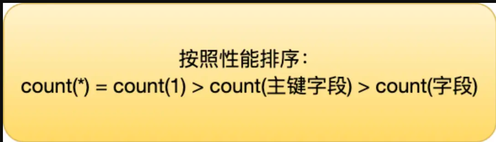


count() 是一个聚合函数，函数的参数不仅可以是字段名，也可以是其他任意表达式，该函数作用是**统计符合查询条件的记录中，函数指定的参数不为 NULL 的记录有多少个**，查询条件指的就是count括号里面写入的值


- count（主键）

  在调用count函数的时候，会在serve层维护一个count变量，会循环向InnoDB读取数据，如果count指定的条件不为null，就将count的值+1，直到符合查询条件的所有记录都被读完。最后将count返回给客户端

  由于InnoDB是通过索引来保存记录的，在没有二级索引的情况下，会走聚集索引去查询数据，然后会判断id值是否为null，不为null就将count+1.

  如果有二级索引就使用二级索引，因为中每一个数据页中存放的数据更少，IO成本低

  

- count（1）

  与上面的操作一样，只不过不用判断查到的值是否为null，因为查询条件是1，1肯定不是null。所以效率比count（主键）高

- count（*）

  count（*）等价于count（0），与count（1）相同

- count（字段）

  count会使用全表扫描的方式统计个数


count（1）/count（*）是统计行数，count（字段）是统计对应字段不为null的行数


## 日志

### 有哪些？有什么作用？

对于使用了InnoDB存储引擎的MySQL中。存在三种日志，分别是bin log，redo log，以及undo log

bin log归档日志，是Server层的日志，记录的是逻辑日志，只要用户数据备份和主从复制

redo log重做日志，是InnoDB独有的日志，记录的是物理日志，实现了事务的持久性，可以实现故障恢复

undo log回滚日志，是InnoDB独有的日志，记录的是逻辑日志，可以用来实现事务回滚和MVCC


### bin log

bin log是Server层的日志，对于所有的存储引擎是共用的。

MySQL在完成一条写操作后，Server层还会生成一条bin log，等事务提交之后，会把bin log统一写入bin log文件中。

#### bin log和redo log的区别：

- 使用对象不同

  bin log是MySQL Server层的日志，对于所有的存储引擎都是可用的

  redo log是InnoDB特有的日志

- 文件格式不同

  bin log，文件有三种格式：

  - STATEMENT

    每一条SQL语句都会记录下来，记录的是逻辑操作。在主从复制的时候，从库只需要在执行一遍SQL语句就可以完成复制。但是该方式有动态函数的问题，比如使用UUID，now等函数，会导致从库再现的时候数据不一致

  - ROW

    记录行数据最终被修改成什么样了，这种格式不能被称为逻辑日志了。对于该数据没有动态函数的问题，缺点是记录的数据量大，批量Update语句，ROW会对每一行数据都记录下来，STATEMENT只需要记录一个Update语句就可以了

  - MIXED

    混合方式，根据不同的情况选择STAMENT模式或者ROW模式

    

  redo log是物理日志，记录的是在哪一个数据页上进行了什么操作

- 写入方式不同

  bin log是追加写入，写满一个文件就换一个新的文件写入，不会覆盖之前的日志，保存的全量日志

  redo log是循环写入的方式，日志空间大小固定，写满之后就会从头开始重新写入，保存尚未刷盘的脏页日志，已经刷盘的日志会被覆盖

- 用途不同：

  bin log用来实现数据备份，主从赋值等

  redo log主要用来故障恢复，具有crash-safe的能力


#### 为什么bin log没有crash-safe的能力？

bin log记录的全量日志，当发生故障的时候无法区分哪些数据需要恢复，

而redo log是循环写入的方式，有write_point和check_point，通过这两个指针就可以得到哪些数据还没有刷盘，需要恢复


#### bin log什么时候刷盘


bin log会先写入binlog cache中，事务提交时，会把binlog cache中的完整事务写入bin log文件中，并清空binlog cache。写入bin log文件的时候会先写到page cache中，这时不涉及IO操作，比较快。

fsync阶段才是数据持久化到磁盘的操作，涉及磁盘IO，频繁执行fsync会导致磁盘IO升高。

有三种策略决定何时刷盘

- 每一次只write，不fsync，由操作系统决定什么时候刷盘
- 每一次事务提交都刷盘，
- 每一次事务都write，等到有N个事务再fsync


### redo log

通过Buffer Pool可以提高读写效率，但是Buffer Pool是在内存中的，一旦掉电或者其他故障，其中的数据就会丢失，所以需要在更新数据的时候，先更新内存数据，然后记录redo log，这时才算更新完。在适当的时候，会调用后台线程将Buffer Pool中的脏页刷新到磁盘。


#### redo log功能

redo log记录的是物理日志，也就是记录的某一个数据页上哪一个记录做了什么样的修改。

事务提交的时候，只需要把redo log保存到磁盘中就可以了，Buffer Pool数据即使丢失也无所谓。因为redo log记录的数据做了哪些修改，重启的时候只需要根据redo log内容就可以恢复到最新状态。

```
所以redo log主要解决的就是：发生故障时，Buffer Pool中的数据没来得及写入磁盘，数据就会丢失，但是这些数据写入了redo log日志中，重启的时候根据redo log中的距离就可以找回那些丢失的数据
```


#### 和undo log的区别

redo log记录了事务完成后的数据状态，记录的是更新后的值

undo log记录的事务开始前的数据状态，记录的是更新前的值

事务提交前发生崩溃，重启后通过undo log可以回滚事务，保证了原子性

事务提交后发生崩溃，可以通过redo log恢复事务，保证了持久性


#### 数据需要刷盘，redo log也需要刷盘，这样是不是多此一举？

redo log采用循环写的方式，写入磁盘的时候是顺序写，但是数据是随机写，顺序写的性能远高于随机写，可以降低磁盘IO开销。先写入日志，然后在合适的时间将数据写到磁盘


所以使用redo log的好处：

将磁盘随机写变为顺序写，提升了性能

拥有crash-safe能力


### redo log的刷盘时机？

刷盘时机支持三种策略：

- 0 每次事务提交时不进行刷盘
- 1 每次事务提交时都将进行刷盘（默认）
- 2 每次事务提交的时候都只把redo log buffer内容写入page cache


### undo log

回滚日志，InnoDB独有，记录的是逻辑日志。

每执行一条增、删、改语句的时候，都会记录undo log日志。

- 在插入数据的时候，会把这条记录的主键记下来，需要回滚的时候删除该主键对应的记录即可
- 在删除数据的时候，会把这条记录的主键记下来，需要回滚的时候再把这条记录添加回去即可
- 在修改数据的时候，会把被更新列的旧值记录下来，回滚的时候只需要把这些列更新为旧值就可以了


对于同一条记录的每一次更新操作产生的undo log格式都会有roll_pointer指针和trx_id，

- 通过trx_id可以知道该记录最近被哪一个事务修改了
- 通过roll_pointer指针可以将针对同一条记录的undo log组成一个链表，这个链表就成为版本链


通过版本链可以实现MVCC，版本链会记录每一条记录的历史版本，在不同的隔离级别下，通过ReadView就可以确定事务可以访问哪一个版本的数据

所以说undo log有两大作用：

- 实现事务回滚，保证了原子性
- 实现MVCC的关键之一


undo log是如何实现持久化的呢？

undo log也需要通过redo log实现持久化。


### redo log两阶段提交

redo log的两阶段提交指的是在执行更新操作的时候，会将记录redo log的操作分成两部步骤，先是prepare阶段，然后提交bin log，最后是redo log的commit阶段。

使用两阶段提交主要是为了保证bin log和redo log内容的一致性，如果两者不一致，那么可能在主从的架构中会导致主库与从库的数据不一致。

如果先写了binlog，再写入redo log之前发生故障，这样重启的时候就不会恢复这条数据，但是由于bin log记录了这条数据，在主从复制或者数据备份的时候，从库就是记录这次修改的操作，造成主从不一致

如果是先写入了redo log，再写入bin log，在写入bin log之前发生故障，由于已经写入了redo log，这条数据是可以被恢复的，但是由于bin log没有写入，导致从库中不会记录本条数据的修改。

使用两阶段提交会先写入redo log，并记为prepare状态，然后写入bin log，最后将redo log修改位commit状态。如果在写入bin log之前发生故障，重启的时候会从redo log中得到需要被恢复的数据，这时会从bin log中查看是不是有对应数据的记录，这里显然是没有，这样为了保证二者的一致性，就不会执行恢复操作。

如果是在bin log写入之后发生故障，这时bin log中会找到对应数据的记录，这时就会执行恢复操作。对于处于prepare阶段的redo log可以执行回滚事务或者提交事务的操作，关键在于bin log中是否有对应的记录。如果有就提交，没有就回滚


### Buffer Pool

Buffer Pool缓冲池可以提高数据库的读写性能

使用了Buffer Pool之后，

- 读取数据的时候，如果数据在Buffer Pool中，就直接读取Buffer Pool中的数据，如果不在去磁盘中读取数据
- 在修改数据的时候，如果数据在Buffer Pool中，就直接修改Buffer Pool中数据所在的页，然后置为脏页（内存数据与磁盘数据不一致），为了减少IO次数，并不会立即将脏页写入磁盘，会有后台线程选择一个何时的实际将脏页写入磁盘


在Buffer Pool中缓存了哪些数据？

InnoDB是以页为单位来划分数据，一个页的默认大小是16KB，Buffer Pool同样需要按照页来划分。

Buffer Pool有一片连续的地址空间，按照16KB的大小划分为若干的页。

缓存的页包括：

- 数据页

- 索引页

- undo 页

  开启事务后，在InnoDB层更新之前，会先记录对应的undo log。如果是更新操作，则把被更新的列记录下来

- 插入缓存页，自适应哈希索引等


## SQL

### char和varchar的区别？

char是定长字符串，varchar是可变长度的字符串，

比如char(10)和varchar(10)

char(10) 存放的字符就算小于10，也会占10个字符的空间，多出来的空间会使用空格补充

varchar(10) 就是最多可以存放10个字符，如果存5个字符那就占5个字符的空间


使用了utf8mb4编码的时候，一个字符会占用4字节，char(10)就会占据固定的40个字节


### exit 和 in的区别

感觉涉及的内容还挺多，后面还需要再学一学


### truncate、delete与drop区别？


### having和where区别？

having是在分组后对数据进行过滤 和 group by配合使用
where是在分组前对数据进行过滤
having后面可以使用聚合函数
where后面不可以使用聚合


### 如何实现分页？

使用limit进行分页查询。limit后面跟着两个参数，第一个参数是从第几条记录开始，第二个参数是查询多少条。

```sql
select * from user limit 5 , 5;
#从查询的所有记录中从第5条记录开始查询5条记录
```

### 深度分页问题？

见其他中的内容

### 有哪些聚合函数？

- count 统计数量
- avg 求平均值
- sum 求和
- max 求最大值
- min 求最小值

### 表和表之间是怎么关联的？

内连接，外连接

内连接通过`inner join`来实现，返回两张表中同时满足连接条件的数据，不满足条件的数据不会查询出来。

外连接包括左连接`(left join)`和右连接`(right join)`。左连接会返回左表中的所有记录以及右表中满足条件的记录。右连接会返回右表中的所有记录和左表中满足连接条件的记录。


### 什么是sql注入？

sql注入在使用字符串来拼接sql语句时出现，比如进行登录验证的时候where条件通常会比较用户名和密码， 如果使用了sql字符串拼接，可以在最后添加一个`or 1=1`，这样就可以绕过用户名密码，直接返回true。

在使用mybatis的时候就强调过这个事情。使用mybatis如果参数不使用占位符`#{}`传递反而使用`${}`传递就会出现这个问题。

为了避免sql注入，第一点就是严格的参数校验，第二点是使用sql预编译，也就是mybatis中使用`#{}`占位符的方式

### sql语句执行的顺序

1. from
2. on
3. left|right|inner join
4. where
5. group by
6. having
7. select
8. distinct
9. order by
10. limit


## 索引

### 什么是索引？

索引是一种特殊的数据结构，体现了一种空间换时间的思想，使用索引可以更快的查询数据。

在Mysql的Innodb、MyISAM存储引擎中使用的BTREE索引，使用的B+树实现。还有其他的所以比如HASH索引，不过BTREE索引性能更好。

使用索引的优点：

加快查询速度。

通过创建唯一索引可以保证表中数据的唯一性

缺点：

索引需要占用一定的磁盘空间。当对表中的数据进行增、删、改的时候会维护索引，增加了时间开销。


### 索引底层数据结构

#### hash表

hash索引可以比较快的定位数据，时间复杂度大概为O(1)，可以根据key的hash值直接定位数据位置（hash % size），但是hash索引无法处理范围查询

#### B-Tree，B+Tree

B-Tree和B+Tree的区别：

- B-Tree的所有结点均键（key）和值（value），B+Tree只有叶子节点存放键和值，其他节点只存放键
- B-Tree的所有叶子节点是独立的，B+Tree的所有叶子节点会形成一个双向链表。


### 索引有哪些种类？

#### 按照存储结构

- 聚集索引

  聚集索引的叶子节点上面挂载的是整行数据，每一个节点的key是主键；

  优点：

  查询速度快，

  缺点：

  依赖于有序的数据，如果主键是无序的，那么插入时就需要不断调整B+数的结构。

  另外修改代价比较高，因为聚集索引的叶子节点上挂载这数据。

- 非聚集索引（二级索引）

  非聚集索引的叶子节点上挂载的主键id，每个节点的key索引列，如果是联合索引那么key就是多个有序（先后顺序）的字段。

  优点：更新代价比聚集索引小

  缺点：可能出现回表查询

#### 按照功能

- 主键索引

  数据表的主键使用的索引就是主键索引。

  一张表只有一个主键，且主键不能为null，不能重复。如果没有主键，那么会检查是否有唯一索引且不允许存在null值的字段，如果有，则该字段为默认得到主键，否则InnoDB将隐藏字段row_id作为主键索引

- 唯一索引

  唯一，可以为null。可以用力加速查询

- 联合索引

  为多个列设置一个索引。使用时需要遵循最左前缀法则

- 覆盖索引

  一个索引覆盖了要所有要查询的字段。如果有字段没有覆盖到，那么就会发生回表查询。


### 索引失效的情况？

1. 对索引列进行计算导致索引失效
2. 索引类是字符串且查询的时候不加引号
3. 模糊查询的时候如果对于尾部的模糊可以使用索引，如果对于头部的模糊会导致索引失效
4. 使用or查询时，前后的条件中有一个没有使用索引，那么所有的索引都会失效
5. 使用了联合索引没有满足最左前缀法则
6. 使用!= 或者 <  > 等会导致索引失效

### 最左前缀法则

如果想使用联合索引就必须遵循最左前缀法则，最左前缀法则就是指对于联合索引，左边的索引类必须出现，否则不会使用索引。

比如创建了一个a,b,c的联合索引，顺序就是a,b,c

在查询时如果是下面的情况a b c会使用索引 a b 会使用，但是只有a b的索引列会使用，a只会使用a的索引类

a c会使用a的索引类，因为跳过了b  b c不会使用索引，因为最左边的索引列a没有使用 另外abc的顺序不做要求，只要存在就可以了


当遇到范围查询(`>`、`<`、`between`、`like`)就会停止匹配，后面的字段不会用到索引。

比如对`(a,b,c,d)`建立索引，查询条件为`a = 1 and b = 2 and c > 3 and d = 4`，那么a，b，c会走索引，d不会走索引


### 覆盖索引和回表扫描？

覆盖索引就是查询的字符是索引列，这样就只需要查询非聚集索引（二级索引）即可返回对应的数据

如果查询的字段中有不是该索引类的字段，那么会先查询非聚集索引，找到对应记录的id，然后根据id查询聚集索引得到该行记录的所有字段，然后返回需要的字段。这就是查询。

所以说要尽可能不使用`select *`，因为这个会造成回表查询，影响性能。

### 如何判断索引有没有生效？

使用explain查看sql执行计划，possible_key给出了是可能会使用的索引，key是实际使用的索引。


### 索引实现的原理

在Innodb中使用B+树实现索引。所有的数据都存储在B+树的叶子节点上，同时所有的叶子节点会形成一个双向链表，方便了范围查询。

相比B树，B树的每个节点都存放key和data，在进行范围查询到时候需要进行多次查询，而使用B+树索引范围查询的时候会先找到一个叶子节点，由于叶子节点形成了双向链表，


### 如何创建索引比较好？

#### 需要创建索引的字段

经常需要查询的字段可以建立索引，使用索引可以加快查询速度

经常需要进行排序的字段可以建立索引，因为索引中已经帮我们排好序了


#### 不用创建索引的字段

where条件用不到的字段不用建立索引。

数据量比较小的话不用创建索引

经常需要增删改的字段，需要平衡使用索引带来的查询性能提升以及维护索引带来的开销


- 选择合适的字段创建索引

  不为null的字段，需要频繁查询的字段，

- 需要频繁更新的索引谨慎创建索引

  频繁更新的字段创建索引会增大维护索引的开销

- 限制每张表上的索引个数

  索引可以增加查询的效率，同时也会降低增删改的效率。如果索引较多会严重影响增删改的效率

- 字符串类型的字段使用索引使用前缀索引替代普通索引

  前缀索引仅限字符串类型，比普通索引更节省空间，

- 数据量比较小的表不用创建索引


### InnoDB和MyISAM之间索引的区别

在MyISAM中索引和数据是分开存放的，也就是数据占据了一部分空间，索引占据了另一部分空间。每一行数据都有地址，MyISAM索引的叶子节点上存放的数据就是对应记录的地址

InnoDB中数据和索引是一体的。数据文件本身就是一个索引文件，结点的key是主键，叶子节点的值就是一行记录。这个是聚集索引。对于非聚集索引，叶子节点中存放的是主键，根据主键可以回到聚集索引中获得对应的行记录，这就是回表查询。


### 为什么要使用B+树作为索引？为什么不使用红黑树？为什么不适用B-Tree

B+树是多路平衡搜索树，相比二叉树，对于相同的数据量，B+Tree的深度更小，这也就意味着只需要进行更少次数的IO就可以找到所需要的数据。

红黑树是一种特殊的平衡二叉树，每个结点只有两个子节点就导致了大数据量的情况下树的高度会很大，也就意味着需要更多次的IO才能找到需要的数据。IO操作是性能瓶颈，所以需要降低树的高度，将二叉树变为多叉树。

B-Tree每个结点及存放key，又存放数据，这就导致了每一个结点的大小比B+Tree大，一页中能存放的结点信息也就小了，就需要多次IO来加载结点信息。同时B-Tree存放数据的结点各部相连，在范围查询以及区间搜索的时候需要多次查找才行，B+Tree的叶子节点连城一个链表，方便了范围查询


还有就是B+Tree查询性能比较稳定，每一次都会查询到叶子节点才能取得数据，对于B-Tree查询性能就不稳定，不同的数据需要的查询次数可能相差很大


### 为什么MySQL的单表数据量不建议超过2000W？

#### 单表最大可以存储的数据量？

在MySQL中，每一条记录都有主键ID，理论上来说，MySQL可以存储的最大的数据量就是MySQL中主键的最大值。

如果主键是int类型的时候，占32位，最大值为2^32-1，大概为21亿

如果是bigint类型的，占64位，最大值就是2^64-1，这个数据量就非常大了，根本无法存储这么多的数据。

所以说主键的类型并不会限制单表数据量。

#### 数据存储结构？

在InnoDB中，数据是以数据页为单位存储的。每一个数据页的大小默认为16KB。

这16KB并不是全部用来存放数据的，还有一些空间用来存储页号，前后指针等内容。

这些数据页会以B+数的形式组织起来，分为了叶子节点和非叶子节点。在叶子节点中存放的实际的数据，在非叶子节点中存放的是索引以及索引对应的页号。这样通过索引，就可以在非叶子节点中找到该索引对应的页号，进而找到对应的数据页。


那么对于InnoDB中的B+树来说，可以存放多少的数据呢？

假设每一个数据页中的其他信息占1KB，那么有效数据部分就是15KB。

B+树高度为N，非叶子节点的数据存储量为X，也就是存了多少页号，叶子节点存储的数据量为Y，也就是存了多少条记录

B+树存储的数据总量就是M = [x^(N-1)]*Y

假设主键使用Bigint，8字节，页号4字节，那么X = 15*1024/(8  + 4) = 1280

假设每一条记录都是1KB，那么Y = 15

B+树高度为2时，1280 * 15 = 19200

B+树高度为3时，1280^2 * 15 = 24,576,000

B+树高度为4时，1280^3 * 15 = 300亿 


所以说，数据量不超过2000W的时候，使用3层B+树就可以了，这样查询数据只需要3次IO，如果数据量继续增大，那么可能就需要4层B+树，意味着需要4次IO，而且数据量过大可能会对磁盘性能造成影响

总的来说，限制单表数据量大小的主要原因时B+树的结构，


### 使用数据库的唯一索引来保证唯一性还是使用业务代码来保证唯一性？

如果使用业务代码来保证唯一性的话可能会增加代码的复杂度，在多线程的环境下还会出现线程安全问题，所以需要使用数据库的唯一索引来实现唯一性

### 前缀索引

有时需要在很长的字符列上创建索引，这会造成索引特别大且慢。使用前缀索引可以避免这个问题。

前缀索引是指对文本或者字符串的前几个字符建立索引，这样索引的长度更短，查询速度更快。

创建前缀索引的关键在于选择足够长的前缀以**保证较高的索引选择性**。索引选择性越高查询效率就越高，因为选择性高的索引可以让MySQL在查找时过滤掉更多的数据行。


## 事务

### 对于事务的理解

事务就是指一组sql语句要么全部执行成功要么不执行。

事务需要遵循ACID四个特性：

- A：atomic 原子性 原子性是指事务是一个不可分割的单位，里面的sql语句要么全部执行成功要全不执行
- C：consistency 一致性 可以理解为事务执行前后数据的状态是预期的状态（比如A给B转了100元，转帐前和转账后的数据都是正确的那么就是一致的，如果事务执行后数据不正确那么就是不一致）

- I：isolation 隔离性 多个用户并发访问数据库时，每一个用户的事务不受到其他事务的影响
- D：durability 持久性 事务一旦提交，结果就是永久性的，即使服务器宕机也可以恢复数据

### 并发存在的问题

- 脏读

  脏读就是读取到其他事务未提交的数据变更。使用读已提交的隔离级别可以解决该问题

- 不可重复读

  不可重复读指的是在一个事务中多次读取一个字段得到的值不一样。使用可重复读的隔离级别可以解决

- 幻读

  幻读可以理解为先查询一条数据发现他不存在，然后想要插入这样的数据但是无法插入。就像出现幻觉一样。使用串行化的隔离界别可以解决这个问题（在MySQL中，RR隔离级别下可以通过MVCC和next-key lock解决幻读）

### 事务隔离级别

- 读未提交

  最低的隔离级别，允许读取其他事务未提交的数据变更，可能会导致脏读，幻读，不可重复读

- 读已提交

  允许读取其他事务已经提交的数据变更，可以防止脏读，但是有幻读，不可重复读的可能

- 可重复读

  一个事务中，对同意字段多次查询结果都是一样， 可以防止脏读，不可重复读，但是可能存在幻读。（好像可以解决幻读问题？）

  是Innodb默认的隔离级别

- 可串行化

  最高的隔离级别，所有事务依次执行，可以防止所有并发问题


### 如何实现ACID特性

- 原子性

  使用undo log实现

  在undo log中记录的执行sql语句的反操作，比如执行insert语句时undo log中会记录delete语句。这样当需要回滚的时候就可以将数据恢复到初始状态。

- 持久性

  使用redo log实现

- 隔离性

  使用MVCC + 锁实现

  MVCC就是多版本并发控制

- 一致性

  前面的原子性、持久性、隔离性都是为了保证一致性。

### 如何解决幻读问题？

先说结论：RR隔离级别下，快照读通过MVCC解决，当前读通过加next-key lock解决

在MySQL的RR隔离级别下，快照读可以通过MVCC解决，因为在MVCC的执行流程中，RR隔离级别会在第一次快照第的时候创建ReadView，进行查询的时候会根据所有数据行的trx_id与ReadView的读取规则进行比较，后插入的数据通过比较会发现是无法读取的，也就不会读出数据。但是如果是RC隔离级别，每一次快照读都会创建ReadView，那么后来插入的时候就是有可能被读取到的。

对于当前读，无法使用MVCC解决，可以通过next-key lock解决。临键锁不仅锁住一行记录，同时锁住该记录前面的间隙，其他事务要在这个间隙中添加数据就会阻塞。从而解决了幻读


快照读通过MVCC实现，当前读通过加锁实现


## 锁

### 锁可以解决哪些问题？

加锁主要是保证在多线程并发的环境中，多个线程对共享变量操作的安全性。

对于MySQL来说，存在下面几种并发问题：脏读，不可重复读，幻读

解决这些并发问题的方式有：

- 读操作使用MVCC，写操作加锁

  读操作可以读取到历史的版本，但是写操作一定是对最新的数据进行修改的

- 读、写操作都加锁


### 锁的分类

#### 对数据的操作类型

共享锁

排他锁


读操作可以加共享锁也可以加排他锁

共享锁`（Shared Lock S锁）`  排他锁`（Exclusive Lock X锁）`

```sql
-- 共享锁
select * from tab lock in shared mode

-- 排他锁
select * from tab for update
```


S与S之间兼容

S与X，X与X之间互斥


简单来说，写操作一定会加排他锁

不过细节上，update和delete会加排他锁，不过insert不会加，因为插入数据之前还没有这条数据，就没有办法加锁了。不过会有一种隐式锁来保护这条记录在事务提交之前不会被其他的事务读到


#### 锁的粒度

##### 表级锁

- 表级别的共享锁、排他锁

  

- 意向锁（intention lock）：

  是行锁和表锁之间的一种折中，是一种表锁。加了行锁之后，会自动添加一个意向锁，不用手动添加。意向锁的目的就是标记这个表中有记录添加了行锁，这样其他线程想要给这个表加表锁的时候，不需要遍历所有的记录看是不是加了行锁，通过意向锁就能直接知道表中已经有记录加锁了，自己不能加表锁

- 自增锁：

  

- 元数据锁（meta data lock）：

  一个事务正在对表中数据进行增删改查，会自动添加MDL读锁。一个事务想要对表结构进行修改，就会添加MDL写锁

  MDL读锁之间兼容，也就是多个事务可以同时对一张表中的数据进行读写操作。MDL读锁与写锁之间互斥，保证了表结构的安全性，防止一个事务正在执行，另一个事务修改了表结构。


##### 行级锁

行级锁可能会出现死锁的问题

- 记录锁（record lock）

  就是普通的共享锁和排他锁。共享锁之间可以兼容，其他都不兼容。

  共享锁使用lock in share mode  排他锁使用for update

  增删改操作会加排他锁

- 间隙锁（gap lock）

  锁住的是两条记录之间的间隙。比如有一条记录id为1，有一条记录id为10，当我们想要查询或者添加1和10之间的数据的时候就会加上间隙锁，其他事务要在这个间隙内插入数据就会阻塞

- 临键锁（next-key lock）

  我认为临键锁是记录锁和间隙锁的组合。既可以锁住一条记录，同时锁住该条记录前面的间隙。既可以保护当前记录，同时方式其他事务在前面的间隙中插入数据

  使用临键锁可以解决RR隔离级别下当前读的幻读问题

##### 页级锁


#### 对持锁的态度

悲观锁

悲观锁就是认为线程安全的问题很可能会发生，就需要加锁来保证并发环境下的安全

乐观锁

乐观锁就是认为线程安全的问题很少发生，可以使用CAS或者版本号的方式来实现

CAS就是compare and swap，先比较再交换，如果比较失败，意味着其他线程修改了共享变量，就重试或者放弃。存在ABA问题

版本号原理类似，每一次修改操作都会修改版本号，且版本号不会重复。所以只要发现版本号不对，就意味着变量被其他的值修改了

#### 加锁方式

隐式加锁

显示加锁


## MVCC

`MVCC （Multi Version Concurrent Control）多版本并发控制`，解决数据行的多个版本管理并发情况下的读写问题。MVCC是通过数据行的隐藏字段、Undo Log版本链和ReadView来实现的

多版本体现在undo log版本链，控制体现在ReadView的访问控制

MVCC的执行流程：首先获得当前事务的id，生成ReadView，查询到数据，然后根据ReadView的访问规则，满足就返回，不满足就从undo log版本链中找满足的版本。如果一个版本不可见，就会找下一个版本的数据，直到找到可见的版本或者找到了版本链的尾部

### 快照读和当前读

普通的查询语句，没有加锁的，就是快照读。快照读读取的数据不一定是最新版本的。

对于加了锁的查询语句是当前读，读取的是数据的最新版本


### 隐藏字段

- row_id

  

- trx_id

  最近更新该条记录的事务id

- roll_pointer

  回滚指针，与UndoLog版本链相关。每次对一条记录进行修改的时候都会讲旧的版本记录在Undo Log日志中，这个回滚指针就是指向当前数据的前一个版本


### UndoLog版本链

对于插入的undo log记录，只有在回滚的时候起作用，事务提交之后就没有用了。

不同事务对于一条记录的修改，会形成一张链表记录在undo log中，隐藏字段roll_pointer就是链表中的指针，链表头部是最新版本的数据，尾部是最老的数据


### ReadView

ReadView就是事务在使用MVCC机制进行快照读的时候创建的读视图，根据这个ReadView就可以确定需要读哪一个版本的数据

ReadView中有四个字段：

- 创建该ReadView的事务id
- 活跃事务集合
- 当前活跃的最小的事务id
- 应分配给下一个事务的id


根据这些内容给出了一套访问规则：

- 如果被访问版本的trx_id与creator_id相同，就意味着当前事务在访问自己修改过的记录，所以该版本可以被当前事务访问
- 如果被访问版本的trx_id小于up_limit_id，就意味着生成该版本的事务在当前事务生成ReadView前已经提奥，所以该版本可以被当前事务访问
- 如果被访问版本的trx_id大于low_limit_id，就意味着生成该版本的事务在当前事务生成ReadView之后才开启，不可以访问该版本的数据
- 如果被访问版本的trx_id在up_limit_id和low_limit_id之间，就需要判断trx_id是不是在trx_ids列表中
  - 如果在，就说明当前事务未提交，不可以访问
  - 如果不在，就说明当前事务已经提交了，可以访问


还有就是生成ReadView的时机

对于快照读而言，RR隔离级别下，第一次快照读会生成一个ReadView，之后的快照读都会复用这个ReadView，从而实现可重复读的效果

RC隔离级别下，每一次快照读都会生成一个新的ReadView，可以读到其他事务已经提交的修改，但是无法实现可重复读的效果


## 优化


## 主从

### 为什么要做主从？


### 如何实现主从同步？


## 其他

### MySQL数据如何同步到Redis缓存？

- 使用MySQL的触发器和UDF函数实现

  

- 解析MySQL的bin log文件实现同步

  可以使用阿里开源的组件Canal实现。使用Canal会把自己伪装成MySQL的一个从库，去订阅MySQL的bin log文件。当bin log发生变化，Canal会将发生的变化发送给消息队列，然后由消息的消费者去消费消息，然后写入Redis

- 在业务代码中实现同步

  在业务代码中实现同步就需要同时操作数据库和Redis。比较常用的方式就是先更新数据库再删除缓存，因为这种出现线程安全的问题最小。

  为了保证能够成功删除Redis的数据，可以使用延迟双删的策略，删除Reid数据之后等一段时间再次删除Reid数据


### 大表查询速度慢怎么优化？

- 合理添加索引，或者优化已经添加的索引
- 使用缓存
- 读写分离
- 分库分表


### 深分页如何解决？

深度分页就是指当分页的偏移量很大的时候，分页会造成性能的降低。

比如limit 0, 10 和 limit 1000000, 10，这两个分页都是查询10条记录，但是前面的偏移量为0，后面的偏移量为10w。后面都分页就需要先把前面的10w条记录查出来再丢掉，这就意味着需要更多的IO次数。

优化的方向主要是从索引考虑。首先就是尽可能使用覆盖索引，增加查询性能。如果我们查询的数据是该行所有的数据，就会发生回表查询。在偏移量很大的时候优化器会放弃使用索引。

如何解决这个问题呢？

- 子查询优化

  子查询优化的思想就是让查询操作会使用索引，比如还是offset为10w条数据，使用子查询先查询到第10w条数据的id，然后利用这个id再查询10条记录。这样我们的分页查询就会利用id，也就是使用聚集索引，加快查询速度。子查询中也可以通过二级索引快速查到id

  ```sql
  select * from t5 where id>=(select id from t5 order by text limit 1000000, 1) limit 10;
  ```

  

- 记录上一次查询结束的位置

  思路就是使用一个变量记录下上一次查询位置的id，然后之后查询的时候直接让id > 记录的id，查询若干条数据。

# Redis

## 基础

### 应用场景

- 缓存

- 分布式锁

- 分布式id

- 消息队列

- 统计PV（Page View 页面浏览量）、UV（Unique Vistor 可以理解为访问数量，同一个用户一天多次访问只需要记录一次）

- 复杂业务场景

  通过`bitmap`统计活跃用户，使用`sorted set`维护排行榜等

### 为什么速度比较快？

1. 基于内存

   内存的速度相较于磁盘是很快的

2. 单线程与多路IO复用

   线程切换与锁是非常消耗性能的。使用单线程就可以避免多线程中的线程切换以及并发问题。利用IO多路复用可以使其在IO操作中能并发处理大量的客户端请求，实现高吞吐率。

3. 使用多种优化后的数据结构


### 为什么要使用Redis或者说为什么要使用缓存？

使用Redis通常是作为缓存使用的。在计算机系统中缓存的作用是解决CPU与主存速度的不一致，相似的我们在应用程序中使用缓存也是解决速度不匹配的问题。我们的应用程序运行在内存中，速度比较快；数据库中的数据一般都是保存在磁盘里面，磁盘IO是比较耗时的。缓存的速度与主存相近，将用户频繁访问的数据放在缓存中，就能减少大量的磁盘IO，提升性能。

另外使用Redis作为缓存是因为Redis具备高性能和高并发的特性。Redis基于内存，单线程执行命令，性能比较高。同时Redis能承受高并发。


### Redis和Memcached的区别？

Redis和Memcached都是基于内存的数据库，可以用来做缓存。

区别在于：

- Redis支持的数据结构更多（5基本3特殊），而Memcached只支持简单的key-value数据类型
- Redis支持数据持久化（AOF，RDB）
- Redis支持事务，Lua脚本


## 数据结构

### Redis中的数据结构有哪些？

五种基本数据结构：String，List，Hash，Set，ZSet

三种特殊数据结构：BitMap（位图），HyperLogLog（基数统计），Geo（地理位置）  后来又加入了一种stream类型的


### 各种数据结构的应用场景？

- String：

  存储对象，简单计数，分布式锁，共享session等

- List：

  可以用来实现消息队列，

- Hash:

  也是用来缓存对象，不过Hash缓存的对象更偏向于其中的字段需要经常修改的对象，比如购物车数据（以用户id作为key，value就是购物车具体的信息，value中保存了以商品id为key，商品数量为value的键值对信息）

- Set:

  使用到集合的性质，比如唯一性，交集，并集等场景，可以实现点赞，关注（点赞关注应该使用的是唯一性，不过关注也有共同关注这种利用集合的其他性质的），抽奖等

- ZSet:

  需要排序的场景，如排行榜

- BitMap:

  位图，用于实现用户签到，判断用户登录状态等

- HyperLogLog:

  统计UV（Unique Vistor 唯一访问？   一个用户一天内多次访问该网站只能记录一次）

- Geo:

  地理位置的应用

### String的应用场景？

- 常规数据：session，token，序列化之后的对象等
- 分布式锁：setnx命令
- 计数

### 需要存储对象的时候使用String还是Hash

String存储的序列化之后的整个对象，Hash可以将对象的各个字段分开存储，可以获得或者修改单个字段。对于频繁需要修改的对象可以使用Hash。

大多数情况下使用String存储对象就可以了。使用String比较方便，而且使用String存储消耗的内存比Hash少，大概只有Hash的一半


### 存储购物车信息的时候使用什么数据结构？

使用Hash来存放对象，因为购物车中的字段可能会经常修改

（以用户id作为key，value就是购物车具体的信息，value中保存了以商品id为key，商品数量为value的键值对信息）


### 如何使用Redis实现排行榜？

使用Zset实现，Zset中有一个权值，可以根据这个权值进行排序


### 如何使用Redis实现抽奖

使用Set实现

- `SPOP key count`随机移除一个或者多个元素，用于不可以重复中奖的场景
- `SRANMEMBER key count`随机获得指定个数的元素，用于可以重复中奖的场景


### 5中基本数据类型的底层是如何实现的？


#### String:

String底层是通过SDS`(Simple Dynamic String)`简单动态字符串实现。

相较于C语言中的字符串，SDS的功能更强。

比如SDS可以存储二进制的信息，判断字符串结束是通过字符串长度进行判断的，所以内容中有'/0'并不会影响字符串。

获得字符串长度的时间复杂度为O(1)，因为SDS保留有一个字段用来记录字符串长度。

还有就是SDS API是安全的，因为SDS在拼接字符串之前会先检查SDS的空间是否满足要求，如果空间不足会先进行扩容。


#### List：

在较新版本的Redis中List是通过`quickList 快表`实现的。在之前的版本中是通过双向链表+压缩链表实现。


#### Hash：

在老版本中使用压缩列表+哈希表实现

在新版本中使用listPack+哈希表实现。之前的压缩列表被废弃，使用listPack替换。


#### Set：

使用整数集合和哈希表实现

#### ZSet:

压缩列表和跳表实现


### 5中基本数据结构的底层实现

共有5种基本数据结构：

- String

  应用场景：

  - 需要存储常规数据的场景，如`token`，序列化之后的对象，使用`get、set`
  - 需要计数的场景，使用`get、set、incr、decr`
  - 分布式锁，`setnx key value`

- List

  底层使用SkipList和LinkedList实现

  应用场景：

  - 信息流展示
  - 消息队列

- Hash

  底层使用HashTable实现

  应用场景：

  - 存储对象 

- Set

  底层使用intset和hashtable实现

  应用场景：

  - 需要存放的数据不能重复
  - 需要获取多个数据源交集、并集、差集的场景
  - 需要随机获取数据源中的元素的场景

- Zset

  底层使用SkipList或者ZipList

  应用场景：

  - 需要随机获得数据源中的元素根据某个权重进行排序的场景，如各种排行榜

其底层实现依赖于这8种数据结构；

SDS：简单动态字符串

LinkedList：双向链表

HashTable：哈希表

SkipList：跳表

IntSet：整数集合

ZipList：压缩列表

QuickList：快速列表


#### SDS

SDS定义：

```c
struct sdshdr{
     //记录buf数组中已使用字节的数量
     //等于 SDS 保存字符串的长度
     int len;
     //记录 buf 数组中未使用字节的数量
     int free;
     //字节数组，用于保存字符串
     char buf[];
}
```


优点：

1. 常数复杂度获得字符串长度

   因为有len属性的存在

2. 二进制安全，可以存储二进制信息如图片等

   c语言中的字符串以`/0`结尾，而图片等二进制文件内容中可能包含`\0`，这样C语言的字符串无法存储。

3. 杜绝缓冲区溢出

   SDS在进行字符修改的时候，会先根据记录的len属性检查内存空间是否需求，不满足就扩充

4. 减少内存分配次数

   使用内存预分配策略，需要分配新内存的时候，如果：

   新字符串小于1M，则新空间为扩展后字符串长度的两倍+1；

   新字符串大于1M，则新空间为扩展后字符串长度+1M+1。称为内存预分配。


#### LinkedList

双向链表，


特点：

1. 双向

   

2. 无环

   表头的pre和表尾的next均为null

3. 带链表长度计数器

   通过len属性获取链表长度的时间复杂度为O(1)

4. 多态

   节点的值可以为多种类型


#### HashTable


#### SkipList

本质上仍然是一个链表，是由有序链表发展而来

它有如下一些性质：

1. 有多层组成
2. 每一层都是一个有序链表，排列顺序为由高层到底层，每层至少包含两个节点，分别是head和nil
3. 最底层链表包含了所有的元素
4. 如果一个元素出现在每一层的链表中，那么在该层之下的链表中也会出现


- 搜索：从最高层的链表节点开始，如果比当前节点要大和比当前层的下一个节点要小，那么则往下找，也就是和当前层的下一层的节点的下一个节点进行比较，以此类推，一直找到最底层的最后一个节点，如果找到则返回，反之则返回空。
- 插入：首先确定插入的层数，有一种方法是假设抛一枚硬币，如果是正面就累加，直到遇见反面为止，最后记录正面的次数作为插入的层数。当确定插入的层数k后，则需要将新元素插入到从底层到k层。
- 删除：在各个层中找到包含指定值的节点，然后将节点从链表中删除即可，如果删除以后只剩下头尾两个节点，则删除这一层。

#### IntSet

intSet是redis中set集合的一种实现方式，基于整数数组实现，具备长度可变、有序等特性。


其中encoding包括三种模式，表示存储的整数大小不同：


contents数组按照升序存储数据

当我们插入一个数据，超过当前的encoding范围的时候，会执行下面的操作：

1. 升级encoding编码，并按照新的编码格式与元素个数扩充数据
2. 按照倒序将原数组中的值copy到新的数组中的正确的位置
3. 将待添加的元素放入正确的位置
4. 修改IntSet的len，encoding等属性

优点：

- IntSet中的元素唯一，有序
- 具备类型升级的机制，可以节省内存空间
- 底层采用二分查询的方式进行查询


1. 

1. 

#### ZipList

压缩列表，是redis为了节省内存而开发的。每个节点可以保存一个字节数组或者一个整数值。

压缩列表并不是将数据使用某种算法进行压缩，而是将数据按照一定的规则编码在一块连续的内存区域。


链表的结构：


每个节点的结构：


## 线程模型

### Redis为什么要选择单线程？

- 使用单线程可以避免过多的上下文切换
- 避免同步锁的开销
- CPU资源并不是Redis的性能瓶颈，主要是内存和网络IO


### Redis真的是单线程吗

在Redis4.0中引入了多线程处理大键值对的异步删除操作

在Redis6.0中正式在网络模型中实现了IO多线程

在Redis6.0之前核心网络部分一直是单线程，利用IO多路复用去处理用户请求。在Redis4.0之前引入多线程去处理大键值对的异步删除操作。在Redis中`del`命令用于删除一个或者多个key存储的val，他是一个阻塞命令，如果需要删除的键值对比较大，里面存放了上百万个对象，那么删除的时间就比较长，这也就导致阻塞时间增加，吞吐率降低。


### 为什么在Redis6.0之后引入了多线程？

因为Redis的性能瓶颈在于内存和网络IO，所以在之前的版本的网络模型中使用单线程。但是随着互联网的发展，业务系统的用户量增大，网络流量也就越来越大。Redis的单线程模式会导致大量的时间浪费在网络IO上。所以提出了使用多线程的方式去处理网络IO。

处理IO的线程仅仅是读取和解析客户端命令，而不会真正去执行命令，客户端的命令的执行最终还是要在主线程上完成。

总的来说就是使用多线程处理网络IO，具体命令的执行还是单线程的。


## 内存管理

### 为什么要给数据设置过期时间？设置过期时间有什么用？

因为Redis的内存是有限的，如果不设置过期时间的话，Redis的内存可能很快就被消耗完。所以设置过期时间可以减少内存的占用。（过期时间使用expire命令完成）

另外，有一些业务需求需要一些数据只能在一段时间内有效，比如验证码只能在几分钟内有限，就可以把验证码存入Redis，设置对应的过期时间。如果超过了时间验证码就被删除了，也就意味着验证码失效。或者是使用Redis保存token，设置过期时间，超过时间用户就需要重新验证身份。


### 如何判断数据是否过期？

当我们对一个key设置了过期时间，那么Redis会把该key带上过期时间存储在一个过期字典中（expires dict）中，也就是说这个过期字典中存放了所有key的过期时间。这个过期字典是一种Hash表，通过key可以在O(1)的复杂度内获得key对应的过期时间。

当我们查询一个key的时候，先检查这个key是不是在过期字典中，如果不在就正常读值，如果在就获取当前key的过期时间，检查是否过期，没过期就返回数据。


### 过期数据如何删除的？过期数据的删除策略有哪些？

常见的过期数据的删除策略有两种：

- 惰性删除

  只会在取出key的时候才对过期的数据进行删除，这样对CPU友好，但是可能存在大量的过期key没有删除

  

  

- 定期删除

  每个一段时间抽取一批key执行删除过期key操作，并且Redis底层会通过限制删除操作执行时长和频率来减少删除操作对CPU时间的影响
  
  定期删除的流程是
  
  1. 从过期字典中随机抽取20个key
  2. 检查这20个key是否过期，并删除过期的key
  3. 如果过期key超过了25%，也就是5个，那就重复步骤1，否则就结束本次删除
  
  
  
  定期删除是一种循环的方式，为了防止循环过度导致线程卡死的状况，Redis增加了定期删除循环流程的时间上限，默认不会超过25ms
  
  
  
  

惰性删除对CPU友好，但是可能存在较多的过期数据没有被删除，对内存不友好。

定期删除的话通过限制操作执行的时间和频率来减少对CPU的影响，同时可以删除内存中一部分已经过期的数据。缺点在于执行的时间和频率难以确定，如果执行频繁，会影响CPU，如果执行不频繁那就向惰性删除一样，导致大量过期数据无法删除。

Redis采用惰性删除和定期删除两者结合的方式进行过期数据删除。

### Redis持久化的时候对于过期数据如何处理？

持久化分为RDB和AOF两种方式。

对于RDB方式，分为文件生成阶段和加载阶段。

- RDB文件生成阶段：从内存状态持久化到RDB文件中时，会对key进行过期检查，过期的键不会被保存到新的RDB文件中。
- RDB文件加载阶段又分为主服务器和从服务器两种。
  - 如果是加载到主服务器中，过期的键不会加载到数据库中
  - 如果是加载到从服务器中，不会检查是否过期，都会加载到数据库中

对于AOF方式，分为AOF文件写入阶段和AOF重写阶段

- AOF写入阶段，如果过期键还没有被删除，那么AOF文件会保留这个过键，当过期键被删除后，AOF文件会追加一条DEL命令来删除该键
- AOF重写阶段，执行AOF重写时，会对Redis中的键值对进行检查，已经过期的键值对不会保存到重写后的AOF文件中


### 内存淘汰机制了解吗？

Redis支持8中内存淘汰策略：

1. `volatile-lru` 

   在设置了过期时间的键集合中，优先移除最近最久未使用的key

2. `allkeys-lru` 

   从所有键中移除最近最久未使用的key

3. `volatile-lfu`

   在设置了过期时间的键集合中，优先移除最不经常使用的key

4. `allkeys-lfu`

   从所有键中移除最不经常使用的key

5. `volatile-random`

   从设置了过期时间的键集合中随机移除key

6. `allkeys-random`

   从所有键集合中随机移除key

7. `volatile-ttl`

   从设置了过期时间的键集合中选择快要过期的key进行淘汰

8. `no-eviction`

   禁止驱逐数据，也就是说当内存不足以容纳新写入的数据时，新写入操作会报错


### LRU算法和LFU算法的区别？在Redis中是如何实现的？

LRU`(Least Recently Used) 最近最少使用`，会淘汰最近最少使用的数据。

传统的LRU算法是使用链表，将所有使用的数据按照顺序排列，最近使用的数据排在头部，最久没使用的数据排在尾部。

不过Redis没有使用这种方法，因为这种方法需要维护一个链表，如果数据量比较大，那么会导致占用较多的内存空间。还有就是使用一个数据之后需要把他移动到链表头部。如果访问大量的数据，那就需要多次移动链表，在时间上也有一定的浪费。

Redis在对象结构体中加了一个字段，用来记录最后一次访问此数据的时间。Redis在进行内存淘汰的时候会随机选择若干条数据，删除其中最久没有使用的数据。使用这种方式不用维护链表，节省了空间。

不过LRU存在一定的弊端，比如一次读取了大量的数据，但是这些数据只读取这一次，那么这些不需要使用的数据就会占据内存空间，存在**缓存污染问题**。

LFU`(Least Frequently Used) 最近最不常用`，会淘汰最近最不常使用的数据。他的思想就是如果一个数据经常被访问，那么将来也会被经常访问。LFU算法会记录每个数据被访问的次数，根据访问次数来删除数据。这样就可以解决偶尔访问的数据占据缓存空间的问题。

在Redis的对象结构体中，有一个24bits的数据。如果是LRU算法，这24字节全部都记录最后一次访问该数据的时间戳。如果是LFU算法，那么前16bits记录时间戳，低8为记录访问次数。


### 缓存更新的策略有哪些？

#### Cache Aside 旁路策略

实际开发中使用的就是旁路策略。

旁路策略的写操作：先更新数据库，在删除缓存。读操作：先读缓存，不存在就读数据库，再回写缓存


#### Write Through 写回策略


#### Write Back 写回策略


## 持久化机制

### Redis如何保证数据不丢失？

Redis的数据是存在内存中的，一旦机器断电或者发生错误，就会导致内存中的数据丢失，为了防止数据丢失，可以将内存中的数据持久化到磁盘中。Redis重启的时候就可以从磁盘中加载原有数据。

### 持久化的方式有哪些？

- AOF，Append Only File，每执行一条命令都将命令以追加的方式写入到AOF文件中。
- RDB，就是记录下某一时刻内存数据的快照，以二进制的形式写入到磁盘中
- 还有就是使用AOF+RDB的混合模式

### AOF方式是如何实现的？

Redis在执行完一条命令之后，会将命令以文本的形式写入AOF文件中。当Redis需要重启恢复数据的时候就依次执行AOF文件中的命令回复数据据。

#### 为什么要先执行命令再写入日志？

好处：

- 避免了额外的检查开销：
  记录日志的时候并不会进行语法检查，如果先写入日志，那么有可能记录一个错误的命令。
- 不会阻塞当前命令的执行：
  在命令成功执行，结果返回之后才记录日志，不会阻塞当前的命令。

但是也有一定的弊端：

- 可能发生数据丢失：

  假设执行完命令之后，写入日志之前，系统发生了崩溃，那么这个命令就没有记录到AOF文件中

- 会阻塞其他命令的执行：

  由于AOF的记录是由主线程执行的，不会阻塞当前命令的执行，但是会阻塞后续命令的执行。

#### AOF写回的策略有哪些？

- Always:每次执行完命令都将AOF文件写入到磁盘中
- EverySec:每秒写入一次。每次都将命令写入到内核缓冲区，每秒钟将内核缓冲区中的数据写入到磁盘
- No:由操作系统决定何时将缓冲区中的数据写入磁盘


#### AOF文件过大会怎么样？

随着写操作越来越多，AOF文件也会越来越大，如果当AOF文件过大，那么在Redis重启恢复数据的时候就会比较耗时。所以为了避免AOF文件过大，提供了**AOF重写机制**，当AOF文件大小大于一定的预置的时候，就会触发AOF重写机制。

这个重写机制就是在重写时，会读取当前数据库中所有的键值对，然后将每一个键值对用一条命令记录到新的AOF文件中。

就比如对于某一个键，先后进行了多次写操作，如果没有AOF重写，那么所有的写操作都会记录下来。使用了AOF重写之后就只会记录最后一条命令，也就是最新的值，前面的旧值就不需要记录了。

这样就可以实现AOF文件的压缩。


#### AOF文件重写的过程？

会`fork()`一个子进程去执行重写


### RDB方式是如何实现的？

RDB是通过快照的方式实现持久化。他记录的是某一瞬间内存中的数据，记录的实际数据（二进制形式）。相比AOF重启恢复数据更快，因为AOF记录的是命令（文本形式），需要重新执行一遍命令才可以。

#### 创建快照会阻塞线程吗？

Redis提供两种命令创建快照，分别是`save  bgsave`

save命令是使用主线程创建RDB文件，

bgsave命令会创建**子进程**生成RDB，从而避免主线程的阻塞

#### 生成RDB文件的时候，数据还能进行修改吗？

可以的，Redis使用了**`写时复制技术（Copy On Write COW）`**。

在使用bgsave命令的时候，会`fork()`出一个子进程，子进程和父进程共享同一片内存数据，因为创建子进程时会赋值父进程的页表，两个页表指向的是同一片内存空间。

主线程在执行读操作的时候，并不会影响bgsave，在执行写操作的时候，会创建一份被修改数据的副本，对这个副本就行修改，子进程读取到的还是原来的数据。（不过这种方式有比较大的开销，比如：创建数据副本造成的内存开销，副本数据的拷贝带来的CPU开销等）

在这个过程中，主线程的写操作并没有受到影响，同时子进程也能读取到原样的数据来生成RDB。

### Redis为什么要使用混合持久化的方式？

对于RDB方式，加载数据比较快，但是由于RDB是全量快照，会将内存中的所有数据都创建快照，是一个比较耗时的操作，如果频繁执行，会影响性能，如果执行较少，会导致数据丢失。

对于AOF方式，优点是数据丢失的少，缺点就是加载的比较慢，需要执行一遍AOF中的命令。

使用混合持久化就是结合了两种方式的优点。在**AOF日志重写**的过程中，fork的子进程将内存中的数据以RDB形式记录到AOF文件中，然后主线程执行的操作会记录到重写缓冲区中，以AOF的方式记录到AOF文件中。完成后通知主线程将这个新的AOF文件替换旧的AOF文件。

使用混合持久化之后，AOF文件中前半部分是RDB格式的全量快照，后半部分是增量数据，


这样的好处就是集合了AOF和RDB两种方式的优点，RDB数据加载比较快，同时AOF的内容保证数据丢失的更少。

缺点就是由于添加了RDB格式的数据会导致AOF文件可读性变差


### Big Key对持久化会造成哪些影响？

对于AOF的always策略，如果是对big key进行操作，那么执行完命令之后就会进行AOF的写入，对于比较大的数据这个操作就会比较耗时。

对于AOF重写和RDB的bgsave命令，会通过`fork()`创建子进程执行任务，这时会将父进程的页表复制一份给子进程。如果存在big key，那么父进程的页表就会比较大，页表越大，这个复制消耗的时间也就越长。

还有就是子进程创建完成之后，如果父进程中修改了big key，由于写时复制技术的存在，会对被修改数据创建一份副本，由于bit key数据量比较大，就会造成一定的阻塞。


## 生产问题

### 缓存穿透、缓存击穿、缓存雪崩等问题的解决

#### 缓存穿透：

原因：

查某个key对应的数据时，redis中不存在相应的数据，就会去数据库中查询。数据库中也不存在相应的数据，会直接返回空，redis也不会缓存该结果。这样就造成每次通过这个样的key去查询数据都会去数据库中查询，redis不会缓存空结果，造成缓存穿透。

比如对服务器进行攻击就可以制造一些非法的key并发起大量的请求，这些请求会落到数据库上， 但是数据库中也没有，也就无法缓存。最终所有的请求都会落到数据库上，对数据库造成了巨大的压力。


解决方案：

1. 缓存无效key

   如果缓存和数据库中都查询不到某个key的数据，就在Redis中给这个key写一个空值，并设置合理的过期时间。不过如果这样key不断变化，会造成Redis中缓存了大量的无效key。所以说这种方案并不能解决根本问题。

2. 布隆过滤器

   布隆过滤器可以在海量数据中判断我们给定的key是否存在。我们可以先将可能存在的请求的值放到布隆过滤器中，当用户请求过来，先经过布隆过滤器判断请求的值是否在布隆过滤器中，如果不在，那么就返回错误信息。如果在再去查询缓存或者数据库。
   
   

需要注意布隆过滤器可能存在误判的情况，如果他说一个值不存在那一定是不存在的，如果他说一个值存在，那这个值可能存在也可能不存在（可能有多个值的hashCode相同，一个不存在的值经过hash运算得到下标发现对应位置有值了就误认为存在）。


#### 缓存击穿

原因：

某个热点key（请求量比较大），在某时刻突然过期，导致大量请求在缓存中查询不到数据，直接打在数据库上。


解决方案：

1. 热点key永不过期或者过期时间较长
2. 针对热点数据提前预热，将其存入缓存并设置合理的过期时间
3. 请求数据库写数据到缓存之前，先获取互斥锁，保证只有一个请求会落在数据库上，减小数据库压力


#### 缓存雪崩

原因：

在某一时刻，redis中大批量的key过期，或者redis宕机，导致大量的请求打在数据库上。

另外，也有可能因为Redis宕机导致所有的请求打到数据库上


解决方案：

1. 对于Redis宕机导致的大量请求打到数据库上，可以使用Redis集群，避免单机Redis宕机影响整个系统
1. 进行限流，避免同时处理大量的请求
1. 使用二级缓存
1. 对缓存数据设置不同的过期时间，比如随机设置缓存数据的过期时间

缓存雪崩与缓存击穿的区别：
缓存雪崩与击穿比较像，但是缓存雪崩是由于大量或者所有的数据失效，击穿是由于某个热点数据失效


### 如何保证缓存与数据库的一致性

#### 先更新数据库还是先更新缓存？

如果先更新数据库：


如果先更新缓存：


可以看到，在并发的环境下，无论是先更新数据库还是先更新缓存，都会造成数据不一致的问题。

#### 先更新数据库还是先删除缓存？

如果先删除缓存：


这样会导致数据不一致

如果先更新数据库：


在这种情况下会出现不一致性的问题，但是这种情况出现的概率不高，因为Redis的写入一般远快于Mysql的更新，所以一般来说，A请求将结果写回Redis一般来说要早于B请求更新数据库。

所以是实际场景下，一般是使用先更新数据库，再删除缓存的策略。


但是删除缓存的操作可能会失败，这样就会导致缓存中存放的是旧值，如果不设置过期时间，那么直到写一次更新数据库，缓存存放的都是旧值。


为了保证两个操作都能成功进行，可以使用**重试机制**来保证成功删除缓存。

对于重试机制，可以引入消息队列，将要删除的数据放到消息队列中，将需要删除的缓存值放入消息队列中，如果删除失败，就从消息队列中取出要删除的额缓存进行重试。如果删除超过一定的次数还有成功就需要报错了

如果删除成功就将数据从消息队列中移除


## Redis事务

### Redis的事务满足了ACID的特性了吗？

对于原子性，如果一批命令出现了语法错误，那么都不会执行。如果是运行时出现错误，那么只有出错的命令不会执行，其他的命令还是可以正常执行。所以Redis并没有很好的实现原子性

对于一致性，

对于隔离性，由于Redis执行命令的时候是单线程执行的，所以具有隔离性

对于持久性，由于Redis没有MySQL中redo log那样的日志，如果说本次事务的操作没来得及持久化到磁盘中，就会导致本次事务的结果丢失。所以没有持久性

### 如何实现Redis的事务？

使用`MULT，EXEC，DISCARD，WATCH`等命令来实现事务的功能。

MULT命令后面可以输入多个命令，Redis不会实现执行这些命令，而是将这些命令放进一个队列中，当调用了`exec`命令后才开始执行。

过程就是使用MULT命令开启事务，然后输入多个命令，按照先进先出的顺序，输入EXEC命令执行事务。

通过DISCARD命令可以取消一个事务，他会清空队列中所有已经保存的命令。

通过WATCH命令监听key，当调用EXEC命令执行事务时，如果一个被WATCH命令监视的key被其他客户端或者Session修改的话，整个事务都不会被执行。

### Redis的事务是否支持原子性？

```
回顾：
事务的四大特性：
A：Atomic 原子性 事务是最小的执行单位，事务中的命令要么全部执行，要不都不执行
C：Consistency 一致性 事务执行前后，数据保持一致？？
I：Isolation 隔离性 在并发的环境下，事务是相互独立的，一个用户的事务并不会影响其他的事务
D：Durability 持久性 事务被提交之后对于数据库的影响是持久的
```


(如果发生了语法错误，那么所有的吗，命令都不会执行；如果是运行时错误，那么只有出错的命令不能成功执行，其他的命令都可以执行)


在Redis事务的执行过程中，如果有命令发生错误，只有这个发生错误的命令不会执行，其他的命令都可以执行，也就不满足原子性的定义，所以Redis的事务不支持原子性。


### 如何解决Redis事务的缺陷？

Redis事务的缺陷在于Redis事务不支持原子性。可以使用Lua脚本来一次性执行多条命令。一段Lua脚可以视为一条指令的执行，一段Lua脚本执行的过程中不会有其他的脚本或者Redis命令执行，保证操作不会被其他指令影响。但是Lua脚本只能在一定程度上解决原子性问题，因为在Lua脚本中，出错命令之前的命令还是会正常执行，之后的命令才不会执行。


## 性能优化

### big key问题

#### 什么是big key

简单来说就是如果一个key对应value占用的内存比较大，就可以认为是一个big key

当value是String类型时，大小超过10kb就认为是big key

当value是list、set、zset、hash时，其成员超过1W就认为是big key

#### 有什么危害？

由于Redis在执行命令的时候是单线程执行的，需要执行big key的命令时就会造成阻塞，影响整体性能。

#### 如何发现big key

可以使用--bigkeys参数查找

使用bigkeys命令以遍历的方式分析Redis实例中的所有Key，并返回整体统计信息与每个数据类型中Top1的大Key

使用redis-rdb-tools命令查找

离线分析工具，通过分析rdb持久化文件来找到big key

#### 如何解决big key

对于不是热点key的big key可以将其删除，对于不是热点key的big key可以将其进行压缩（使用压缩算法进行压缩）或拆分（进行数据分片）


## 其他


### 如何实现消息队列？


### Redis实现分布式ID

随着用户量增大，用户的做题记录也会增多。用户每一次，做的每一个题都会记录下来，那么用户量增大，题目增多，就会导致做题记录的表记录很大，这样会导致查询的效率变低，所以需要进行分表。


这里需要对表进行水平拆分。水平拆分之后就需要注意每一条记录的ID，拆分之后不可以使用数据库自带的自增ID，这样会导致两张表的记录ID存在重复，需要自己去实现全局唯一ID。


全局唯一ID的实现方式如下：

- UUID

  UUID会生成32个16进制数字，这里面就可能含有字符，同时ID不是递增的，不适合作为MySQL的主键

  

- Snowflake

  生成一个long型的id，64bit，分成若干段1+41+10+12。高位表示时间戳，低位表示统一时间戳下的序列号。总体上来说是递增的，但是该算法依赖于机器时钟，如果对机器时间进行回调，会出现重复ID

  

- 基于Zookeeper

  

- 基于Redis实现

  可以使用Redis去实现一个自增的序列，然后将该自增序列和时间戳拼接起来，这样可以让ID是递增的（高位时间戳递增，低位序列号递增），而且ID的规律不容易被发现，

- 基于数据库实现

  这里基于数据库实现全局唯一ID是使用一张表来生成ID，其他的表使用这个生成ID表生成的ID来作为自己的ID。实现方式和基于Redis的差不多，但是Redis的性能要比数据库强很多


想要实现一个全局唯一ID生成器，需要满足下面几个条件

- 唯一性，ID需要保证全局唯一
- 高可用，什么时候去申请ID都可以申请到
- 递增行，保证ID是递增的，这样方便数据库建立索引
- 安全性，ID的生成规律不能被轻易发现
- 高性能，生成ID的性能比较高


使用Redis实现全局唯一ID生成器

long型，64bit，1+31+32，1符号位，31时间戳（精确到秒），32序列号

2^31-1 约等于 68年，每一秒的并发量为2^32-1，


```java
public class IDWorker{
    //获得当前时间的时间戳（秒）
    private static final long START = ;
    //时间戳所处的位数
    private static final int BITCOUNTS = 32;
    
    //获得当前时间戳
    long time = nowtime - START
    //获得自增序列
    long incrment = 通过Redis获取，利用incr实现，使用业务作为键，但是如果该业务只是用这一个键的话，可能过一段时间这个键对应的value会比较大，已经超过了32位的范围，所以可以每一天使用一个键，也就是 业务标识:日期 作为自增序列的键，这样可以将业务的自增序列分开，同时方便统计每一天生成的ID个数
        
    //拼接ID
    time << BITCOUNTS | incrment;
    //时间戳占据了高32位，将time左移32位，低32位就是0，再与自增序列进行与运算，使得高32位为时间戳，低32位为自增序列
}
```


### Redis实现分布式锁


注意事项：

- 获得锁的线程可以正常执行，但是对于没有获得锁的线程，需要不断重试。重试的方法不能选择递归重试，因为每一次递归都会生成栈帧，重试的次数多了就会Out of Memory。可以选择循环重试的方式替换，while循环中，条件就是判断是否获得锁，没获得就继续循环，获得就退出循环

- 只是用setnx命令的话，如果某个线程获得了锁，但是在释放锁之前挂掉了，那么他占用的锁就不会释放，造成死锁。所以需要加上过期时间

- 加过期时间的时候，setnx命令和expire命令两个操作需要具备原子性，也就是说这两个操作不能分开执行，需要在一起执行才可以，可以将两条命令写在一起，或者使用Lua脚本实现

- 在删除锁的时候，如果简单的使用del key这种命令，考虑下面的一种情况：如果线程A获得锁资源，但是执行一半发生了线程切换，线程B尝试获得分布式锁，由于锁还没释放，但是加上了过期时间，假设正好在B的执行阶段过期时间到期，B就获得了锁。然后A继续执行，A会执行del命令释放锁，但是这个时候锁已经是B的了，这样A就释放了B的锁！！所以在删除锁的时候还要检查现在的锁是不是自己的锁！！

- 我们知道了在删除锁的时候需要检查value是不是自己的锁，这是还有一个问题，就是检查锁和删除锁是两个操作，不满足原子性，所以还需要改进。比如可以使用Lua脚本来解决。

- 通过上面的一些操作可以解决分布式锁的独占性、防死锁、不乱抢等，但是如何实现可重入性呢？

  想一下我们要实现可重入性需要满足几个方面？第一就是分布式锁对应的key，不同的进程或者说线程的标识，还有一个就是需要计数，统计重入次数，可以想到这种情况下使用Hash是比较方便的。Hash的key就是业务的标识或者说是锁的标识，Hash里面的value的key就是线程的标识，value就是计数器，记录重入次数。如果value为0，就表示现在没有线程占用该锁，可以获得。不为0就表示有线程占用了。大于1表示锁重入的次数。所以使用hset命令替换之前的set命令可以实现可重入性

  

#### 什么是分布式锁？

分布式锁需要和单机的锁进行对比。

在单机系统中，使用synchronized关键字就可以实现锁机制，但是这中锁只对这一个JVM有效。如果是部署在一个集群中，不同的JVM之间的锁是互不影响的，也就是说向synchronized这种锁在集群模式下是无效的，这样就需要使用分布式锁。（synchronized是一种线程锁，分布式锁的话就是进程锁，线程锁只能在一个进程中生效，多个进程之间的数据是相互独立的，所以线程锁无法影响进程。）

分布式锁的话就是一种跨JVM的能实现资源互斥访问的锁。

对于分布式锁需要满足下面几个特性：

- 独占性
- 高可用
- 防死锁
- 不乱抢
- 重入性

#### 如何实现分布式锁？


#### 如果redis是单点部署的，会造成什么问题？

可用性问题？


#### Redis集群模式下，CAP方面会有哪些问题？


#### 什么是RedLock？什么是Redisson？

RedLock是一种分布式锁定算法，用来保障在集群模式下Redis分布式锁的可靠性。

RedLock的基本思路就是让客户端和多个独立的Redis结点依次请求申请加锁，如果超过半数的Redis结点成功完成了加锁的操作，那么我们就认为客户端成功获得了分布式锁，否则加锁失败。

RedLock算法加锁的步骤：

1. 获得客户端当前时间 t1
2. 客户端依次向多个Redis结点申请加锁：
   - 使用setnx命令，带上ex过期时间，以及客户端的唯一标识
   - 如果某个Redis结点发生了故障，为了保证这种情况下RedLock算法能够正常运行，需要给加锁操作设置一个超时时间（加锁的超时时间远小于锁的过期时间）
3. 一旦超过半数的Redis加锁成功，这是获得当前时间t2，比较整个加锁时间t2-t1与所得过期时间的大小，如果小于就认为加锁成功，否则失败

所以加锁成功有两个条件：

- 超过半数结点成功加锁
- 加锁总耗时小于锁的过期时间


加锁成功需要重新计算锁的过期时间，结果就是最初设定的过期时间减去加锁的时间，

加锁失败向所有Redis结点发出解锁的操作，和单结点释放锁一样，执行Lua脚本，先检查是不是自己申请的锁，在释放锁


#### 如何实现锁的续期？


#### 什么是看门狗？


# RabbitMQ

## 一些概念

RabbitMq中的概念：

1. broker

   可以认为一个broker就是一个rabbitmq服务器

2. exchang

   交换机，有四种交换机种类

   - fanout

     不进行任何匹配，将该交换机的所有消息发送到所有与该exchange绑定的queue中。可以进行广播

   - direct

     将消息路由到Bingingkey和RoutingKey完全匹配的queue中

   - topic

     BingingKey和RoutingKey是以点分割的多个单词组成，使用通配符进行模糊匹配，#标识多个单词（可以是0个），*标识一个单词

     

   - headers

     不常用

3. queue

   队列，消息就存放在queue中，等待被消费

4. producer 和 consumer

   producer消息提供者

   consumer消息消费者


RabbitMq的工作模式：

1. simple简单模式

   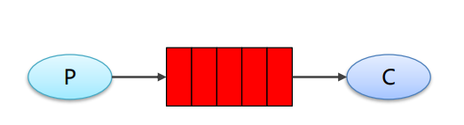

   最简单的模式，一个生产者一个消费者，使用同一个队列

   

2. work工作模式

   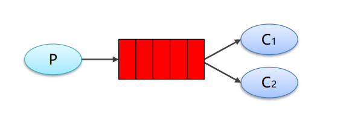

   多个消费者共同监听一个队列，会出现资源竞争。需要保证一个消息只能被一个消费者消费

   

3. publish/subscribe 发布订阅模式

   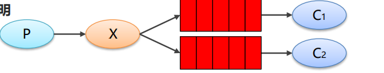

   需要引入交换机，相当于有一种广播的方式，消息生产者会将消息发送到交换机中，然后交换机会将消息发送给所有与这个交换机绑定的队列。

   该模式下exchange选择fanout类型

   

4. routing 路由模式

   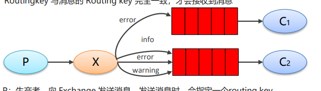

   交换机根据路由RoutingKey将消息分发到不同的队列。

   相较于发布订阅模式，路由模式会根据路由键将消息发送给匹配的队列。

   该模式下exchange选择direct类型

   

5. topic 主题模式（路由模式的一种）

   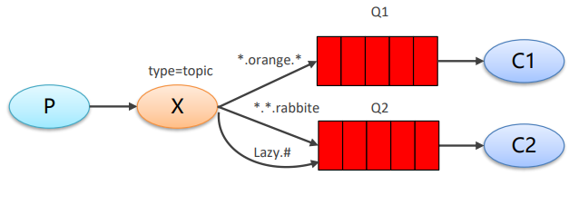

   使用模糊匹配的一种路由模式

   该模式下exchange选择topic或者header类型

   

6. RPC模式

## 应用场景

- 应用解耦
- 削峰填谷
- 数据分发

## 消息存活时间是什么？

消息存活时间就是`TTL,Time to Live`，如果设置了TTL，那么在消息过期后RabbitMq会丢弃消息或者将消息发送给DLX。

TTL可以对消息设置也可以对队列设置。

对于消息的TTL，每一条消息都可以设置TTL，只有当消息被消费的时候才会检查有没有过期，如果在消息大量堆积的情况下，已经过期的消息由于得不到消费，不会判断已经过期，还会存活在队列中，导致实际存活时间比设置的时间长。

对于队列的TTL，是对队列中每一条消息都能生效。时间到期后会之间将消息发送给DLX或者丢弃，不会等待消息消费再去判断。

如果同时设置了队列的TTL和消息的TTL，会取其中较小的一个判断。


## 什么是死信队列？如何导致的？

死信队列（DLX）就是Dead-Letter-Exchange，死信交换机。当消息在一个队列中变成死信之后，就会被重新发送到另一个交换机中，这个交换机就是DLX，与之绑定的队列就是死信队列。

产生死信的原因？

- 消息被拒绝（basic.reject / basic.nack）
- 消息TTL过期
- 队列满了，无法再添加

## 如何使用RabbitMq实现延迟队列？

使用TTL+DLX的方式实现延迟队列。

TTL就是`Time to Live`，就是消息存活时间，消息存活时间到期之后会发送到死信交换机中，死信交换机可以绑定死信队列，由消费者监听死信队列。

这样我们就可以通过给消息设置过期时间，这个过期时间就是需要延迟的时间，时间到了之后，消息称为死信，发送给死信队列，再由消费者消费，从而实现延迟的功能。


设计延迟队列时需要设置延迟交换机和死信交换机，需要延迟不同时间的消息由 延迟交换机分发到不同的延迟队列中，延迟队列设置不同的TTL，这些延迟队列再绑定死信交换机，由死信交换机将消息分发给不同的死信队列，再交给消费者消费。


## 如何做到消息的可靠投递？

保证消息的可靠投递也就是保证这个消息在整个投递的过程中不会丢失。消息丢失可能发生在三个方面：

- 生产者丢失消息

  可能由于网络等原因导致消息传递失败

- MQ丢失消息

  可能MQ没有开始持久化，消息保存在内存中，断电之后导致丢失

- 消费者丢失消息

  消费者还没有处理完消息，消费者就挂掉了

针对这三种情况有具体的解决方案：

- 生产者丢失消息

  开启confirm机制

- MQ丢失消息

  开启MQ的持久化机制

- 消费者丢失消息

  消费者使用手动ACK的方式

- 

## 如何保证消息的顺序性？

出现消息的顺序性问题可能有两种原因：

- 多个消费者监听同一个队列，由于消费者消费消息的能力不同，导致消息处理完成的顺序不同
- 一个消费者监听队列，但是消费者使用了多线程的方式处理消息，可能导致后来的消息先处理完


保证消息的顺序性可以使用两个方法:

- 一个Queue只能由一个消费者去消费，消费者内部维护多个内存队列，根据消息中的一些数据将消息分派到不同的队列中，每个队列对应一个线程去执行。就比如对于同一个订单的消息都会发送到同一个队列中，再使用单线程去处理这些消息，就能保证消费的顺序性
- 拆分成多个队列，每一个队列对应一个消费者。根据消息的一些数据将消息分发到不同的队列中。

总体上来说就是需要保证对于同一条数据的消息需要由单线程去操作。消息传递过来是有序的，使用单线程去消费也是有序的。

然后使用多线程去操作多批不同的数据，提高应用的吞吐量。


如果生产者需要生产A，B，C三条消息，A，C都成功发送给MQ，B消息丢失，需要重发，那么就会导致MQ中消息顺序为A，C，B。这样消息的顺序就被破坏了。这种情况应该如何解决？

- 


## 如何确保消息不堆积？

- 设置队列容量，超过容量就拒绝添加新的消息
- 


## 如何保证消息不会重复消费？

消息的重复消费通常由下面两种情况造成：

1. 生产端重复发送消息

   消息已经到达了MQ，但是由于网络波动等原因，生产端没有收到确认，就认为没有成功发送，所以就需要重新发送。

2. 消费端重复消费消息

   消费端消费了消息，但是由于网络波动，MQ没有收到确认信息，就会再次发送消息。

解决方法可以给每一个消息都加上一个全局唯一ID，可以把这个ID放在Redis里面。每一次需要消费消息的时候都先去Redis里面查看有无当前id的记录，如果有就说明这个消息已经被消费了，就丢弃该条消息。如果没有就说明该条消息还没有被消费，可以执行。


## 如何保证消息的幂等性？

消息的幂等性指的是同一条消息不会被重复消费，或者重复消费了也不会对系统数据造成影响。

解决方法可以参考保证消息不被重复消费的方法。为每一个消息设置一个全局唯一ID，。。。


# 设计模式

## 面向对象开发原则

为了提高软件开发的可复用性、可维护性，增加程序的灵活性和可拓展性，程序员在进行软件开发的时候需要遵循下面几种设计原则

### 开闭原则

对拓展开放，对修改关闭。也就是说在需要对代码进行拓展的时候，不能去修改原有代码，而是要实现一种热插拔的效果

想要达到这种效果，可以使用接口和抽象类来实现。在软件功能发生变化的时候，只需要重新设计实现类即可，不用修改原有的接口或者抽象类


### 单一职责原则

单一职责原则（SRP）是指一个类或模块应该有且仅有一个引起它变化的原因。这意味着一个类或模块只负责完成一项单一的职责或功能，而不应该承担过多的职责或功能。

目的就是提高代码的内聚性，降低耦合性，

### 接口隔离原则

接口隔离原则就是要求将一个大的接口拆分成多个小的接口。如果使用比较大的、臃肿的接口，那么在实现接口的时候就需要实现所有的方法，无论这些方法是不是能用到。拆分成多个小的接口，就可以只去实现用得上的接口即可

### 合成复用原则


### 里氏替换原则

子类尽可能少的重写父类的方法


### 迪米特法则

迪米特法则又称最少知识原则，是一种设计原则，旨在降低软件系统中对象之间的耦合度。该原则的基本思想是一个对象应该对其他对象尽可能少的了解，也就是说，一个对象只应该与其直接交互的对象进行通信


### 依赖倒转原则

依赖倒转原则主要包括下面几个方面：

- 高层模块不应该依赖底层模块，而是应该依赖于抽象接口。这就意味着高层模块只需要和接口打交道，而不需要和具体的实现打交道
- 抽象不应该依赖于具体实现，应该是具体实现依赖于抽象。这意味着具体实现类实现了抽象接口中定义的方法，而抽象接口不需要关心具体实现类的实现细节

依赖倒转也是实现DI（Dependency Injection）的基础，实现DI的方式有接口注入，构造方法注入，Setter方法注入

依赖倒转原则的核心是面向接口编程


## UML

UML(Unified Modeling Language)统一建模语言

### 类图

#### 依赖关系

只要在类中用到了对方，就可以认为存在依赖关系

比如A类中有一个成员变量是B类，就认为A类依赖于B类

又或者是A类的方法的返回值是B类，或者方法参数有B类，或者方法中使用了B类，都可以认为A依赖于B


#### 泛化关系

泛化关系可以认为是继承关系的特例，如果A类继承了B类，我们就说A和B存在泛化关系


#### 实现关系

 实现关系实际上就是A类实现B接口，是依赖关系的特例

#### 关联关系

表示两个类之间有联系，其中一方可以访问另一方的属性或方法。关联关系可以分为单向、双向、自身关联等。是一种特殊的依赖关系


#### 聚合关系

聚合关系表示的整体与部分的关系，其中整体可以包含多个部分，也可以没有部分

聚合关系中双方是可以分离的，

#### 组合关系

一种更加强烈的聚合关系，其中整体与部分的生命周期相同

组合关系中双方是不可分离的


## 设计模式

### 创建型模式

#### 单例模式

##### 饿汉式

```java
// 饿汉式-静态变量
class Singleton2{
    private Singleton2(){}
    
    private final static Singleton2 instance = new Singleton2();
    
    public static Singleton2 getInstance(){
        return instance;
    }
}


// 饿汉式-静态代码块
class Singleton3{
    private Singleton3(){}
    
    private static Singleton3 instance;
    
    static{
        instance = new Singleton3();
    }
    
    public static Singleton2 getInstance(){
        return instance;
    }
}
```

饿汉式利用了类加载机制来保证线程安全，但是可能会造成一定的内存浪费，如果new出来的这个对象一直没有被使用，那么就造成了浪费


##### 懒汉式

```java
// 懒汉式-线程不安全
class Singleton1{
    private Singleton1(){}
    private static Singleton1 instance;
    public static Singleton1 getInstance(){
        /*在多线程环境下，线程A先进行判断，发现没有实例化，此时发生线程切换，线程B执行.
        B也执行到这，发现没有实例化，就new一个并返回。
        这是切换到A执行，这时A就不会进行检查直接new，这样就导致new了多个对象*/
        if(instance == null){
            instance = new Singleton1();
        }
        return instance;
    }
}

// 懒汉式-加锁保证线程安全
class Singleton4{
    private Singleton4(){}
    
    private static Singleton4 instance;
    
    // 使用synchronized锁住该方法，这样就不会出现多个线程同时进入该方法的问题
    public static synchronized Singleton4 getInstance(){
        if(instance == null){
            instance = new Singleton4();
        }
        return instance;
    }
}
//这种方法虽然保证了线程安全，但是效率太低。我们只需要保证第一次new的时候只有一个线程执行就可以，这里加锁的粒度比较大，导致每一次getInstance都要获得锁，其实是没有必要的
```


##### 双重检验

```java
// Double-Check保证线程安全 同时降低了锁的粒度 保证了执行效率
class Singleton5{
    private Singleton5(){}
    
	// 这里得volatile是保证不会发生指令重排序
    private static volatile Singleton5 instance;

    public static Singleton5 getInstance(){
        // 第一次检验
        if(instance == null){
            synchronized (Singleton5.class){
                // 第二次检验
                if(instance == null){
                    instance = new Singleton5();
                }
            }
        }
        return instance;
    }
}
```

##### 静态内部类

```java
//静态内部类的方式实现
class Singleton6{
    private Singleton6(){}

    private static class InnerSingleton{
        private static Singleton6 instance = new Singleton6();
    }

    public static Singleton6 getInstance(){
        return InnerSingleton.instance;
    }
}
```

使用静态内部类可以通过类加载的机制保证线程安全，同时静态内部类的类加载时机和外部的类的加载时机不同，可以减少内存的浪费


##### 枚举

```java
enum Singleton7{
    INSTANCE;
}
```

枚举的方式我不是很懂，这里的INSTACE是什么属性的？


#### 工厂模式

##### 简单工厂模式


##### 工厂方法模式


#### 抽象工厂模式


#### 原型模式


#### 建造者模式


### 结构型模式

#### 适配器模式

适配器有三种，类适配器，对象适配器，接口适配器

在SpringMVC中就用到了适配器模式，像HandlerAdapter

#### 桥接模式


#### 装饰模式


#### 组合模式


#### 外观模式


#### 享元模式


#### 代理模式


### 行为型模式

#### 模板方法模式


#### 命令模式


#### 访问者模式


#### 迭代器模式


#### 观察者模式


#### 中介者模式


#### 备忘录模式


#### 解释器模式


#### 状态模式


#### 策略模式


#### 责任链模式


# 分布式

## 分布式锁


## 分布式ID


## 分布式事务


## RPC


## 


# 场景题

### 海量数据题: A,B大文件,各自有50亿行字符串, 每一个字符串占1KB, 系统最大内存1GB, 如何把两个AB文件中重复的字符串找出来写入文件中


# Other

## jdk动态代理和cglib动态代理的区别

jdk动态代理是面向接口的，cglib是通过类继承的方式实现的动态代理

jdk动态代理实现原理：

主要使用InvocationHandler和Proxy实现

cglib动态代理：

利用被代理对象的字节码，通过修改字节码生成子类实现


在Spring中默认使用了JDK动态代理，如果被代理对象没用实现接口，那么就会使用cglib动态代理方式


## 分布式系统中的相关概念

### 集群

一个业务模块，部署在多台机器上

通俗来说就是很多人跟同一件事

可以保证应用的高性能、高可用


### 分布式

一个大的业务系统，拆分成多个小的业务模块，分别部署在多台机器上

通俗来说就是很多人干不同的事情，但是这些事情合起来是一件大事

分布式可以保证可拓展性，伸缩性（通过增加/减少软硬件来增加/减少性能）


### 单体架构

多个模块都在一个应用程序中

优点

- 简单，开发比较方便，

缺点：

- 项目启动慢
- 可靠性差
- 可伸缩性差
- 性能低

### 垂直架构

垂直架构就是将单体架构中的多个模块拆分为多个独立的项目，形成多个独立的单体架构

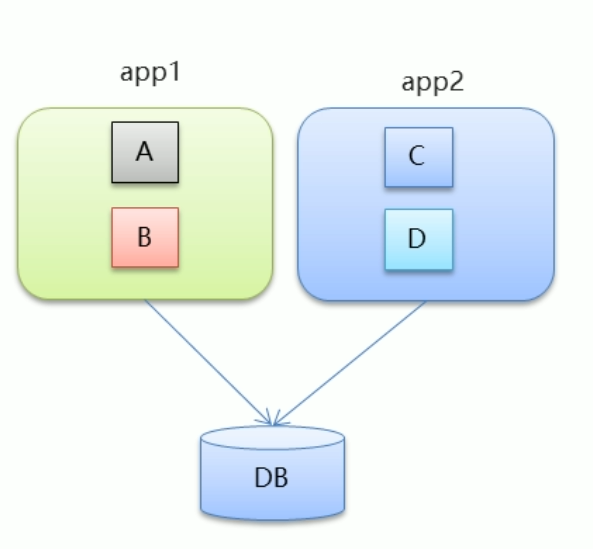


### 分布式架构

在垂直架构的基础上，将一些公共模块提取出来，作为独立的服务提供方，实现服务的共享和重用

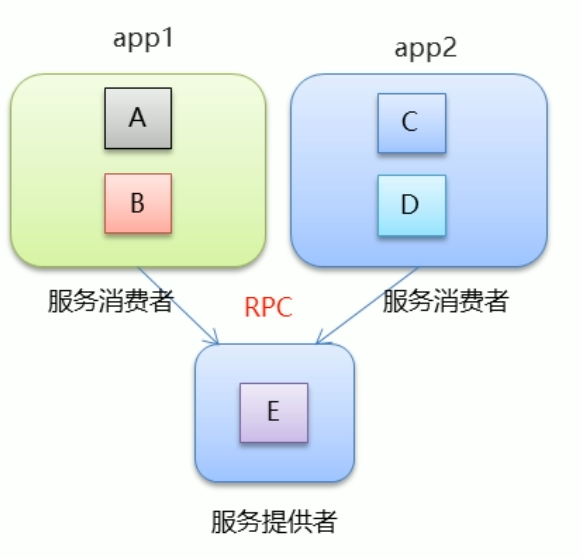


服务提供方和服务消费方之间通过远程过程调用（Remote Produce Call，RPC）进行通信。

解决了垂直架构中重复功能较多的情况。

存在的问题：

如果服务提供方发生变动，那么所有的消费方都需要发生改变。（比如服务提供方的ip地址变化，那么所有的消费方都需要相应的进行改变）


## 像腾讯会议之类的视频会议软件采用的是什么网络协议？

通常采用的是UDP协议。

UDP是面向无连接的，不需要实现建立连接，速度更快。另外UDP报文首部较短。对于视频会议这类软件对于实时性要求比较高，通常采用UDP。


# 项目相关

## java线程池的使用


## 单点登录相关

### 总体设计：

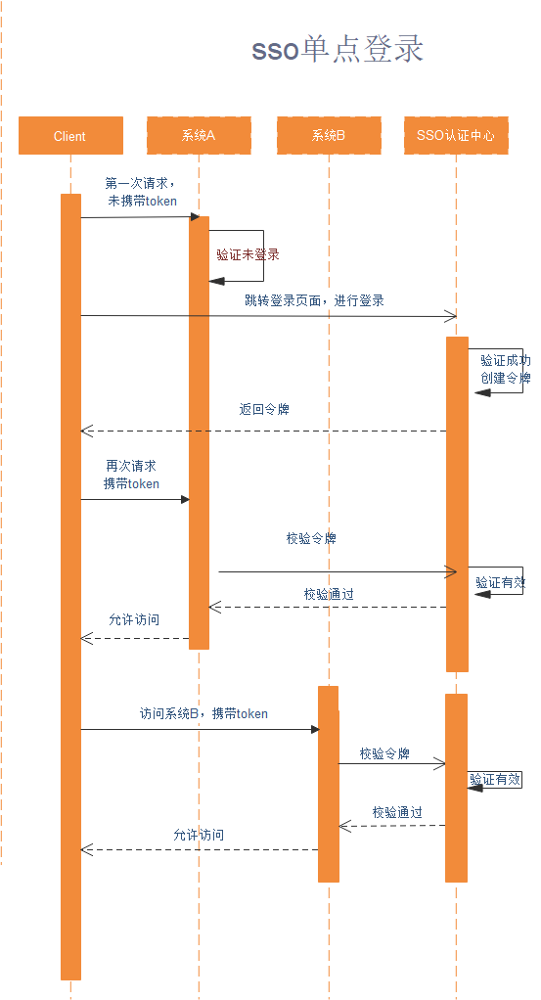

客户首次访问我们的系统会先到认证中心进行身份认证。认证中心包括下面的功能：用户登录、注册、身份认证。

如果是新用户需要先注册，如果是老用户，只需要直接登录就可以了。登录之后会生成一个令牌，也就是JWT，返回给客户。客户之后访问其他系统的时候携带这个令牌就可以不用登录了。

系统A、B收到用户请求，会调用认证中心的身份认证功能，检验客户携带的token是否合法，并检查token是否过期。如果不合法直接拒绝请求。如果token过期了，就需要重新登录。身份认证通过之后需要对token的有效期刷新，并返回认证通过的信息。A、B系统收到认证通过的信息之后就可以允许客户访问该系统。

对于用户登录方面，允许客户使用用户名密码的方式登录，也可以使用邮箱验证码的方式进行登录。


SSO认证中心主要提供三个接口：

1. send

   send就是发送验证码，需要用户输入邮箱账号。邮箱验证码会存放到redis中，以邮箱账号为键，并设置过期时间。

2. check

   验证邮箱验证码。从redis中取出该邮箱对应的验证码，如果验证码过期或者错误，就返回错误信息。验证成功就通过邮箱账号查询用户id，并生成jwt。将jwt保存到redis中，以token为键，用户信息为值。将token返回给用户，用户的后续请求都携带这个token

3. auth

   通过token对用户身份进行校验。获得token先检查是否被篡改，没有篡改就去redis中查询信息。查不到就说明登录过期，需要重新登录。否则就刷新token过期时间并返回认证通过信息。

   

在发送邮箱验证码的时候我发现有时发送的过程会比较耗时，可能会卡住几秒，所以考虑将发送验证码的请求发送到消息队列中，也就是有一个生产者，另外有多个消费者去消费消息，这样可以一定程度上增大系统的吞吐量，提高速度。

在消费者端使用多线程去消费消息并执行发送验证码的动作。


在SSO中会存在跨域问题，比如A、B系统域名分别为a.xxx.com,b.xxx.com，SSO认证中心的域名为c.xxx.com，各系统的域名不同，浏览器会拒绝不同域名下cookie的共享。为了解决这个问题，可以在SSO中使用基于token的方式，来实现不同域名下数据的共享。

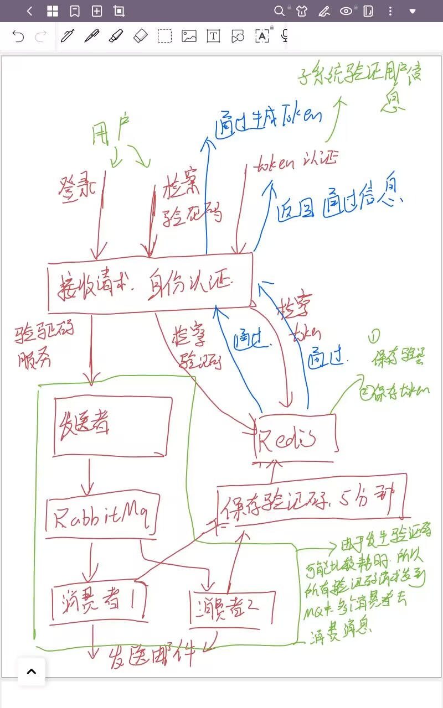


### 什么是单点登录？为什么要使用单点登录？


### 具体流程是什么样的？


### 为什么要使用Redis？有什么用？


### 为什么要使用jwt？有什么用？


### 使用了邮箱验证码，具体是怎么实现的？


## jwt是什么？


## 自定义注解实现缓存


## session cookie token的区别  jwt？

### 为什么会有他们？

由于HTTP协议是无状态的，所谓无状态就是说客户端每一次与服务器通信都需要重新建立连接，每一次的请求和上一次或者下一次的请求之间没有任何关系。如果一个用户访问一个应用程序，输入了一些个人信息。随后他又访问了该应用，还需要再次输入这些相同的信息，这样就很麻烦。所以需要记录发起请求的用户信息。

### 什么是cookie

cookie保存在客户端或者说是浏览器中的一小块数据，

可以进行身份验证，但是不建议，因为cookie能存放的信息较小，另外cookie是保存在浏览器的，可能会泄露。


### 什么是session

在使用cookie进行身份确认的时候，在服务端会生成一个session保存用户信息，并将sessionId保存在cookie中传给浏览器。之后浏览器发起请求的时候携带cookie，服务端就可以得到sessionId，进而完成身份验证。

session 由服务端创建，当一个请求发送到服务端时，服务器会检索该请求里面有没有包含 sessionId 标识，如果包含了 sessionId，则代表服务端已经和客户端创建过 session，然后就通过这个 sessionId 去查找真正的 session，如果没找到，则为客户端创建一个新的 session，并生成一个新的 sessionId 与 session 对应，然后在响应的时候将 sessionId 给客户端，通常是存储在 cookie 中。如果在请求中找到了真正的 session，验证通过，正常处理该请求。


session通常和cookie结合使用完成身份验证


### 什么是token

session + cookie的身份认证的方式存在一定的弊端

- 每一个用户都会对应一个session，保存在服务器中，会浪费服务器的资源
- 拓展性差，session只能保存在一个服务器中，如果由多个服务器结点，无法做到session的同步。

token实质上就是一个被加密后的字符串，它通常使用userId等内容进行加密，存放在cookie中。后续请求的时候验证token，然后根据解析得到的userId去数据库中查询用户信息。

token的认证流程如下：


简单来说，session存储了全部的用户信息，是空间换时间，token存储了部分用户信息，但是全部信息需要查询数据库，是时间换空间。

### 什么是jwt

jwt全称`JSON Web Token`，是token的一种具体实现方式

jwt本质上还是token，是一个字符串，


jwt包含三个部分：Header，Payload，Signature

payload是有效荷载部分

### jwt的实际应用

用户经过登录验证之后，服务器生成一个token（不是指jwt，可以是随机生成的），将这个token作为key，用户信息作为value，保存在redis中，并设置过期时间，这个过期时间就是登录失效的时间

之后将生成的token信息封装到jwt的payload字段，返回给前端，

前端每次请求都会携带这个jwt信息

后端编写一个拦截器，拦截除了登录之外的所有请求，获得前端携带的jwt，并验证，通过后获得其中的payload中的token，然后根据这个token去redis中获得用户信息。获得成果进行后续业务逻辑，不成功说明登录过期，要重新登陆。


## 日志记录是怎么做的？

进行日志记录的时候，我是用的是RabbitMq来完成，应用系统会封装要记录的日志信息，然后发送给RabbitMq，有一个消费者服务会监听Mq，现在主要记录的日志信息包括服务器错误日志，用户行为日志。用户行为日志目前只记录了用户登录，用户登出，开启做题等行为。消费者服务会监听不同的队列，然后将这些日志进行记录到本地的文件中。

有一个问题需要注意，就是我们可以生产者生产消息的时候，可能会发生消息丢失，或者由于网络等原因导致阻塞，这样就会影响线程的执行，所以发送消息这里我是使用了多线程的方式，当需要发送消息的时候，就交给线程池来发送消息。这样，由于发送消息导致的阻塞就不会影响到主线程的执行。


## 你为什么使用了JWT，还将JWT在Redis中保存了一份？

将JWT在Redis中保存的原因是防止用户已经退出登录等情景下，之前已经生成的JWT还有效，这样就会出现错误。可以把生成的JWT在Redis中保存，当需要让某个JWT失效的时候，只需要在Redis中删除即可。另外使用Redis保存JWT也方便设置JWT的过期时间，以及进行续期操作  。  不过这样就导致每次使用JWT之前都要去Redis中检查有没有这个JWT。

还有就是我认为在服务器上保留一份JWT也能起到一种双重检验的作用。因为我们不能完全的相信前端，可能有攻击者盗用别人的JWT。


保存在Redis里面也可以起到缓存的作用。这样业务系统不需要每一次请求都去SSO中进行校验，业务系统可以检查Redis中有没有对应的记录，如果有，就认为该用户处于登录状态，可以放行。如果没有再去SSO中进行认证。（使用了JWT同样可以在业务系统中进行验证啊？  使用JWT进行验证的时候需要使用密钥，我认为这个密钥最好不要放在业务系统里面，主要是处于密钥的安全性考虑）


## 如何随机生成50道题目呢？

就是根据练习所选的科目，查询该科目下所有的题目，然后在这些题目中进行查询，在查询的SQL语句的最后添加`order by RAND() limit 50`的方式实现随机选择50道题目

limit可以加两个参数，第一个是offset，也就是偏移量，第二个就是查询的个数count

## 哪些内容做了缓存

项目中频繁被访问的数据做了缓存，比如科目列表，

因为项目主要就是做题嘛，所以会频繁的查询科目列表，查看有哪些科目的题目。主要就是查询出所有的科目列表，然后转换成Json字符串，然后保存到Redis里面

## 项目中哪些地方用到了RabbitMq

首先就是在发送邮箱验证码的时候，有一个生产者去生产消息，这个消息就是要发送验证码的邮箱，有多个消费者去监听队列，得到消息后解析出其中的邮箱，然后生成验证码并发送给该邮箱

其次是在记录错题本的时候。我们是每一次提交题目之后都会判断题目是否正确，如果回答错误，就会记录到错题本中。这个记录错题本的操作我认为不应该影响我们用户做题的线程，也就是记录错题本可能因为网络等原因导致一些阻塞，我并不像让这种阻塞影响用户体验，所以就使用了RabbitMq来进行一种异步记录错题的方式。

还有一个就是在记录日志的时候，不过用途和目的和上面类似，也是防止日志记录带来的阻塞影响用户体验


## 项目的难点？

首先就是有一些需要用到异步的地方，比如说需要进行异步的日志记录，以及异步进行错题本记录

还有一大难点就是数据库表的设计，如果说数据库中的表在项目开始的时候就设计完善，那么后期开发的时候可能就需要修改，这样就会非常麻烦

# 其他问题

## 自我介绍

面试官您好，我是合肥工业大学计算机科学与技术大三在读学生。在校主修课程有计算机网络、操作系统等计算机基础课程，也学习了MySQL，Redis，SpringBoot等主流技术栈，做了一个在线题库的项目。在校成绩是专业前30%，获得过两次三等奖学金。这就是我的自我介绍。


## 为什么要选择银行科技岗？

首先就是随着数字化的发展，咱们银行部门也需要更多的科技人员去进行数字化开发。所以科技岗算是比较受到重视的岗位，在这样的岗位工作自身的经验积累或者是机会都会更多。

其次，选择银行科技岗的一个原因就是我认为银行的话相较于互联网企业更加稳定一些。如今互联网企业节奏比较快，而且各大互联网企业都有在裁员，我的话更倾向于选择一个相对稳定一些的工作。还有就是选择银行科技岗位的话不仅可以积累对口专业的这种软件开发的，也可以了解到一些其他的内容，比如金融相关的知识，毕竟是在银行工作嘛，我觉得多多少少都会接触到一些，这样也算是对自己的一种提升。


## 未来发展规划

首先，作为应届生，要学习的东西有很多，所以参加工作后首先要做的就是尽快熟悉工作内容，适应工作节奏，和周围的同事处好关系，保质保量的完成自己的工作。

在工作一段时间之后，基本上就已经能够熟悉工作流程。在完成自己本质工作的基础上，可以去多了解一下公司中其他的业务，和自己所做的业务有什么区别，拓展自己的视野吧，也可以增加自己的技术积累。

之后的话，可以去考一些相关的证书，提升自己的能力。

